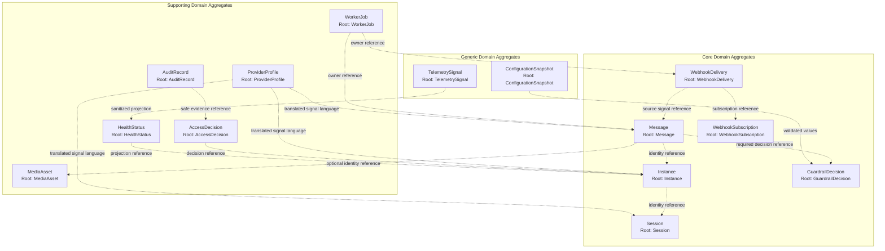

# OmniWA Aggregates

## Purpose

This document defines OmniWA's tactical aggregate model for Phase 2.2.

It does not define REST APIs, OpenAPI, database schema, Prisma models, repositories, use cases, services, source code, or method signatures.

## Design Rules

- Every aggregate belongs to exactly one bounded context from Phase 2.1.
- Aggregate roots are the only mutation entry point for aggregate-owned state.
- Aggregate boundaries define business consistency, not database tables.
- Transaction boundary means domain consistency boundary for one aggregate change; concrete persistence transaction design is deferred.
- Cross-aggregate coordination belongs to Application orchestration and approved domain contracts.
- Aggregates do not publish directly to EventBus, Queue, Webhook, Log, Provider, or external systems.
- Provider-native payloads are not aggregate input.
- Secret and raw Confidential data must not be retained or exposed by aggregate behavior.

## Aggregate Catalog

| Bounded Context | Aggregate | Aggregate Root | Purpose | Business Consistency Boundary | Invariant Boundary | Transaction Boundary | Lifecycle |
| --- | --- | --- | --- | --- | --- | --- | --- |
| Instance | Instance | Instance | Own product lifecycle, connection readiness summary, health summary, and action-required state for one managed instance. | One instance identity and its lifecycle state. | Destroyed is terminal; at most one active session reference; connection state cannot imply provider guarantee. | One Instance lifecycle change. | Created -> Connecting/QR Pending -> Connected/Disconnected/Logged Out -> Destroyed. |
| Session | Session | Session | Own session lifecycle, pairing state, session availability, Secret-sensitive session policy, and recovery requirement. | One product session for one instance. | Active and Revoked are mutually exclusive; session belongs to one instance; session material is Secret. | One Session lifecycle or retention change. | Empty -> Pending -> Active/Expired/Revoked -> cleanup or new pairing. |
| Messaging | Message | Message | Own inbound/outbound message lifecycle for MVP-supported message types. | One product message and its current lifecycle state. | One current state; supported type only; no broadcast/campaign; body not retained by default. | One Message state or classification change. | Created -> Queued/Processing -> Sent/Delivered/Read or Failed/Cancelled. |
| Media | MediaAsset | MediaAsset | Own supported media metadata, media processing state, retention classification, and diagnostic capture policy. | One media asset metadata record and processing lifecycle. | Supported media categories only; binary not retained by default; diagnostic capture must be explicit and expiring. | One MediaAsset state or retention change. | Received/Referenced -> Accepted/Processing -> Processed/Attached or Failed/Cleaned. |
| Webhook Delivery | WebhookSubscription | WebhookSubscription | Own product-level subscription intent for approved integration signals. | One subscription and its validation status. | Subscription must be valid before scheduling delivery; Secret values are not exposed. | One WebhookSubscription validation or lifecycle change. | Draft/Configured -> Active/Suspended/Invalid -> Retired. |
| Webhook Delivery | WebhookDelivery | WebhookDelivery | Own delivery lifecycle for one approved integration signal to one webhook subscription. | One delivery item and its attempts/retry/dead-letter state. | Delivered is terminal; retry is bounded; failure must not mutate source business state. | One WebhookDelivery state transition. | Pending -> Delivering -> Delivered/Retrying/Failed/Dead Letter/Cancelled. |
| Guardrails | GuardrailDecision | GuardrailDecision | Own responsible-usage decision for one evaluated message/work intent. | One guardrail evaluation result. | Decision is allow, block, throttle, or action-required; mandatory guardrails cannot be silently bypassed. | One GuardrailDecision creation or outcome change. | Requested -> Evaluated -> Passed/Blocked/Throttled/Action Required. |
| Provider Integration | ProviderProfile | ProviderProfile | Own product-level provider capability and compatibility language without owning business policy. | One provider profile/capability set. | Provider profile cannot expose provider-native payloads; provider compatibility cannot override product scope. | One ProviderProfile compatibility update. | Candidate -> Supported -> Degraded/Unsupported/Retired. |
| Operations | WorkerJob | WorkerJob | Own visible lifecycle of accepted asynchronous work. | One job lineage and retry/dead-letter state. | Accepted work cannot disappear; one current state; dead is terminal for the lineage unless recovery creates new work. | One WorkerJob state transition. | Queued -> Reserved -> Running -> Completed/Retrying/Dead. |
| Security and Access | AccessDecision | AccessDecision | Own capability decision for one actor attempting one sensitive or product action. | One access decision. | Decision must be explicit; privileged actions require audit eligibility. | One AccessDecision outcome. | Requested -> Granted/Denied/Expired. |
| Audit | AuditRecord | AuditRecord | Own Secret-safe evidence of security-sensitive or operational action. | One audit evidence record. | No Secret or raw Confidential payload; retention category is explicit. | One AuditRecord creation or retention change. | Requested -> Recorded -> Retained -> Retention Expired. |
| Health | HealthStatus | HealthStatus | Own operator-readable product/dependency health classification. | One health subject and its current classification. | Health projection cannot mutate source business state; must distinguish OmniWA, provider, downstream, and dependency causes. | One HealthStatus classification change. | Unknown -> Healthy/Degraded/Unavailable/Action Required -> Recovered. |
| Configuration | ConfigurationSnapshot | ConfigurationSnapshot | Own validated effective configuration and safety classification. | One effective configuration snapshot. | Invalid config cannot become active; config cannot silently disable required guardrails. | One ConfigurationSnapshot validation or activation change. | Proposed -> Validated/Rejected -> Active -> Superseded/Retired. |
| Observability | TelemetrySignal | TelemetrySignal | Own sanitized telemetry signal vocabulary and correlation-safe projection. | One telemetry signal/projection. | No Secret; raw Confidential data redacted; telemetry is not source of business truth. | One TelemetrySignal creation or redaction decision. | Captured -> Sanitized -> Projected/Dropped. |

## Aggregate Root Details

### Instance

| Aspect | Design |
| --- | --- |
| Responsibilities | Maintain instance lifecycle, connection readiness summary, action-required reason, and instance-owned health summary. |
| Business Rules | Destroyed is terminal; an instance cannot claim send-capable state without translated provider/session readiness; logged-out requires operator action before normal messaging. |
| Commands | Create instance, request connect, mark QR required, mark connected, mark disconnected, mark logged out, mark action required, destroy instance. |
| State | Identity, lifecycle status, readiness summary, action-required reason, health summary, current session reference. |
| Lifecycle | Begins at Created, becomes operational through connection/pairing, may degrade/disconnect, and ends at Destroyed. |

### Session

| Aspect | Design |
| --- | --- |
| Responsibilities | Maintain session lifecycle, pairing status, Secret-sensitive session classification, retention eligibility, and recovery requirement. |
| Business Rules | One session belongs to one instance; Active and Revoked cannot both be true; session material is Secret; revoked/expired sessions are not send-capable. |
| Commands | Start pairing, mark pending, activate session, expire session, revoke session, mark recovery required, mark retention expired, cleanup session. |
| State | Identity, owning instance reference, lifecycle status, action-required reason, retention classification, recovery marker, Secret classification marker. |
| Lifecycle | Empty or Pending until authenticated, Active while usable, Expired/Revoked when invalid, then cleanup or re-pairing. |

### Message

| Aspect | Design |
| --- | --- |
| Responsibilities | Maintain supported message classification, direction, lifecycle state, delivery visibility, and failure category. |
| Business Rules | Only text, image, video, document, and audio are MVP-supported; outbound work must have a guardrail outcome before acceptance; body is not retained by default after processing; upstream delivery is not guaranteed. |
| Commands | Create outbound intent, classify inbound signal, accept message, reject message, queue message, mark processing, mark sent, mark delivered, mark read, fail message, cancel message. |
| State | Identity, instance reference, optional media reference, direction, supported type, current lifecycle state, delivery status, failure category, retention classification. |
| Lifecycle | Created and classified, queued if accepted, processed by async work, updated by translated provider status, terminal when read/failed/cancelled where applicable. |

### MediaAsset

| Aspect | Design |
| --- | --- |
| Responsibilities | Maintain media category, safe metadata, processing status, retention classification, and diagnostic capture marker. |
| Business Rules | Only image, video, document, and audio media are supported; raw binary is not retained by default; diagnostic capture requires explicit enablement and expiration. |
| Commands | Register media, accept media, reject media, mark processing, mark processed, mark attached, fail media, mark cleaned, request diagnostic capture. |
| State | Identity, media category, metadata classification, processing status, retention decision, diagnostic capture marker, associated message reference where applicable. |
| Lifecycle | Received or referenced, validated, processed, associated with a message workflow, and cleaned or failed. |

### WebhookSubscription

| Aspect | Design |
| --- | --- |
| Responsibilities | Maintain product-level webhook subscription intent, validity, allowed signal scope, and lifecycle. |
| Business Rules | A subscription must be valid before deliveries are scheduled; unsafe or incomplete subscription configuration cannot be active; Secret values are not exposed. |
| Commands | Propose subscription, validate subscription, activate subscription, suspend subscription, mark invalid, retire subscription. |
| State | Identity, target URL value, signal selection, validity status, secret classification marker, lifecycle status. |
| Lifecycle | Proposed/configured, validated, active or suspended, invalid if unsafe, retired when no longer used. |

### WebhookDelivery

| Aspect | Design |
| --- | --- |
| Responsibilities | Maintain delivery lifecycle, attempt visibility, retry eligibility, terminal outcome, and dead-letter reason. |
| Business Rules | Delivered is terminal; retry budget is bounded; delivery failure cannot mutate source business fact; payload is Confidential and redacted from normal logs. |
| Commands | Schedule delivery, reserve delivery, mark delivering, mark delivered, mark retrying, mark failed, mark dead letter, cancel delivery. |
| State | Identity, subscription reference, source signal reference, delivery lifecycle state, attempt summary, retry policy, dead-letter reason, idempotency key. |
| Lifecycle | Scheduled as Pending, attempts delivery, may retry, then reaches Delivered, Failed, Dead Letter, or Cancelled. |

### GuardrailDecision

| Aspect | Design |
| --- | --- |
| Responsibilities | Maintain responsible-usage evaluation result for one outbound intent or work request. |
| Business Rules | Guardrails run before outbound acceptance; decision must be explicit; block/throttle/action-required outcomes must be visible; mandatory guardrails cannot be bypassed by configuration. |
| Commands | Request evaluation, evaluate intent, mark passed, mark blocked, mark throttled, mark action required, expire decision if not used. |
| State | Identity, evaluated intent reference, actor/access context reference, decision outcome, reason, rate-limit classification, abuse-risk classification, visibility marker. |
| Lifecycle | Requested, evaluated, becomes passed/blocked/throttled/action-required, then expires or is linked to accepted work. |

### ProviderProfile

| Aspect | Design |
| --- | --- |
| Responsibilities | Maintain product-level provider capability, compatibility, and failure classification vocabulary. |
| Business Rules | Provider profile cannot expand MVP product scope by itself; provider-native payloads are never domain state; provider errors must be classified before product contexts consume them. |
| Commands | Register provider profile, mark supported, mark degraded, mark unsupported, classify capability, classify provider failure, retire profile. |
| State | Identity, provider kind, capability summary, compatibility status, supported product features, failure classification vocabulary. |
| Lifecycle | Candidate during evaluation, Supported for active use, Degraded when compatibility risk exists, Unsupported/Retired when unusable. |

### WorkerJob

| Aspect | Design |
| --- | --- |
| Responsibilities | Maintain visible lifecycle of accepted async work and retry/dead-letter status. |
| Business Rules | Accepted work cannot be fire-and-forget; one current job state; one job lineage cannot run in two workers simultaneously; dead is terminal unless recovery creates new work. |
| Commands | Queue job, reserve job, start job, complete job, mark retrying, release reservation, mark dead, mark recovery action required. |
| State | Identity, work type, owner context reference, current lifecycle state, retry policy, attempt summary, dead-letter reason, correlation context. |
| Lifecycle | Queued, reserved, running, completed or retrying, and dead if terminal failure occurs. |

### AccessDecision

| Aspect | Design |
| --- | --- |
| Responsibilities | Maintain capability decision for one actor/action request and identify audit-sensitive decisions. |
| Business Rules | Privileged action requires explicit access decision; denied access cannot perform product mutation; Secret access requires reason and audit eligibility. |
| Commands | Request access decision, grant access, deny access, mark privileged, expire decision. |
| State | Identity, actor reference, capability, target context reference, decision outcome, privileged marker, audit eligibility marker. |
| Lifecycle | Requested, granted or denied, expires after intended decision scope ends. |

### AuditRecord

| Aspect | Design |
| --- | --- |
| Responsibilities | Maintain Secret-safe evidence summary and retention classification for one auditable fact. |
| Business Rules | Secret data is never stored; raw Confidential payloads are never stored; retention category is explicit; redaction marker is required for sensitive facts. |
| Commands | Request audit record, record evidence, apply redaction, mark retained, mark retention expired. |
| State | Identity, audit category, evidence summary, redaction marker, retention category, source context reference, correlation context. |
| Lifecycle | Requested, recorded, retained for policy window, retention expired. |

### HealthStatus

| Aspect | Design |
| --- | --- |
| Responsibilities | Maintain health classification for a product or dependency subject. |
| Business Rules | Health cannot mutate source business state; degradation cause must distinguish OmniWA, provider/account, downstream receiver, and infrastructure dependency where possible. |
| Commands | Classify healthy, classify degraded, classify unavailable, mark action required, mark recovered. |
| State | Identity, health subject reference, health category, dependency category, action-required reason, recovery marker, last safe signal summary. |
| Lifecycle | Unknown until classified, then healthy/degraded/unavailable/action-required, recovered when stable. |

### ConfigurationSnapshot

| Aspect | Design |
| --- | --- |
| Responsibilities | Maintain validated effective configuration and safety classification. |
| Business Rules | Invalid configuration cannot become active; required guardrails cannot be silently disabled; configuration changes that affect sensitive behavior are audit-eligible. |
| Commands | Propose configuration, validate configuration, reject configuration, activate configuration, supersede configuration, retire configuration. |
| State | Identity, safety classification, validation outcome, effective setting categories, guardrail-bypass rejection marker, audit eligibility marker. |
| Lifecycle | Proposed, validated or rejected, active, superseded or retired. |

### TelemetrySignal

| Aspect | Design |
| --- | --- |
| Responsibilities | Maintain sanitized telemetry projection decision and correlation vocabulary. |
| Business Rules | No Secret values; raw Confidential values must be redacted; telemetry does not become source of business truth; correlation identifiers must not reveal business payload. |
| Commands | Capture signal, classify sensitivity, apply redaction, project signal, drop unsafe signal. |
| State | Identity, correlation context, source context reference, telemetry category, sensitivity classification, redaction marker, projection decision. |
| Lifecycle | Captured, sanitized, projected if safe or dropped if unsafe. |

## Aggregate Diagram

## Phase 2.2 Aggregate Checklist

| Item | Status |
| --- | --- |
| Every Phase 2.1 bounded context has at least one aggregate | PASS |
| Every aggregate has a root | PASS |
| Every aggregate has a business consistency boundary | PASS |
| No aggregate depends on infrastructure/provider-native payloads | PASS |
| No aggregate defines persistence or API shape | PASS |

## Phase 2.2 Checklist

| Item | Status |
| --- | --- |
| Aggregates defined | PASS |
| Aggregate roots defined | PASS |
| Entities identified | PASS |
| Value objects identified | PASS |
| Identity model completed | PASS |
| Aggregate boundaries defined | PASS |
| Domain invariants defined | PASS |
| Consistency boundaries defined | PASS |

**Phase 2.2 is ready for review.**
