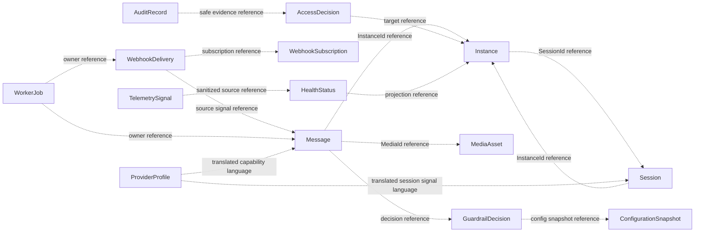

# OmniWA Aggregate Boundaries

## Purpose

This document explains why each aggregate boundary exists, why it is not split smaller, why it is not merged larger, and the trade-offs.

It also defines aggregate relationship rules and business constraints for Phase 2.2.

This document does not define database tables, ORM mappings, repositories, APIs, use cases, source code, or service implementations.

## Boundary Principles

- Aggregate boundary is a business consistency boundary.
- Aggregate root is the only mutation point for aggregate-owned entities.
- Aggregates reference other aggregates by identity or safe product reference, not object reference.
- Cross-context coordination belongs to Application orchestration.
- Event publication timing belongs to Application.
- Persistence and transaction mechanics are deferred.

## Boundary Rationale

| Aggregate | Why It Exists | Why Not Split Smaller | Why Not Merge Larger | Trade-off |
| --- | --- | --- | --- | --- |
| Instance | Instance is the primary product resource and owns lifecycle/readiness/action-required state. | Splitting lifecycle, health summary, and action marker would make operator state inconsistent. | Merging with Session would mix product resource lifecycle with Secret session policy. | Requires explicit Instance/Session coordination. |
| Session | Session owns Secret-sensitive authentication lifecycle and recovery/retention rules. | Splitting pairing, active session, and recovery would weaken Secret handling and active/revoked invariants. | Merging with Instance would expose session concerns to instance lifecycle and increase aggregate size. | Cross-aggregate invariant "one active session per instance" needs clear Application coordination. |
| Message | Message owns supported message type, direction, lifecycle, and delivery visibility. | Splitting delivery status from message would make single current state harder to protect. | Merging with Media, Guardrails, Session, or Webhook would create a large workflow aggregate and violate ownership boundaries. | Requires identity references to related decision/media/session state. |
| MediaAsset | Media metadata, processing, and retention are separate from message lifecycle. | Splitting retention and processing would risk retaining media binary incorrectly. | Merging with Message would force text messages and media messages into one oversized aggregate. | Media-bearing messages need coordination with Message aggregate. |
| WebhookSubscription | Subscription validity is distinct from delivery attempts. | Splitting target, selection, and active status would allow invalid delivery scheduling. | Merging with WebhookDelivery would make every delivery carry subscription lifecycle state. | Delivery must reference a valid subscription snapshot. |
| WebhookDelivery | Delivery retry/dead-letter lifecycle is independent from source business facts. | Splitting attempt/retry/dead-letter would hide delivery status. | Merging with source Message/Instance/Session would allow webhook failure to mutate original facts. | Eventual consistency between source signal and delivery lifecycle is intentional. |
| GuardrailDecision | Guardrail outcome must be explicit before outbound acceptance. | Splitting rate-limit, abuse-risk, and unsupported-usage checks would obscure final decision. | Merging with Message would make guardrails message-only and harder to reuse for future work intents. | Decision references intent snapshot rather than owning message state. |
| ProviderProfile | Provider capability and compatibility language must be isolated from product policy. | Splitting capability and failure classification would make provider compatibility harder to validate. | Merging with Message/Session/Instance would leak provider-specific concerns into core aggregates. | ProviderProfile must stay non-policy and may look technical, but it protects product language. |
| WorkerJob | Accepted async work needs visible lifecycle and retry/dead-letter state. | Splitting job attempt, retry, and dead state would reintroduce hidden work. | Merging with Message/Webhook/Media would make generic async state business-specific and too large. | Owning product aggregate must interpret job result. |
| AccessDecision | Capability checks are product-sensitive and audit-relevant. | Splitting actor, capability, and outcome would make decisions ambiguous. | Merging with every product aggregate would duplicate security rules. | Product actions require explicit decision references. |
| AuditRecord | Audit evidence has its own retention and redaction rules. | Splitting evidence, redaction, and retention would risk unsafe or incomplete audit data. | Merging with source aggregates would make audit retention alter business lifecycle. | Audit consumes safe evidence and may lag source action slightly. |
| HealthStatus | Health is a projection with operator semantics separate from source business state. | Splitting subject, category, and cause would make health unclear. | Merging with every source aggregate would let health mutate business state. | Health may be eventually consistent and must show uncertainty honestly. |
| ConfigurationSnapshot | Effective configuration needs one validated safety boundary. | Splitting settings and validation would allow unsafe settings to become active. | Merging with Guardrails/Session/Webhook would make configuration own business rules. | Product contexts consume validated values but own final policy meaning. |
| TelemetrySignal | Sanitized telemetry needs redaction/correlation consistency. | Splitting capture, redaction, and projection would risk raw payload leakage. | Merging with Audit or product aggregates would turn telemetry into business state. | Telemetry is generic and may drop unsafe signals. |

## Aggregate Relationship Rules

| Relationship Type | Meaning | Allowed Use | Forbidden Use |
| --- | --- | --- | --- |
| Ownership | One aggregate owns its internal entities and value objects. | Message owns DeliveryObservation; WebhookDelivery owns WebhookDeliveryAttempt. | One aggregate owning another aggregate's state. |
| Composition | Child entity/value object exists only inside one aggregate. | RateLimitWindow inside GuardrailDecision; JobAttempt inside WorkerJob. | Sharing mutable child entities across aggregates. |
| Association | Aggregate has a product relationship to another aggregate. | Message associated with InstanceId and optional MediaId. | Direct object reference or mutation of associated aggregate. |
| Reference | Aggregate stores another aggregate's identity or safe snapshot. | WebhookDelivery references WebhookSubscriptionId and source signal reference. | Using provider-native IDs as product source of truth. |
| Projection | Aggregate consumes sanitized signal to create local view. | HealthStatus and TelemetrySignal projections. | Projection mutating source aggregate state. |

## Aggregate Relationship Matrix

| Aggregate | References | Owns | Relationship Notes |
| --- | --- | --- | --- |
| Instance | SessionId, HealthStatusId, CorrelationId | InstanceActionMarker | Holds only current session reference/status summary, not session secrets. |
| Session | InstanceId, CorrelationId | PairingAttempt, SessionRecoveryMarker | Belongs to one instance; owns Secret classification, not secret storage implementation. |
| Message | InstanceId, optional MediaId, GuardrailDecisionId, CorrelationId | DeliveryObservation, MessageFailureRecord | Does not own Session; uses availability/guardrail/media outcomes through Application. |
| MediaAsset | MessageId when attached, CorrelationId | MediaProcessingAttempt, DiagnosticCaptureMarker | Owns metadata/retention, not message delivery state. |
| WebhookSubscription | WebhookSecretRef, CorrelationId | Subscription validity state | Owns product subscription intent, not external receiver uptime. |
| WebhookDelivery | WebhookId, SourceSignalRef, JobId, CorrelationId | WebhookDeliveryAttempt, RetryScheduleEntry | Owns delivery lifecycle, not source business fact. |
| GuardrailDecision | MessageId or intent reference, AccessDecisionId, ConfigurationSnapshotId | RateLimitWindow, AbuseRiskIndicator | Owns decision outcome, not message lifecycle. |
| ProviderProfile | ProviderId, ConfigurationSnapshotId | ProviderCapabilityEntry, ProviderFailureClassification | Owns compatibility language, not provider runtime state or business policy. |
| WorkerJob | OwnerContextRef, CorrelationId | JobAttempt, RetryScheduleEntry, RecoveryActionMarker | Owns job lifecycle, not owner context business outcome. |
| AccessDecision | ActorRef, Capability, target context reference | Decision outcome | Owns access decision, not identity provider records. |
| AuditRecord | SourceSignalRef, CorrelationId | AuditEvidenceSummary | Owns safe evidence, not source business state. |
| HealthStatus | OwnerContextRef, SourceSignalRef | DependencyHealthItem | Owns health projection, not source lifecycle. |
| ConfigurationSnapshot | AccessDecisionId, CorrelationId | ConfigurationValidationResult | Owns validated effective configuration, not deployment source. |
| TelemetrySignal | SourceSignalRef, CorrelationId, TraceId | TelemetryRedactionDecision | Owns sanitized telemetry projection, not business state. |

## Business Constraints

- No Aggregate may know Infrastructure, Interface, Application orchestration internals, provider libraries, queue engines, persistence, logging, telemetry exporters, configuration sources, framework types, or transport details.
- Entity must not publish Integration Event.
- Value Object must not have side effect.
- Aggregate Root is the only point that changes aggregate-owned state.
- Business Rule must not live outside the Aggregate when it belongs to that Aggregate.
- Aggregate must not store provider-native payload as domain state.
- Aggregate must not store Secret values.
- Aggregate must not retain raw Confidential payloads unless an explicit retention policy allows a bounded diagnostic path.
- Aggregate must not use database transaction assumptions to define correctness.
- Aggregate must not rely on webhook, queue, or provider success to validate its own internal invariant.
- Cross-aggregate references use identity references, safe snapshots, or published product signals.

## Aggregate Relationship Diagram

## Future Evolution

| Future Change | Aggregates Likely To Change | Aggregates Expected To Stay Stable | Notes |
| --- | --- | --- | --- |
| Multi Tenant | Identity values, AccessDecision, AuditRecord, ConfigurationSnapshot, TelemetrySignal, possibly all aggregate references. | ProviderProfile ACL rule, Message lifecycle meaning, WebhookDelivery delivery lifecycle. | Requires product decision and ADR; TenantId remains reserved in MVP. |
| Campaign | New Campaign/Audience/Recipient aggregates, GuardrailDecision, possibly Message reference strategy. | Message as single-message lifecycle, WebhookDelivery, ProviderProfile ACL rule. | Campaign must not be hidden inside Message. |
| Analytics | New Analytics/Reporting projection aggregates. | Source-of-truth aggregates: Instance, Session, Message, MediaAsset, WebhookDelivery, GuardrailDecision. | Analytics must consume published language and not own business state. |
| Cloud Provider | ProviderProfile, ProviderCapabilityEntry, ProviderFailureClassification, possibly Message/Media provider reference values. | GuardrailDecision, AuditRecord, WebhookDelivery lifecycle unless product semantics change. | Provider differences must stay behind ACL. |
| Telegram | ProviderProfile, MessageType vocabulary, Message, MediaAsset, GuardrailDecision, Ubiquitous Language. | AuditRecord, TelemetrySignal, WorkerJob generic lifecycle. | Requires product decision because non-WhatsApp semantics may not fit current aggregates. |
| Message Template | New MessageTemplate aggregate or template value reference; Message may reference approved template identity. | WebhookDelivery, WorkerJob, AuditRecord. | Requires product decision; must not imply campaign support. |
| Interactive Message | MessageType, Message, MediaAsset if media-bearing, GuardrailDecision. | Instance, Session, AuditRecord, Observability. | Out of MVP; requires product and ADR approval. |

## Boundary Review Checklist

| Question | Required Answer |
| --- | --- |
| Does the aggregate have one root? | Yes. |
| Does the root own all mutable child entities? | Yes. |
| Does the aggregate know provider-native payloads? | No. |
| Does the aggregate require database/queue/API design to be valid? | No. |
| Does the aggregate mutate another aggregate? | No. |
| Does the aggregate preserve frozen MVP scope? | Yes. |
