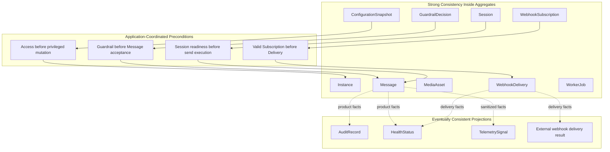

# OmniWA Consistency Boundaries

## Purpose

This document defines what requires strong consistency and what may be eventually consistent in OmniWA's tactical domain model.

It does not design database transactions, isolation levels, repositories, queue mechanics, worker locking, distributed locks, or implementation services.

## Consistency Principles

- Strong consistency is required inside aggregate boundaries for aggregate-owned invariants.
- Cross-aggregate consistency is coordinated by Application and must be explicit.
- Eventual consistency is allowed for projections, integrations, telemetry, and provider/downstream observations.
- Eventual consistency must not mean silent loss of accepted work.
- Provider uncertainty must become known product state, failure category, unknown, or action-required state.

## Strong Consistency

| Consistency Need | Owner | Why Strong | Boundary |
| --- | --- | --- | --- |
| Instance lifecycle transition | Instance | Prevents contradictory instance states. | Instance aggregate. |
| Session active/expired/revoked state | Session | Prevents Active and Revoked being true together. | Session aggregate. |
| Message current state | Message | Prevents ambiguous delivery lifecycle. | Message aggregate. |
| Supported message type classification | Message | Prevents unsupported MVP capabilities from being accepted. | Message aggregate. |
| Media category and retention decision | MediaAsset | Prevents unsafe media handling and default binary retention. | MediaAsset aggregate. |
| Webhook subscription validity | WebhookSubscription | Prevents scheduling delivery to invalid subscription. | WebhookSubscription aggregate. |
| Webhook delivery terminal state | WebhookDelivery | Prevents retry after Delivered or hidden dead-letter. | WebhookDelivery aggregate. |
| Guardrail decision outcome | GuardrailDecision | Outbound acceptance depends on explicit allow/block/throttle/action-required result. | GuardrailDecision aggregate. |
| Worker job lifecycle state | WorkerJob | Prevents accepted work from disappearing or running ambiguously. | WorkerJob aggregate. |
| Access decision outcome | AccessDecision | Prevents denied or missing access from mutating product state. | AccessDecision aggregate. |
| Audit redaction and retention category | AuditRecord | Prevents unsafe audit records. | AuditRecord aggregate. |
| Configuration safety validation | ConfigurationSnapshot | Prevents unsafe/guardrail-bypassing config becoming active. | ConfigurationSnapshot aggregate. |
| Telemetry redaction decision | TelemetrySignal | Prevents unsafe telemetry projection. | TelemetrySignal aggregate. |

## Strong Cross-Aggregate Preconditions

These are not aggregate merges. They are Application-coordinated preconditions that must be satisfied before the target aggregate changes.

| Precondition | Target Aggregate | Required Source | Reason |
| --- | --- | --- | --- |
| Outbound Message acceptance requires GuardrailDecision outcome. | Message | GuardrailDecision | Guardrails must run before accepted work. |
| Media-bearing Message acceptance requires acceptable MediaAsset state or explicit pending media workflow. | Message | MediaAsset | Prevents message lifecycle from claiming media readiness incorrectly. |
| WebhookDelivery scheduling requires active/valid WebhookSubscription. | WebhookDelivery | WebhookSubscription | Prevents invalid deliveries. |
| Privileged mutation requires granted AccessDecision. | Target product aggregate | AccessDecision | Protects sensitive actions. |
| Session activation must preserve one active session for the instance. | Session | Existing Session/Instance reference contract | Preserves frozen invariant without merging Instance and Session. |
| WorkerJob completion that changes business state must be interpreted by owner aggregate. | Owner aggregate | WorkerJob | Operations does not own business outcome. |

## Eventually Consistent

| Flow | Source | Consumer | Why Eventual Is Acceptable | Required Guardrail |
| --- | --- | --- | --- | --- |
| Provider delivery status to Message | Provider Integration | Message | Provider status arrives asynchronously and may be delayed/corrected. | Must be translated and classified. |
| Message fact to WebhookDelivery | Message | Webhook Delivery | External delivery must be async and retry-visible. | Delivery lifecycle must be visible. |
| Webhook delivery result to Health/Observability | Webhook Delivery | Health, Observability | Projection lag is acceptable. | Dead Letter and failures must be operator-visible. |
| Product facts to AuditRecord | Product contexts | Audit | Audit may consume safe evidence after source action. | No Secret/raw Confidential payload. |
| Product facts to TelemetrySignal | Product contexts | Observability | Telemetry is projection, not business state. | Redaction before projection. |
| Source lifecycle to HealthStatus | Product/dependency contexts | Health | Health is a projection. | Must distinguish uncertainty and cause category. |
| Configuration changes to consuming contexts | Configuration | Product contexts | Consumers can use validated snapshot references. | Invalid/unsafe config cannot become active. |
| WorkerJob lifecycle to owner aggregate | Operations | Owner context | Job state may precede business interpretation. | Accepted work must remain visible. |

## Consistency Boundary Matrix

| Aggregate | Strong Inside Aggregate | Cross-Aggregate Strong Precondition | Eventual Projections |
| --- | --- | --- | --- |
| Instance | Lifecycle, current session reference, action-required state. | Session active/revoked coordination for readiness. | Health, Audit, Webhook, Observability. |
| Session | Session lifecycle, Secret classification, recovery marker. | Instance ownership and one-active-session rule. | Instance readiness, Health, Audit, Observability. |
| Message | Supported type, current state, failure category, retention decision. | Guardrail outcome, session availability snapshot, media readiness when media-bearing. | WebhookDelivery, Audit, Health, Observability. |
| MediaAsset | Category, processing state, retention policy. | Message association when attached. | WebhookDelivery, Audit, Health, Observability. |
| WebhookSubscription | Validity, active/suspended/invalid state. | Access decision for privileged changes. | Audit, Health, Observability. |
| WebhookDelivery | Attempt/retry/dead-letter/delivered state. | Valid subscription before scheduling. | Health, Audit, Observability. |
| GuardrailDecision | Outcome and reason. | Message intent snapshot and configuration safety. | Message acceptance, Audit, Health, Observability. |
| ProviderProfile | Capability and compatibility classification. | Configuration safety for provider settings. | Health, Observability. |
| WorkerJob | Job lifecycle, retry, dead-letter lineage. | Owner context interpretation for business result. | Health, Audit, Observability. |
| AccessDecision | Granted/denied/expired decision. | Actor/capability context must be valid. | Audit, Observability. |
| AuditRecord | Safe evidence and retention category. | Source signal must be safe. | Observability, Health. |
| HealthStatus | Health category and cause. | Safe source signal. | Observability, Webhook if approved. |
| ConfigurationSnapshot | Validation/safety/active status. | Access decision for privileged activation. | Audit, Health, Observability. |
| TelemetrySignal | Redaction/projection decision. | Safe source signal. | Monitoring export later. |

## Consistency Boundary Diagram

## Non-Consistency Guarantees

| Not Guaranteed | Reason |
| --- | --- |
| Upstream WhatsApp final delivery | Provider/WhatsApp controls delivery; OmniWA records translated status only. |
| Exactly-once external webhook receiver processing | External receiver behavior is outside OmniWA; OmniWA provides idempotency expectations and retry visibility. |
| Immediate health projection after every business state change | Health is projection and may lag, but must not hide terminal failures. |
| Immediate telemetry export | Observability is projection and adapter-dependent later. |
| Cross-provider semantic equality | Future providers require product decision and ADR. |
