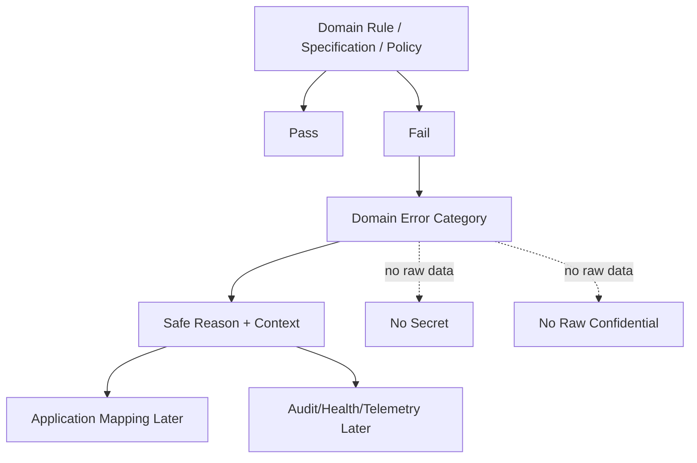

# OmniWA Domain Errors

## Purpose

This document defines OmniWA's domain error model.

Domain errors describe product-rule failures. They are not HTTP responses, REST status codes, exception classes, log formats, database errors, provider exceptions, queue errors, or source code.

## Error Principles

- Domain errors use product language and safe reason categories.
- Domain errors must not contain Secret values or raw Confidential payloads.
- Domain errors must preserve ownership. The owning context decides the product meaning of the failure.
- Domain errors may later be mapped to API, logs, telemetry, audit, or health by Application/Interface/Infrastructure, but this document does not design those mappings.
- Provider, queue, storage, transport, and dependency failures must be translated into product-level classifications before influencing domain state.
- Recoverability is a product classification, not an implementation retry instruction.

## Error Categories

| Error Category | Meaning | Example | Recoverable? | Should Be Exposed To API Later? | Should Be Logged? |
| --- | --- | --- | --- | --- | --- |
| BusinessRuleViolation | A product rule was violated while using valid product vocabulary. | Trying to send while session is expired; attempting webhook delivery for inactive subscription. | Sometimes, if caller/operator changes state or waits for required condition. | Yes, as safe product reason. No raw payload. | Yes, sanitized category, context identity, and correlation only. |
| InvalidStateTransition | Requested lifecycle movement is not allowed from current state. | Retrying Delivered WebhookDelivery; moving Destroyed Instance back to Connected; completing WorkerJob that is not running. | Usually recoverable only by choosing a valid workflow; terminal states are not recoverable. | Yes, as safe lifecycle reason. | Yes, sanitized state names and aggregate identity where safe. |
| UnsupportedCapability | Requested capability is outside MVP or unsupported by approved provider profile. | Sticker, location, contact card, reaction, campaign, broadcast, group-admin send, or provider-only feature. | No for MVP unless future product decision and ADR add support. | Yes, as unsupported capability. | Yes, safe capability name only. |
| PolicyViolation | A domain policy denied the action. | Guardrail blocked/throttled; configuration attempts to disable mandatory guardrails; access policy denies privileged action. | Sometimes, after action-required resolution, rate window reset, or configuration correction. | Yes, as safe policy outcome. | Yes, sanitized policy name/outcome and correlation. |
| IdentityError | Product identity or reference is missing, malformed, reused incorrectly, or unsafe. | MessageId derived from provider ID; JID used as aggregate identity; SourceSignalRef includes raw payload. | Usually recoverable by generating/using correct product identity. | Yes, as invalid identity/reference category. | Yes, no raw identity value if it is Confidential or Secret-adjacent. |
| ConsistencyError | Required aggregate or cross-aggregate precondition is missing or contradictory. | Message acceptance without GuardrailDecision; active-session conflict; WorkerJob completion tries to decide Message business outcome. | Sometimes, through Application reconciliation or operator recovery. | Usually yes, as safe consistency conflict. | Yes, with safe aggregate IDs, precondition category, and correlation. |
| SensitiveDataViolation | A workflow attempts to use, retain, log, audit, emit, or project unsafe sensitive data. | Secret in audit evidence; raw webhook payload in logs; media binary retained by default; raw phone/JID in telemetry. | Recoverable only after redaction, removal, or redesign of input. | Usually yes as generic sensitive-data rejection, without exposing the sensitive value. | Yes, high-signal sanitized security event; never log the sensitive data. |
| RetentionRuleViolation | A retention or cleanup decision conflicts with approved retention policy. | Diagnostic capture without expiry; cleanup before active workflow is safe; audit record missing retention category. | Often recoverable by applying explicit retention policy or waiting for eligibility. | Yes, as safe retention policy failure. | Yes, sanitized retention category and owner context. |
| AccessDecisionViolation | A privileged or sensitive mutation lacks valid granted access. | Expired AccessDecision used to destroy instance; denied actor attempts session cleanup; Secret access lacks reason. | Recoverable after valid access decision and audit eligibility. | Yes, as access denied/expired/missing decision. | Yes, sanitized actor reference, capability, target context, and correlation. |
| ExternalSignalClassificationError | External or infrastructure observation cannot be safely translated into product language. | Provider status is unknown/stale; provider failure category missing; webhook receiver outcome cannot be classified safely. | Sometimes, after retry, translation update, provider profile update, or operator action. | Usually yes as external classification unavailable/unsafe. | Yes, safe boundary and classification category only; no raw provider/transport payload. |
| ConfigurationDomainError | Configuration cannot be used as a product setting. | Invalid snapshot; guardrail-bypass rejected; Secret value exposed in configuration summary. | Recoverable by correcting configuration and creating a new valid snapshot. | Yes, as safe configuration rejection. | Yes, safe setting category only, never Secret value. |

## Error Ownership Matrix

| Context | Primary Error Categories | Notes |
| --- | --- | --- |
| Instance | InvalidStateTransition, ConsistencyError, ExternalSignalClassificationError | Disconnected/logged-out/action-required distinctions must remain safe and explicit. |
| Session | InvalidStateTransition, SensitiveDataViolation, RetentionRuleViolation | Secret material must never be included in error details. |
| Messaging | BusinessRuleViolation, UnsupportedCapability, PolicyViolation, ExternalSignalClassificationError | Outbound rejection must distinguish unsupported type, guardrail block, unusable session, and provider-classified failure. |
| Media | UnsupportedCapability, RetentionRuleViolation, SensitiveDataViolation | Binary retention and diagnostic capture failures are policy-sensitive. |
| Webhook Delivery | BusinessRuleViolation, InvalidStateTransition, PolicyViolation, SensitiveDataViolation | Delivery failure cannot mutate source business state. |
| Guardrails | PolicyViolation, BusinessRuleViolation, ConfigurationDomainError | Guardrail outcomes are visible product decisions, not hidden validation failures. |
| Provider Integration | UnsupportedCapability, ExternalSignalClassificationError | Provider profiles translate and classify; they do not own product business policy. |
| Operations | InvalidStateTransition, ConsistencyError, PolicyViolation | Job lifecycle protects accepted work visibility and bounded retry. |
| Security and Access | AccessDecisionViolation, PolicyViolation, SensitiveDataViolation | Denied or missing access cannot mutate product state. |
| Audit | SensitiveDataViolation, RetentionRuleViolation | Audit stores only safe evidence. |
| Health | ConsistencyError, ExternalSignalClassificationError | Health projection cannot mutate source state. |
| Configuration | ConfigurationDomainError, PolicyViolation, SensitiveDataViolation | Unsafe config cannot become active. |
| Observability | SensitiveDataViolation, PolicyViolation | Telemetry must be sanitized and cannot become business truth. |

## Error Model Diagram

## Recoverability Guidance

| Recoverability | Meaning | Examples |
| --- | --- | --- |
| Caller-correctable | User or API client can change input or workflow. | Unsupported message type, invalid identity, inactive webhook subscription. |
| Operator-correctable | Operator must repair instance/session/configuration/account state. | Logged out instance, revoked session, unsafe configuration, provider action-required. |
| Time-correctable | Retry or waiting may make the action valid later. | Rate-limit throttled, transient webhook failure, recoverable provider failure. |
| Terminal | Domain state must not continue normally. | Destroyed Instance, Delivered WebhookDelivery retry attempt, dead WorkerJob lineage. |
| Design-blocked | Product scope or architecture does not allow the capability. | Broadcast/campaign send, multi-tenant behavior in MVP, unsupported provider-only features. |

## Exposure Rules For Future API Mapping

| Rule | Requirement |
| --- | --- |
| Safe category is allowed. | API may later expose category such as unsupported_capability or policy_violation. |
| Safe reason code is allowed. | API may later expose a product reason code if it contains no sensitive data. |
| Secret details are forbidden. | API must never expose session material, API keys, tokens, private keys, or webhook secrets. |
| Raw Confidential details are forbidden. | API must not expose raw message bodies, media payloads, webhook payloads, raw phone numbers, or raw JIDs in error details. |
| Provider-native details are forbidden by default. | Provider specifics require translated product categories. |
| Implementation stack traces are forbidden. | Runtime diagnostics belong to sanitized observability, not domain errors. |

## Logging Rules For Domain Errors

- Log sanitized category, owner context, safe aggregate identity, safe reason code, and correlation identifiers where allowed.
- Do not log Secret values.
- Do not log raw Confidential payloads.
- Do not log provider-native payloads.
- Do not log message/media/webhook bodies.
- Do not turn domain errors into telemetry source of business truth.

## Error Rejection Rules

An error design must be rejected if it:

- Encodes HTTP status, SQL error, ORM error, queue error, or provider exception as domain meaning.
- Contains sensitive values.
- Has no owning context.
- Hides a guardrail, access, retention, or consistency failure behind a generic unexpected error.
- Allows retries of terminal domain states.
