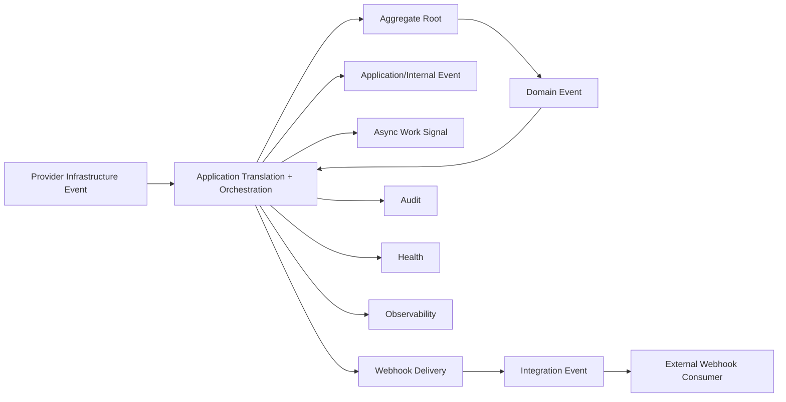
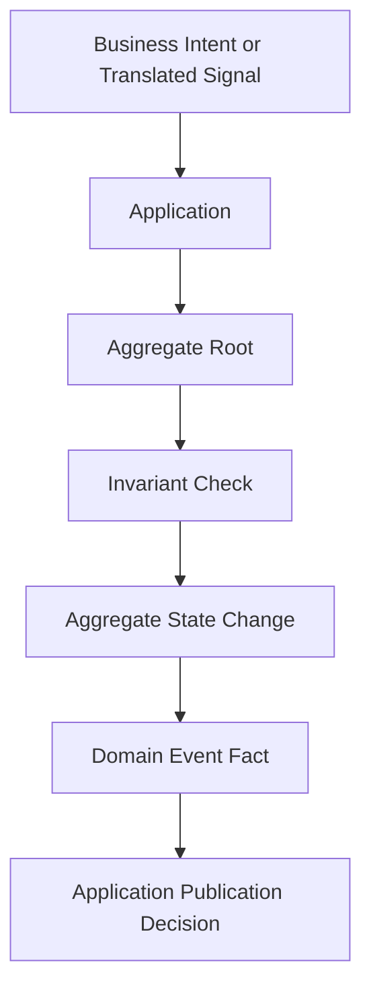
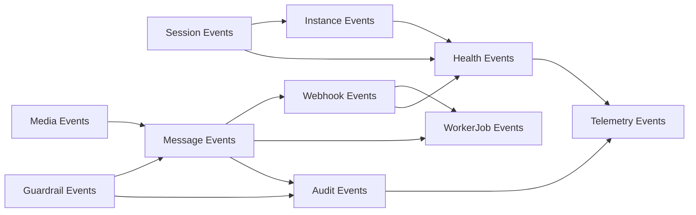
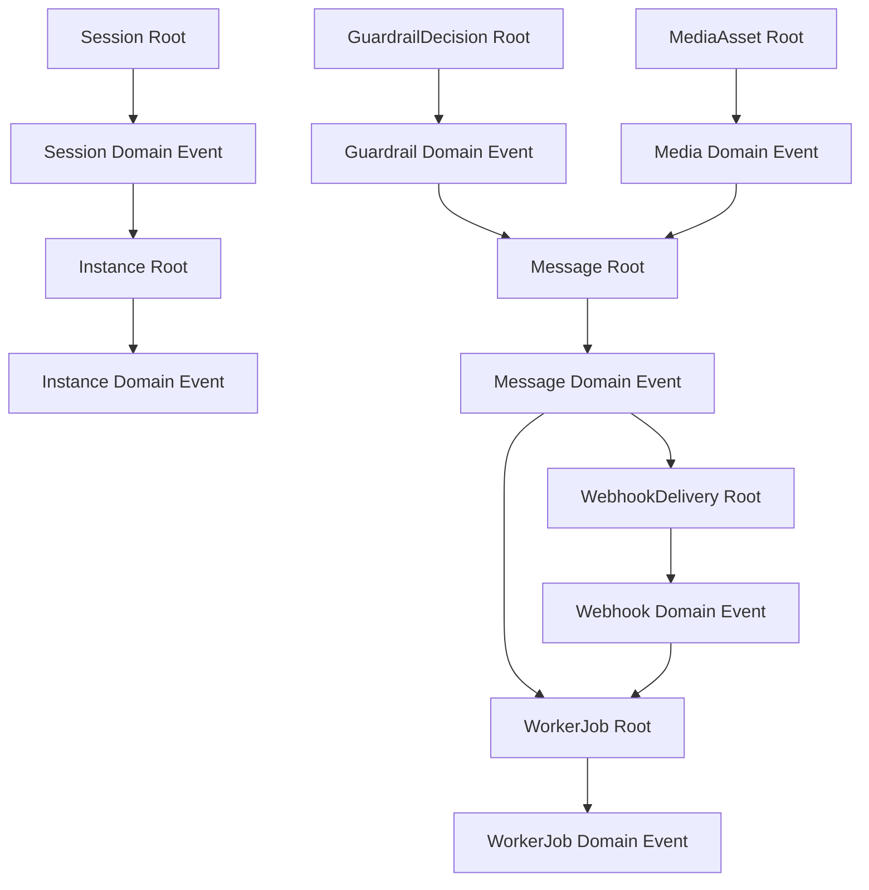

# OmniWA Domain Events

## Purpose

This document defines OmniWA domain events for Phase 2.3.

Domain events are business facts created by aggregate roots. They are not commands, event bus messages, queue jobs, webhook payloads, Kafka topics, database rows, REST responses, Prisma models, or source code.

## Frozen Rules

- Aggregate Root is the only domain object that may create a Domain Event.
- Entity must not publish event.
- Value Object must not publish event.
- Infrastructure must not create Domain Event.
- Provider may create Infrastructure Event only; provider-native signals must be translated before domain consumption.
- Webhook consumes approved Integration Events and owns external delivery lifecycle.
- Application controls orchestration, publication timing, persistence decisions, queueing decisions, and transformation decisions.
- Domain does not publish directly to EventBus, Queue, Webhook, Log, Provider, or external systems.
- Events must not carry Secret values or raw Confidential payloads.
- Events must preserve MVP scope: Single Tenant + Multi Instance, supported send types text, image, video, document, and audio.

## Event Categories

| Category | Meaning | Producer | Consumer | Use When | Not For |
| --- | --- | --- | --- | --- | --- |
| Domain Event | Business fact created by an aggregate root after an invariant-protected state change. | Aggregate Root. | Application first; downstream contexts only through Application publication rules. | Capturing product facts such as `MessageAccepted` or `SessionRevoked`. | Commands, provider callbacks, queue jobs, webhook payloads. |
| Application Event | Workflow fact or command-like internal signal coordinated by Application. | Application. | Application handlers, Worker orchestration, Scheduler orchestration. | Coordinating cross-aggregate workflow such as `OutboundMessageSendRequested`. | Representing source-of-truth business state. |
| Infrastructure Event | Observation from provider, queue, transport, dependency, runtime, or adapter. | Infrastructure adapter/runtime boundary. | Application translation layer. | Capturing external facts such as provider disconnect or webhook transport timeout. | Direct domain mutation or external integration contract. |
| Integration Event | Product event approved for external systems and prepared by Webhook Delivery. | Webhook Delivery after Application approval. | External webhook consumers. | Delivering sanitized product facts outside OmniWA. | Internal state mutation or provider-native payload propagation. |

## Publication Model

1. Aggregate Root changes aggregate-owned state and records Domain Event as a product fact.
2. Application receives aggregate outcome and controls publication timing.
3. Application may use a Domain Event to coordinate local handlers, create async work, request audit evidence, update health projection, or ask Webhook Delivery to prepare an Integration Event.
4. Webhook Delivery may create Integration Events only from approved and sanitized product facts.
5. Observability and Audit consume sanitized event information only.

## Aggregate Event Matrix

| Aggregate | Business Events | Internal Events | External Integration Events | Publisher | Consumers | Trigger | Invariant Protected |
| --- | --- | --- | --- | --- | --- | --- | --- |
| Instance | InstanceCreated, InstanceQrRequired, InstanceConnected, InstanceDisconnected, InstanceLoggedOut, InstanceActionRequired, InstanceDestroyed | ReconnectRequested, InstanceHealthRefreshRequested | `instance.created.v1`, `instance.connected.v1`, `instance.disconnected.v1`, `instance.logged_out.v1` | Instance root creates domain facts; Application publishes. | Session, Health, Audit, Webhook Delivery, Observability. | Instance lifecycle state changes. | Destroyed is terminal; connected state requires translated provider/session readiness; logged-out differs from disconnected. |
| Session | SessionPairingStarted, SessionPending, SessionActivated, SessionExpired, SessionRevoked, SessionRecoveryRequired, SessionCleaned | SessionRestoreRequested, SessionBackupRequested | `session.activated.v1`, `session.expired.v1`, `session.revoked.v1` | Session root creates domain facts; Application publishes. | Instance, Health, Audit, Webhook Delivery, Observability. | Pairing, activation, expiry, revocation, recovery, cleanup. | One session belongs to one instance; Active and Revoked are mutually exclusive; session material is Secret. |
| Message | InboundMessageReceived, UnsupportedMessageReceived, MessageAccepted, MessageRejected, MessageQueued, MessageProcessingStarted, MessageDispatched, MessageDelivered, MessageRead, MessageFailed, MessageCancelled | OutboundMessageSendRequested, MessageStatusRefreshRequested | `message.received.v1`, `message.accepted.v1`, `message.dispatched.v1`, `message.delivered.v1`, `message.read.v1`, `message.failed.v1` | Message root creates domain facts; Application publishes. | Guardrails, Media, WorkerJob, Webhook Delivery, Audit, Health, Observability. | Message classification, acceptance, queueing, provider-translated status, failure, cancellation. | One current message state; MVP message type only; guardrail decision before acceptance; no default body retention. |
| MediaAsset | MediaAccepted, MediaProcessingStarted, MediaProcessed, MediaAttached, MediaFailed, MediaExpired, MediaCleaned, DiagnosticCaptureRequested | MediaProcessingRequested, MediaCleanupRequested | `media.processed.v1`, `media.failed.v1`, `media.expired.v1` | MediaAsset root creates domain facts; Application publishes. | Message, WorkerJob, Webhook Delivery, Audit, Health, Observability. | Media validation, processing, attachment, failure, cleanup, diagnostic decision. | Supported media category only; binary not retained by default; diagnostic capture explicit and bounded. |
| WebhookSubscription | WebhookSubscriptionProposed, WebhookSubscriptionValidated, WebhookSubscriptionActivated, WebhookSubscriptionSuspended, WebhookSubscriptionInvalidated, WebhookSubscriptionRetired | WebhookSubscriptionValidationRequested | Usually not external; subscription events may be internal/audit only. | WebhookSubscription root creates domain facts; Application publishes. | WebhookDelivery, Audit, Health, Observability. | Subscription proposal, validation, activation, suspension, invalidation, retirement. | Subscription valid before delivery; Secret values not exposed. |
| WebhookDelivery | WebhookDeliveryScheduled, WebhookDeliveryStarted, WebhookDeliverySucceeded, WebhookDeliveryRetryScheduled, WebhookDeliveryFailed, WebhookDeliveryDeadLettered, WebhookDeliveryCancelled | WebhookDeliveryRequested, WebhookReplayRequested | Delivery outcome events may be external only when approved: `webhook.delivery.succeeded.v1`, `webhook.delivery.failed.v1`, `webhook.delivery.dead_lettered.v1` | WebhookDelivery root creates domain facts; Application publishes. | WorkerJob, Audit, Health, Observability, external webhook consumers where approved. | Delivery scheduling, attempt, success, retry, failure, dead-letter, cancellation. | Delivered terminal; retry bounded; failure does not mutate source business fact. |
| GuardrailDecision | GuardrailEvaluated, GuardrailPassed, GuardrailBlocked, GuardrailThrottled, GuardrailActionRequired | GuardrailEvaluationRequested | `guardrail.blocked.v1`, `guardrail.throttled.v1`, `guardrail.action_required.v1` where approved. | GuardrailDecision root creates domain facts; Application publishes. | Message, Audit, Health, Webhook Delivery, Observability. | Responsible usage evaluation. | Explicit allow/block/throttle/action-required outcome; mandatory guardrails not bypassed. |
| ProviderProfile | ProviderProfileSupported, ProviderProfileDegraded, ProviderProfileUnsupported, ProviderCapabilityChanged, ProviderFailureClassified | ProviderSignalTranslated, ProviderCompatibilityCheckRequested | Usually not external; provider status may be exposed through health/instance events only when approved. | ProviderProfile root creates domain facts for compatibility; provider adapter creates Infrastructure Events only. | Instance, Session, Message, Media, Health, Observability. | Capability evaluation, compatibility change, provider failure classification. | ProviderProfile owns no business policy; provider-native payloads remain outside domain. |
| WorkerJob | WorkerJobQueued, WorkerJobReserved, WorkerJobStarted, WorkerJobCompleted, WorkerJobRetryScheduled, WorkerJobDead, WorkerJobRecoveryRequired | AsyncWorkRequested, WorkerJobReservationRequested | Not external by default; dead/recovery facts may be reflected through health/webhook where approved. | WorkerJob root creates domain facts; Application publishes. | Owning product context, Health, Audit, Observability. | Async work lifecycle transitions. | Accepted work visible; one current job state; dead terminal unless recovery creates new work. |
| AccessDecision | AccessGranted, AccessDenied, PrivilegedActionMarked, SecretAccessRequested, AccessDecisionExpired | AccessDecisionRequested | Not external. | AccessDecision root creates domain facts; Application publishes. | Product contexts, Audit, Observability. | Access/capability decision. | Privileged mutation requires granted access; denied access cannot mutate product state. |
| AuditRecord | AuditRecordRequested, AuditRecorded, AuditRedactionApplied, AuditRetentionExpired | AuditWriteRequested | Not external. | AuditRecord root creates domain facts; Application publishes. | Observability, Health where audit path degrades. | Audit evidence creation, redaction, retention expiry. | No Secret or raw Confidential payload; retention category explicit. |
| HealthStatus | HealthStatusChanged, HealthDegraded, HealthRecovered, HealthActionRequired | HealthRefreshRequested | `health.degraded.v1`, `health.recovered.v1`, `health.action_required.v1` where approved. | HealthStatus root creates domain facts; Application publishes. | Instance, Operations, Webhook Delivery, Observability, external consumers where approved. | Health classification change. | Health cannot mutate source business state; cause category distinguished where possible. |
| ConfigurationSnapshot | ConfigurationValidated, ConfigurationRejected, ConfigurationActivated, ConfigurationGuardrailBypassRejected, ConfigurationSuperseded | ConfigurationValidationRequested | Not external by default; audit-only unless approved. | ConfigurationSnapshot root creates domain facts; Application publishes. | Guardrails, Session, Media, Webhook Delivery, Audit, Health, Observability. | Configuration proposal, validation, activation, rejection, superseding. | Invalid config cannot become active; guardrail bypass rejected. |
| TelemetrySignal | TelemetryCaptured, TelemetrySanitized, TelemetryDropped, TelemetryProjected | TelemetryProjectionRequested | Not external as business integration event. | TelemetrySignal root creates observability facts; Application publishes. | Observability adapters, Health summary where safe. | Telemetry capture and redaction decision. | No Secret; raw Confidential data redacted; telemetry not business truth. |

## Event Constraints

- Event names must use product language, not provider-native language.
- Domain Event names must be past-tense business facts.
- Application Event names may be request-like only when they represent workflow work, not business truth.
- Integration Event names must be versioned and externally documented before exposure.
- Infrastructure Event names must remain behind adapters and never become product vocabulary without translation.
- Event data must contain identifiers and safe classifications, not raw payloads.
- Events must not be used to bypass Aggregate boundaries or Application orchestration.

## Event Flow Diagram

## Domain Event Flow

## Context Event Flow

## Aggregate Event Flow

