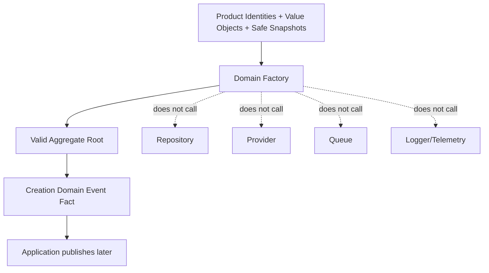

# OmniWA Domain Factories

## Purpose

This document defines domain factory concepts for creating valid aggregate roots.

It does not define constructors, TypeScript interfaces, method signatures, DTO mapping, database defaults, provider payload mapping, REST request handling, or source code.

## Factory Rules

- A factory creates an aggregate root in a valid initial product state.
- A factory enforces creation-time invariants only. Ongoing lifecycle rules remain on aggregate roots, policies, services, and specifications.
- A factory must use product identities and value objects, not database IDs, provider-native IDs, or transport payloads.
- A factory must not persist, publish events, enqueue jobs, call providers, log, or read configuration sources.
- Domain events listed here are facts recorded by the aggregate root as part of the creation decision. Application controls publication later.
- A factory must not include Secret values or raw Confidential payloads in aggregate state or events.

## Factory Catalog

| Factory | Purpose | Aggregate Created | Required Inputs | Invariants Enforced | Events Emitted |
| --- | --- | --- | --- | --- | --- |
| InstanceFactory | Create a product-managed WhatsApp instance in initial lifecycle state. | Instance | InstanceId, safe display/operational metadata, actor/action context where applicable, CorrelationId. | InstanceId is opaque; initial state is Created; no provider-native connection state; no active session reference at creation unless Application has approved safe reference. | InstanceCreated. |
| SessionFactory | Create a Session lifecycle for pairing, restoration, or recovery. | Session | SessionId, InstanceId, pairing/recovery reason, SecretClassification marker, retention policy reference. | Session belongs to exactly one Instance; session material is Secret; initial state is Empty or Pending according to approved workflow; no raw session payload included. | SessionPairingStarted or SessionPending when pairing begins. |
| MessageFactory | Create a Message aggregate from outbound intent or translated inbound signal. | Message | MessageId, InstanceId, MessageDirection, MessageType, safe metadata, GuardrailDecisionId for accepted outbound, optional MediaId, IdempotencyKey, CorrelationId. | MessageType is MVP-supported for accepted outbound; no broadcast/campaign/group-admin intent; body not retained by default; provider reference is external only; one initial lifecycle state. | InboundMessageReceived, UnsupportedMessageReceived, MessageAccepted, or MessageRejected depending on approved classification. |
| MediaAssetFactory | Create a MediaAsset metadata and processing lifecycle. | MediaAsset | MediaId, MediaCategory, safe MediaMetadata, MediaRetentionPolicy, optional MessageId reference, DiagnosticCapturePolicy when explicitly requested. | MediaCategory is image, video, document, or audio; binary not retained by default; diagnostic capture is explicit and bounded; provider media payload is not domain input. | MediaAccepted or MediaFailed; DiagnosticCaptureRequested when explicit diagnostic capture is requested. |
| WebhookSubscriptionFactory | Create a webhook subscription intent. | WebhookSubscription | WebhookId, WebhookUrl, WebhookSignalSelection, WebhookSecretRef, actor/action context, data classification marker. | Destination is represented as product WebhookUrl; secret value is not included; subscription starts proposed/configured and must be validated before active delivery. | WebhookSubscriptionProposed. |
| WebhookDeliveryFactory | Create a delivery lifecycle for one approved product signal and subscription. | WebhookDelivery | WebhookDeliveryId, WebhookId, SourceSignalRef, RetryPolicy, IdempotencyKey, safe signal classification. | Subscription validity must be Application-coordinated before creation; source signal is approved and sanitized; delivery starts Pending/Scheduled; retry is bounded. | WebhookDeliveryScheduled. |
| GuardrailDecisionFactory | Create a responsible-usage decision for one evaluated intent. | GuardrailDecision | GuardrailDecisionId, evaluated intent reference, actor/access context reference, rate-limit classification, abuse-risk classification, GuardrailOutcome, GuardrailReason. | Outcome is explicit; mandatory guardrails are not bypassed; safe reason contains no raw body/JID/phone; evaluated intent is one decision scope. | GuardrailEvaluated plus GuardrailPassed, GuardrailBlocked, GuardrailThrottled, or GuardrailActionRequired. |
| ProviderProfileFactory | Create a product-level provider capability profile. | ProviderProfile | ProviderId, provider kind in product vocabulary, approved capability summary, compatibility classification, safe failure vocabulary. | ProviderProfile cannot expose provider-native payloads; provider capability cannot expand product scope; profile begins candidate/supported/degraded according to approved classification. | ProviderProfileSupported, ProviderProfileDegraded, ProviderProfileUnsupported, or ProviderCapabilityChanged. |
| WorkerJobFactory | Create visible async work lifecycle for accepted work. | WorkerJob | JobId, JobType, OwnerContextRef, RetryPolicy, IdempotencyKey, CorrelationId, source work reference. | Work is accepted by owner context before job creation; one current job state starts Queued; retry is finite; owner context interprets business result. | WorkerJobQueued. |
| AccessDecisionFactory | Create a capability decision for one actor/action request. | AccessDecision | AccessDecisionId, actor reference, Capability, target context reference, access outcome, privilege marker, audit eligibility marker, expiry scope. | Decision is explicit; denied access cannot mutate product state; privileged/Secret access is audit-eligible; no identity-provider token stored. | AccessGranted, AccessDenied, PrivilegedActionMarked, SecretAccessRequested when applicable. |
| AuditRecordFactory | Create Secret-safe audit evidence for an approved source signal. | AuditRecord | AuditRecordId, SourceSignalRef, AuditCategory, safe evidence summary, RedactionMarker, RetentionPolicy, CorrelationId. | No Secret or raw Confidential payload; retention category explicit; redaction marker applied where needed. | AuditRecordRequested, AuditRedactionApplied where applicable, AuditRecorded. |
| HealthStatusFactory | Create or initialize health classification for one health subject. | HealthStatus | HealthStatusId, health subject reference, HealthCategory, DependencyCategory, safe source signal summary, action-required reason when applicable. | Health is projection only; cause category distinguishes OmniWA/provider/account/downstream/dependency where possible; no source state mutation. | HealthStatusChanged, HealthDegraded, HealthRecovered, or HealthActionRequired. |
| ConfigurationSnapshotFactory | Create a validated or rejected configuration snapshot. | ConfigurationSnapshot | ConfigurationSnapshotId, setting category summary, ConfigurationSafety, SecretClassification markers, access decision reference when privileged, active/superseded reference where applicable. | Invalid/unsafe config cannot become active; guardrail-bypass config rejected; Secret values not stored; activation requires safe validation. | ConfigurationValidated, ConfigurationRejected, ConfigurationActivated, ConfigurationGuardrailBypassRejected, or ConfigurationSuperseded. |
| TelemetrySignalFactory | Create sanitized telemetry projection decision. | TelemetrySignal | TelemetrySignalId, SourceSignalRef, TelemetryCategory, DataClassification, RedactionMarker, CorrelationId, projection/drop reason. | Secret absent; raw Confidential redacted before projection; telemetry is not source of business truth. | TelemetryCaptured, TelemetrySanitized, TelemetryDropped, or TelemetryProjected. |

## Factory Diagram

## Factory Boundary Notes

| Boundary | Rule |
| --- | --- |
| Factory vs Application | Factory creates a valid aggregate; Application decides when to call factory, what ports to use, and how to coordinate cross-aggregate preconditions. |
| Factory vs Mapper | Factory uses product concepts; a mapper may later translate boundary DTOs or persistence records outside domain. |
| Factory vs Provider Adapter | Provider adapters translate external signals; factories receive only product-safe values after translation. |
| Factory vs Repository | Repository persists/retrieves aggregates; factory does not persist and does not query. |
| Factory vs Event Bus | Factory/aggregate records domain facts; Application controls publication timing. |

## Factory Rejection Rules

A factory input must be rejected if it:

- Uses provider-native payloads as domain state.
- Uses JID, phone number, URL, content hash, provider ID, or Secret as aggregate identity.
- Requires raw message body or media binary retention by default.
- Attempts to create campaign, broadcast, group administration, or unsupported message type capability.
- Creates active webhook delivery without validated subscription precondition.
- Creates accepted message without guardrail outcome.
- Creates audit or telemetry facts containing Secret or raw Confidential values.
