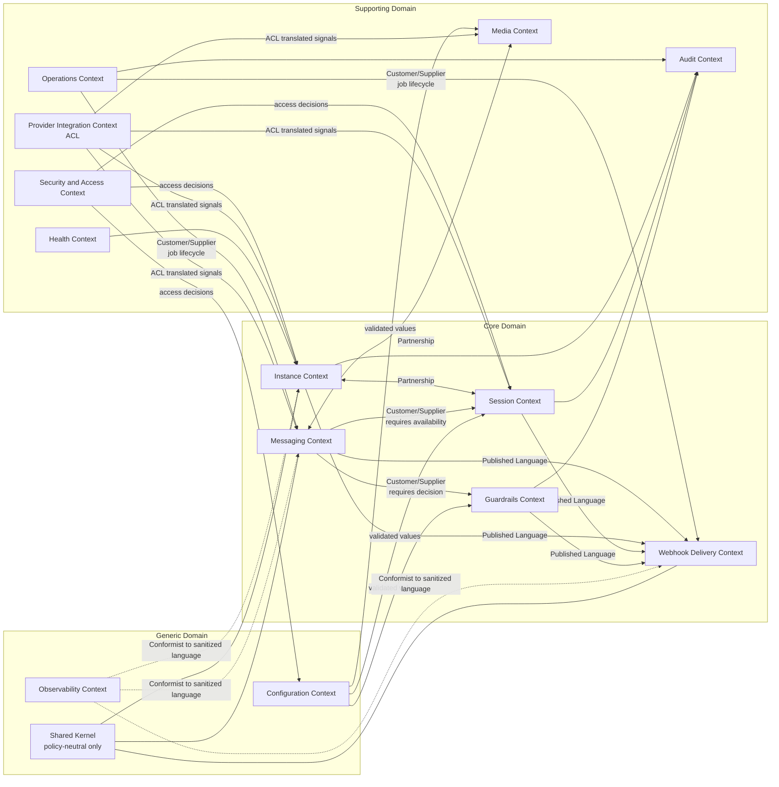
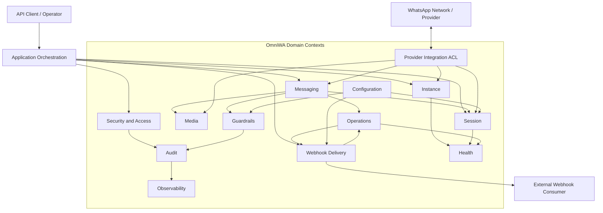
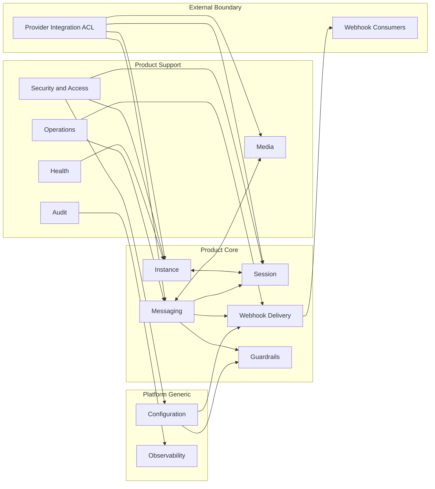
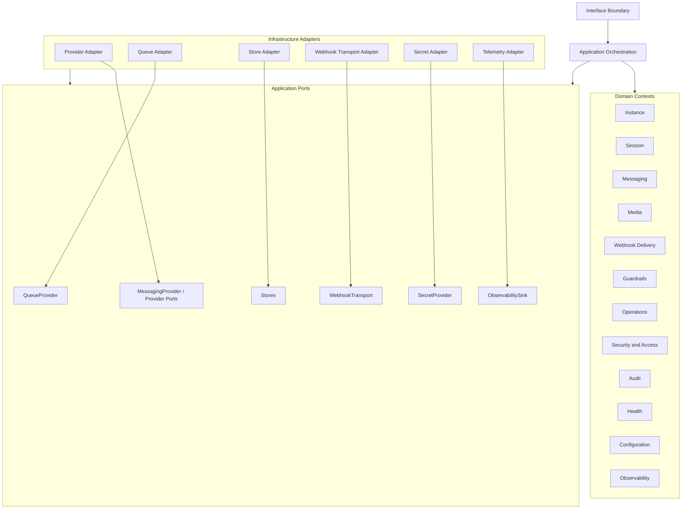

# OmniWA Domain Map

## Purpose

This document defines the strategic relationship map between OmniWA bounded contexts.

The map follows the Phase 1 frozen architecture: modular monolith, clean dependency direction, hexagonal ports and adapters, provider isolation, async webhook delivery, and no direct domain publication to external systems.

## Domain Map Summary

| Upstream Context | Downstream Context | Relationship Pattern | Reason |
| --- | --- | --- | --- |
| Instance | Session | Partnership | Instance lifecycle and session lifecycle must be coordinated, but each owns different state. |
| Session | Instance | Partnership | Session availability directly affects instance readiness, while instance lifecycle controls whether a session is meaningful. |
| Messaging | Guardrails | Customer/Supplier | Messaging requires guardrail decisions before outbound work can be accepted. Guardrails supplies allow/block/throttle outcomes. |
| Session | Messaging | Customer/Supplier | Messaging depends on session availability but must not own session state. |
| Messaging | Media | Partnership | Media-bearing messages require coordinated message and media readiness while preserving separate ownership. |
| Messaging | Webhook Delivery | Published Language | Messaging publishes product message signals; Webhook Delivery consumes approved integration signals. |
| Instance and Session | Webhook Delivery | Published Language | Lifecycle facts can become external integration events without Webhook Delivery owning their state. |
| Guardrails | Webhook Delivery | Published Language | Guardrail outcomes can be exposed as sanitized integration events when approved. |
| Product Contexts | Provider Integration | Anti-Corruption Layer | Product contexts must not consume provider-native payloads or provider-specific state. |
| Operations | Product Contexts | Customer/Supplier | Operations supplies async job lifecycle visibility; product contexts interpret business meaning. |
| Product Contexts | Audit | Published Language | Audit consumes selected security/operational facts without mutating business state. |
| Product Contexts | Observability | Conformist | Observability conforms to sanitized product/failure language and must not influence business decisions. |
| Configuration | Product Contexts | Customer/Supplier | Configuration supplies validated values but must not own business outcomes. |
| Webhook Delivery | External Webhook Consumers | Open Host Service | Webhook Delivery exposes an external integration contract through approved application/transport boundaries. |
| All Contexts | Shared Kernel | Shared Kernel | Only policy-neutral primitives are shared. Business rules are not shared. |

## Relationship Pattern Decisions

### Partnership

Used when two contexts must coordinate closely and neither can be treated as a passive supplier.

Applied to:

- Instance and Session.
- Messaging and Media.

Benefit: keeps ownership separate while acknowledging lifecycle coupling.

Trade-off: requires explicit coordination through Application and documented contracts.

### Customer/Supplier

Used when one context needs stable output from another context but ownership remains clearly upstream.

Applied to:

- Messaging depends on Guardrails for responsible-usage decisions.
- Messaging depends on Session for session availability.
- Product contexts depend on Configuration for validated values.
- Product contexts depend on Operations for async job lifecycle visibility.

Benefit: clarifies source of truth.

Trade-off: downstream contexts must tolerate upstream policy changes through versioned product language later.

### Conformist

Used only where the downstream context should conform to upstream language without shaping it.

Applied to:

- Observability conforms to sanitized product and failure language.
- External monitoring conforms to Observability output.

Not applied to core product contexts because core contexts must not conform to provider-native language.

### Anti-Corruption Layer

Used at the provider boundary.

Applied to:

- Provider Integration protects Instance, Session, Messaging, and Media from Baileys and future provider-specific payloads.

Benefit: preserves product language and future provider optionality.

Trade-off: requires explicit translation and compatibility testing.

### Shared Kernel

Used narrowly for policy-neutral concepts only.

Allowed shared concepts:

- Identifiers.
- Time primitives.
- Correlation context.
- Data classification labels.
- Error category labels.
- Result/status vocabulary that carries no business rule.

Forbidden shared concepts:

- Message lifecycle rules.
- Session rules.
- Guardrail rules.
- Provider payloads.
- Persistence, queue, logging, telemetry, or transport types.

### Open Host Service

Used for externally consumable integration behavior, not for internal shortcuts.

Applied to:

- Webhook Delivery exposes a product integration surface to external webhook consumers through Application and transport boundaries.

Not applied to:

- Provider Integration, because providers are external dependencies behind adapters, not consumers of OmniWA product services.

### Published Language

Used for stable product signals between contexts.

Applied to:

- Instance, Session, Messaging, Media, Guardrails, Operations, Audit, and Health publish conceptual signals.
- Webhook Delivery, Audit, Health, and Observability consume selected signals according to their responsibilities.

The published language is product-level and sanitized. It is not provider-native, database-native, queue-native, or HTTP-native.

## Domain Map Diagram

## Context Map Diagram

## Bounded Context Diagram

## Dependency Diagram

## Relationship Constraints

- Provider Integration is always an Anti-Corruption Layer and cannot be the source of business policy.
- Webhook Delivery consumes product signals and owns delivery lifecycle only; it cannot mutate source business state.
- Observability conforms to sanitized product language and cannot require business contexts to expose raw payloads.
- Configuration supplies validated values and cannot be used to silently disable required guardrails.
- Shared Kernel must remain policy-neutral and small.
- Any future service extraction must preserve the same context relationships unless a new ADR changes them.
