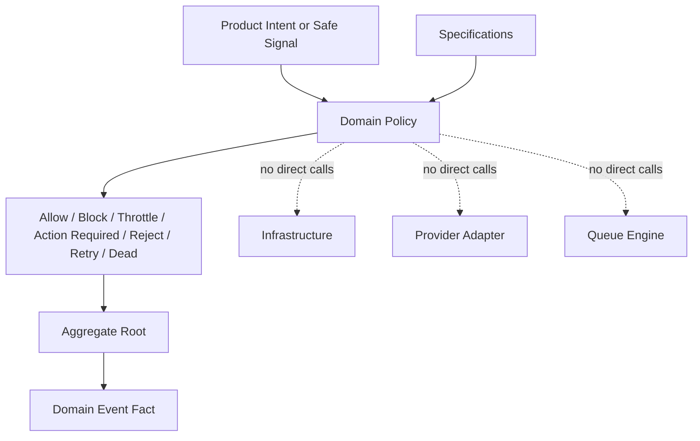

# OmniWA Domain Policies

## Purpose

This document defines domain policies for OmniWA Phase 2.4.

Domain policies make product decisions from approved invariants, lifecycle rules, and event contracts. They do not implement rate limit engines, HTTP middleware, queue retries, provider behavior, persistence, logging, or API response mapping.

## Policy Rules

- A policy must have one owning bounded context.
- A policy must make one explicit product decision.
- A policy must not call infrastructure, provider adapters, repositories, queues, loggers, telemetry exporters, or secret stores.
- A policy may be used by aggregate roots, domain services, or specifications.
- A policy outcome must be visible when it blocks, throttles, rejects, or marks action required.
- Policies must preserve MVP scope: Single Tenant + Multi Instance and send support only for text, image, video, document, and audio.

## Policy Catalog

| Policy | Decision It Makes | Inputs | Rules | Owner Context | Consequences |
| --- | --- | --- | --- | --- | --- |
| MessageSendingPolicy | Whether an outbound message intent may become accepted async message work. | MessageType, direction, session usability snapshot, GuardrailDecision outcome, media readiness, provider capability classification, idempotency context. | Allow only outbound intent with supported MVP type; require guardrail pass; require usable session; require media readiness for media-bearing messages; reject broadcast/campaign/group-admin or advanced type intent; do not imply WhatsApp final delivery. | Messaging | Passed intent can create MessageAccepted/MessageQueued flow later; failed intent produces safe BusinessRuleViolation, UnsupportedCapability, or PolicyViolation. |
| MessageStatusPolicy | Whether a translated provider status may move Message lifecycle. | Message current state, translated status, provider failure classification, ordering marker, idempotency key. | Ignore stale observations; reject provider-native states; preserve one current Message state; map uncertain provider result to safe failure, unknown, or action-required category. | Messaging | Valid status can produce MessageDispatched/Delivered/Read/Failed; invalid status produces ConsistencyError or ExternalSignalClassificationError. |
| WebhookRetryPolicy | Whether a webhook delivery failure should retry, fail terminally, or dead-letter. | WebhookDelivery state, RetryPolicy, AttemptNumber, safe failure category, receiver outcome category. | Retry only when retry budget remains and state is not Delivered/Dead Letter/Cancelled; non-retryable or exhausted failures become Failed or Dead Letter; failure must not mutate source fact. | Webhook Delivery | Retry creates retry-visible delivery state; exhausted failure creates operator-visible dead letter or terminal failure. |
| SessionRevocationPolicy | Whether a Session should be revoked, expired, recoverable, or cleanup-eligible. | Session state, translated logout/invalid-session signal, retention policy, backup/recovery marker. | Revoked/expired sessions are not send-capable; Secret material remains Secret in every state; revocation is visible and audit-eligible when sensitive. | Session | Can produce SessionRevoked, SessionExpired, SessionRecoveryRequired, or SessionCleaned facts. |
| InstanceConnectionPolicy | Whether an Instance is connected, disconnected, logged out, action-required, or destroyed. | Instance lifecycle, session availability, translated provider readiness, provider failure category, operator action marker. | Destroyed is terminal; Connected requires translated readiness and usable session; Logged Out is distinct from Disconnected; action-required must be visible. | Instance | Can update readiness summary and create InstanceConnected/Disconnected/LoggedOut/ActionRequired facts. |
| MediaRetentionPolicy | Whether media metadata/binary/diagnostic data may be retained, processed, cleaned, or expired. | Media category, processing state, retention policy, diagnostic capture policy, data classification. | Binary is not retained by default; diagnostic capture must be explicit, bounded, and auditable; metadata must be safe and category-supported. | Media | Media may proceed, fail, expire, clean, or request bounded diagnostic capture. |
| ComplianceGuardrailPolicy | Whether a work intent passes, is blocked, throttled, or requires action under product-enforced guardrails. | Intent category, rate-limit window, abuse-risk level, actor/access context, configuration safety, message direction. | Spam, broadcast, campaign, unsupported automation, unsafe rate, and abuse-risk patterns cannot be facilitated; guardrails cannot be silently disabled; policy is product guardrail, not legal compliance guarantee. | Guardrails | Passed outcome can be used by Messaging; block/throttle/action-required outcomes must be visible and audit/health eligible. |
| ProviderCapabilityPolicy | Whether provider capability is supported, degraded, unsupported, or changed for approved product semantics. | ProviderProfile, approved MVP capability set, safe translated observation, configuration safety. | Provider cannot expand product scope; degraded/unsupported capability must be visible; provider-native features remain outside product until ADR/product decision. | Provider Integration | Product contexts receive capability and failure classifications only after translation. |
| WorkerJobRetryPolicy | Whether a WorkerJob can retry, must die, or requires recovery. | WorkerJob state, RetryPolicy, AttemptNumber, owner context reference, safe failure category. | Accepted work cannot disappear; retry is finite; one job lineage has one current state; dead is terminal unless recovery creates new work. | Operations | Produces retry/dead/recovery classification consumed by owner context and projections. |
| ConfigurationSafetyPolicy | Whether a configuration snapshot can be validated, activated, rejected, or guardrail-bypass-rejected. | Proposed setting categories, Secret references, guardrail-affecting settings, access decision snapshot, current active snapshot reference. | Invalid config cannot become active; guardrail-bypass settings are rejected; Secret values are never exposed; sensitive changes are audit-eligible. | Configuration | Can produce ConfigurationValidated, Rejected, Activated, GuardrailBypassRejected, or Superseded. |
| AuditRedactionPolicy | Whether source evidence is safe for audit record creation. | SourceSignalRef, data classification, audit category, redaction marker, retention category. | Secret and raw Confidential payloads must not be stored; redaction marker required for sensitive facts; retention category is explicit. | Audit | Safe evidence can become AuditRecorded; unsafe evidence is rejected or redacted before recording. |
| PrivilegedActionPolicy | Whether an actor/action combination requires explicit access decision and audit eligibility. | Actor reference, capability, target context reference, action sensitivity, Secret access reason. | Privileged mutation requires granted AccessDecision; denied access cannot mutate product state; Secret access requires reason and audit eligibility. | Security and Access | Produces granted/denied/privileged/secret-access decision facts used as preconditions. |
| HealthProjectionPolicy | Whether a safe signal should change health status or remain non-actionable telemetry. | Source signal category, dependency category, failure category, previous health state, action-required marker. | Health is projection only; distinguish OmniWA/provider/account/downstream/dependency causes where possible; no source state mutation. | Health | HealthStatus may change, degrade, recover, or mark action required; source aggregates remain unchanged. |
| TelemetrySafetyPolicy | Whether a telemetry signal can be projected, sanitized, or dropped. | Telemetry category, data classification, redaction marker, source context reference, correlation values. | Secret never projected; raw Confidential must be redacted; telemetry is not business truth. | Observability | Safe telemetry may project; unsafe telemetry is dropped and may contribute to health only as sanitized category. |

## Policy Diagram

## Policy Trade-offs

| Choice | Benefit | Trade-off |
| --- | --- | --- |
| Keep policy decisions in domain language. | Stable across provider, queue, database, and API choices. | Application must translate runtime conditions into policy inputs. |
| Keep policies explicit and visible. | Operators can understand blocked/throttled/action-required outcomes. | More domain facts and audit/health handling are needed. |
| Keep guardrails mandatory. | Preserves product compliance posture. | Some high-volume legitimate workflows may require future product decision instead of hidden bypass. |
| Keep provider capability policy separate from Messaging. | Enables future provider changes without rewriting message lifecycle. | Messaging must consume capability classifications through Application coordination. |

## Policy Rejection Rules

A policy proposal must be rejected if it:

- Depends on provider-native payloads or queue/database/framework details.
- Creates a hidden bypass for guardrails, access, retention, or data classification.
- Introduces campaign, broadcast, group administration, or unsupported message types.
- Stores or logs Secret/raw Confidential values.
- Allows a projection context to mutate source business state.
- Turns a runtime implementation concern into product policy without ADR/product decision.
