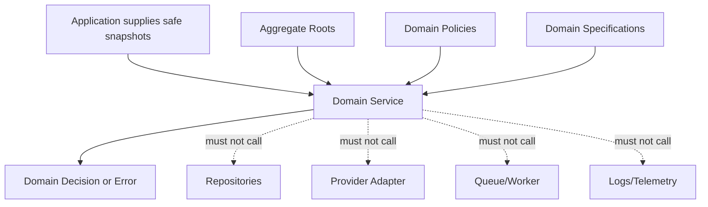

# OmniWA Domain Services

## Purpose

This document defines domain services for business decisions that do not naturally belong to a single aggregate root.

It does not define Application Services, use cases, TypeScript interfaces, method signatures, provider adapters, queue workers, database access, REST APIs, or implementation code.

## Domain Service Rules

- A domain service exists only when the rule spans multiple aggregates or requires product language not owned by a single aggregate.
- A domain service must be owned by one bounded context.
- A domain service must consume aggregate state, value objects, policies, specifications, and safe snapshots supplied by Application orchestration.
- A domain service must not load data from repositories by itself.
- A domain service must not call provider adapters, queues, logs, telemetry exporters, HTTP clients, secret stores, configuration sources, or persistence implementations.
- A domain service may return a domain decision, classification, or error, but it must not publish events or orchestrate workflows.
- Application remains responsible for sequence, repository access, transaction mechanics, async work creation, and event publication timing.

## Service Catalog

| Domain Service | Purpose | Inputs | Outputs | Business Rule | Context Ownership | Dependencies Allowed | Dependencies Forbidden |
| --- | --- | --- | --- | --- | --- | --- | --- |
| MessageAcceptanceDomainService | Decide whether an outbound message intent is acceptable as a product message before async work is created. | Outbound intent snapshot, MessageType, InstanceId, session usability snapshot, GuardrailDecision outcome, optional MediaAsset readiness, idempotency context. | Acceptance decision, rejection reason, required failure category, factory-ready safe input. | A message can be accepted only if type is MVP-supported, guardrail outcome allows it, session is usable, media is acceptable when required, and the intent is not broadcast/campaign/group-admin scope. | Messaging | MessageSendingPolicy, CanSendMessage, IsMessageTypeSupported, IsSessionUsable, IsMediaReadyForMessage, safe snapshots from Session/Guardrails/Media. | Repositories, provider adapter, queue, webhook transport, raw message body retention, Baileys payload, API response mapping. |
| MessageDeliveryStatusDomainService | Classify translated delivery observations into allowed Message lifecycle movement. | Message current state, translated provider status, provider failure classification, occurrence ordering marker, idempotency context. | Delivery lifecycle decision, stale-observation decision, safe failure category. | Provider status can change Message only after translation, and stale or unsupported observations must not corrupt one-current-state lifecycle. | Messaging | Message lifecycle rules, ProviderFailureClassified product vocabulary, FailureCategory, ordering/idempotency values. | Provider-native enums, raw provider payload, direct ProviderProfile mutation, logging, external delivery guarantee. |
| InstanceSessionCoordinationDomainService | Decide product readiness and action-required classification from Instance and Session state. | Instance lifecycle snapshot, Session availability snapshot, translated connection readiness, action-required classification. | Readiness decision, action-required reason, safe current session reference recommendation. | An Instance may be send-capable only when session and translated provider readiness allow it; logged out and disconnected must remain distinct. | Instance | InstanceConnectionPolicy, CanReconnectInstance, IsSessionUsable, safe Session contract, provider failure classification. | Session Secret material, provider runtime object, direct Session mutation, reconnect worker orchestration. |
| SessionRecoveryDomainService | Decide whether a Session requires recovery, new pairing, revocation handling, or cleanup. | Session lifecycle state, expiry/revocation reason, retention policy, translated provider authentication signal. | Recovery classification, action-required decision, cleanup eligibility decision. | Expired/revoked sessions are not send-capable; Secret-sensitive session state must remain explicit and recoverable under policy. | Session | SessionRevocationPolicy, IsSessionUsable, retention values, safe provider failure classifications. | Secret storage implementation, QR rendering, provider-native session payload, Operations job scheduling. |
| WebhookSchedulingDomainService | Decide whether an approved product signal may create a WebhookDelivery. | SourceSignalRef, WebhookSubscription state, signal selection, data classification, idempotency key. | Deliverability decision, schedule eligibility, rejection reason. | Delivery can be scheduled only for active/valid subscription and approved sanitized product signal; webhook delivery never mutates source fact. | Webhook Delivery | IsWebhookDeliverable, WebhookRetryPolicy, WebhookSignalSelection, SourceSignalRef, data classification values. | Webhook transport, HTTP status handling, raw payload, source aggregate mutation, queue implementation. |
| RetryEligibilityDomainService | Decide whether failed async work remains retryable or must become dead/action-required. | WorkerJob or WebhookDelivery retry state, RetryPolicy, AttemptNumber, safe failure category, terminal-state marker. | Retry decision, dead-letter decision, recovery-required decision. | Retry budgets are finite; accepted work must remain visible; terminal delivered/dead states must not retry. | Operations for WorkerJob, Webhook Delivery for delivery-specific retry | RetryPolicy, CanRetryWebhookDelivery, WorkerJob lifecycle rules, WebhookDelivery lifecycle rules, DeadLetterReason. | Queue engine, worker lease, timers, HTTP client, provider retry mechanics. |
| MediaReadinessDomainService | Decide whether media can participate in a message workflow. | MediaAsset category/status, retention decision, diagnostic capture policy, MessageType, optional MessageId reference. | Media readiness decision, unsupported/failed reason, cleanup or diagnostic eligibility. | Media must be MVP-supported, metadata-safe, and processed or explicitly pending according to workflow; binary is not retained by default. | Media | IsMediaTypeSupported, CanCleanMedia, MediaRetentionPolicy, MediaCategory, MediaRetentionPolicy values. | Object storage, provider media transport, binary payload, Message delivery mutation. |
| GuardrailEvaluationDomainService | Interpret responsible-usage policy outcome for a work intent. | Intent classification, rate-limit window, abuse-risk classification, actor/access context reference, configuration safety snapshot. | Guardrail outcome, safe reason, throttle/action-required classification. | Mandatory guardrails for spam, broadcast, rate-limit, and abuse-risk cannot be silently bypassed. | Guardrails | ComplianceGuardrailPolicy, IsRateLimitAllowed, ConfigurationSafety, GuardrailOutcome, AbuseRiskLevel. | Legal compliance guarantee, provider policy bypass, raw message body, configuration source implementation. |
| ProviderCompatibilityDomainService | Classify provider capability and failure vocabulary in product terms. | ProviderProfile state, safe translated provider observation, approved MVP capability set, configuration safety classification. | Capability support/degraded/unsupported decision, product failure classification. | Provider capability cannot expand OmniWA product scope; provider failures must be classified before product contexts consume them. | Provider Integration | ProviderCapabilityPolicy, IsProviderCapabilitySupported, FailureCategory, ProviderReference as external reference. | Baileys native objects in domain, business policy mutation, direct product aggregate state change, logs with raw payloads. |
| AuditEvidenceSafetyDomainService | Decide whether a product signal can become audit evidence. | SourceSignalRef, data classification, audit category, redaction marker, actor/action context. | Safe audit evidence decision, redaction-required decision, rejection reason. | Audit evidence must not store Secret or raw Confidential payloads and must have explicit retention category. | Audit | AuditRedactionPolicy, IsAuditEvidenceSafe, RetentionPolicy, RedactionMarker. | Raw payload storage, log sink, source business mutation, Secret values. |
| HealthClassificationDomainService | Classify safe lifecycle/failure signals into operator-readable health state. | Health subject, source signal category, safe failure category, dependency category, previous health state. | Health classification, action-required marker, recovery marker. | Health is projection only; it must distinguish OmniWA, provider/account, downstream, and dependency causes where possible. | Health | HealthProjectionPolicy, HealthCategory, DependencyCategory, FailureCategory. | Dependency probe implementation, source aggregate mutation, telemetry exporter, provider-native payload. |
| ConfigurationSafetyDomainService | Decide whether configuration is valid, unsafe, active, rejected, or guardrail-bypass-rejected. | Proposed setting categories, safety constraints, Secret reference markers, guardrail-affecting settings, access decision snapshot. | Configuration safety decision, activation eligibility, rejection category. | Invalid configuration cannot become active and cannot silently disable mandatory guardrails. | Configuration | ConfigurationSafetyPolicy, CanActivateConfiguration, ConfigurationSafety, SecretClassification. | Environment loading, secret value retrieval, deployment mechanics, product aggregate mutation. |

## Domain Service Diagram

## Service Placement Guidance

| Question | If Yes | If No |
| --- | --- | --- |
| Does the rule protect one aggregate's own invariant? | Put it on that aggregate root. | Continue evaluating. |
| Does the rule combine multiple aggregate decisions using product language? | Use a domain service owned by the primary context. | Continue evaluating. |
| Does the rule sequence repositories, ports, transactions, jobs, or publication timing? | It belongs to Application, not domain service. | Continue evaluating. |
| Does the rule translate provider, queue, HTTP, storage, or secret-provider mechanics? | It belongs to an adapter/Application boundary, not domain service. | Continue evaluating. |
| Does the rule only validate transport shape? | It belongs to Interface/Application validation, not domain service. | Use a domain specification only if it validates product semantics. |

## Service Constraints

| Constraint | Reason |
| --- | --- |
| Domain services cannot publish Domain Events. | Aggregate roots create domain facts; Application publishes later. |
| Domain services cannot create WorkerJob or WebhookDelivery side effects. | Async work lifecycle must be Application-coordinated and visible. |
| Domain services cannot read another context's repository directly. | Cross-context coordination must remain explicit. |
| Domain services cannot retain raw bodies or media binaries. | Preserves no-default-body-retention and data classification rules. |
| Domain services cannot hide guardrail or access failures. | Blocked/throttled/denied/action-required outcomes must remain visible. |
| Domain services cannot return provider-native error vocabulary. | Product contexts consume only translated product classifications. |
