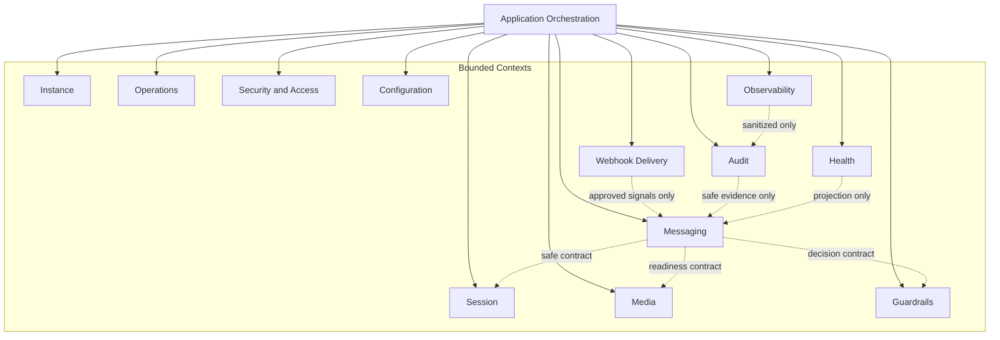

# OmniWA Domain Service Boundaries

## Purpose

This document clarifies boundaries between domain services, policies, specifications, factories, repository ports, Application Services, and infrastructure guardrails.

It also constrains cross-context access so Phase 2.4 does not break the bounded contexts, dependency rules, or architecture freeze.

## Boundary Definitions

### Domain Service vs Application Service

| Concern | Domain Service | Application Service |
| --- | --- | --- |
| Primary role | Make product decision that spans aggregates or product concepts. | Orchestrate workflow sequence, ports, repositories, transaction mechanics, and publication timing. |
| Owns business rule? | Yes, when no single aggregate owns the full rule. | No, it coordinates domain rules but must not redefine them. |
| Loads data? | No. Receives safe aggregate state/snapshots from Application. | Yes, later through repository ports and other ports. |
| Calls provider/queue/webhook/logging? | No. | May call ports, never concrete implementations. |
| Publishes events? | No. | Controls publication timing later. |
| Example | MessageAcceptanceDomainService decides acceptance from session, guardrail, media, and provider capability snapshots. | Future send-message use case loads needed aggregates, invokes domain service/root, persists result, schedules async work, publishes facts. |

### Domain Policy vs Infrastructure Guardrail

| Concern | Domain Policy | Infrastructure Guardrail |
| --- | --- | --- |
| Meaning | Product rule such as "broadcast intent is not allowed" or "retry budget is finite". | Runtime protection such as timeout, circuit breaker, rate limiter implementation, request size cap, or worker concurrency limit. |
| Owned by | Bounded context. | Infrastructure/Application runtime boundary. |
| Data | Product values and safe classifications. | Runtime metrics, transport values, external dependency status. |
| Failure output | Domain error or policy outcome. | Infrastructure error or translated product classification. |
| Must not do | Depend on libraries or deployment mechanics. | Decide product policy or silently bypass domain guardrails. |

### Specification vs Validation DTO

| Concern | Domain Specification | Validation DTO / Boundary Validation |
| --- | --- | --- |
| Validates | Product semantics and invariants. | Transport shape, required fields, basic format, request constraints. |
| Vocabulary | Domain terms such as MessageType, GuardrailOutcome, RetryPolicy. | Interface/request terms that will be mapped before domain. |
| Result | Pass/fail with domain error category. | Boundary validation outcome. |
| Example | IsMessageTypeSupported rejects sticker as out of MVP scope. | Future request validation checks a type field exists and is text-like. |
| Must not do | Read HTTP, database, queue, or provider payload directly. | Replace domain rule checks. |

### Repository Port vs Repository Implementation

| Concern | Repository Port | Repository Implementation |
| --- | --- | --- |
| Meaning | Product contract for aggregate rehydration and persistence. | Technical adapter that persists/loads data. |
| Location | Inner architecture contract for owner context/Application coordination. | Infrastructure later. |
| Language | Aggregate identity, lifecycle, safe state, consistency expectation. | Database, ORM, serialization, transaction, connection handling. |
| Allowed now | Conceptual allowed/forbidden operations and consistency boundary. | Deferred. |
| Must not include | SQL, Prisma, schema, indexes, table names, storage engine. | Product policy not already expressed by domain. |

### Factory vs Mapper

| Concern | Domain Factory | Mapper |
| --- | --- | --- |
| Purpose | Create valid aggregate root using product values and creation invariants. | Translate between external/persistence/transport representation and product values later. |
| Owns business invariant? | Creation-time invariants only. | No. |
| Uses provider-native payload? | No. | May translate at adapter boundary before domain receives safe value. |
| Publishes events? | No. Aggregate records facts; Application publishes later. | No. |

## Cross-context Access Principles

- A bounded context owns its aggregate repository port.
- A context must not call another context's repository port directly.
- Application orchestration may coordinate multiple owner-context repositories for a workflow, but it must preserve each context's ownership and precondition rules.
- Cross-context decisions must use published language, safe snapshots, domain events through Application publication, or approved ports/ACLs.
- Webhook Delivery, Audit, Health, and Observability consume signals and create their own state only; they do not mutate source business state.
- Provider Integration crosses provider boundary through ACL/product ports and never exposes provider-native payloads to domain policy.
- Operations owns async job lifecycle only. Owner contexts interpret business outcomes.

## Cross-context Access Matrix

| Context | Own Repository Ports | May Use Product Contract From | Event-only Consumers / Producers | Must Use ACL or Port For | Forbidden Access |
| --- | --- | --- | --- | --- | --- |
| Instance | InstanceRepositoryPort | Session availability, Security access, Configuration safety, Health classification | Publishes Instance lifecycle facts to Audit, Health, Webhook, Observability through Application. | Provider readiness through Provider Integration; persistence through own port. | SessionRepository direct mutation, Session Secret material, provider runtime object, Message lifecycle state. |
| Session | SessionRepositoryPort | Instance lifecycle intent, Security access, Configuration retention/safety | Publishes Session facts to Instance, Audit, Health, Webhook, Observability through Application. | Provider authentication/logout signals through Provider Integration; Secret boundary through SecretProvider later. | Instance lifecycle mutation, Messaging delivery state, raw provider session payload. |
| Messaging | MessageRepositoryPort | Session usability, GuardrailDecision outcome, Media readiness, Provider capability, Operations job visibility, Security access | Publishes Message facts to Webhook Delivery, Audit, Health, Observability through Application. | MessagingProvider port for provider operation later; QueueProvider for async work through Application. | SessionRepository direct access, MediaRepository mutation, GuardrailRepository mutation, provider-native payload, campaign/broadcast queries. |
| Media | MediaAssetRepositoryPort | Messaging association, Configuration retention, Operations job visibility | Publishes Media facts to Messaging, Audit, Health, Webhook, Observability through Application. | Provider media and storage boundaries through ports later. | MessageRepository mutation, object storage implementation detail, raw binary default retention. |
| Webhook Delivery | WebhookSubscriptionRepositoryPort, WebhookDeliveryRepositoryPort | Approved product signals, Configuration safety, Operations job visibility | Consumes approved Integration Event candidates; publishes delivery facts to Audit, Health, Observability. | WebhookTransport and QueueProvider later through Application. | Source aggregate mutation, raw webhook payload logging, direct HTTP client in domain. |
| Guardrails | GuardrailDecisionRepositoryPort | Messaging intent snapshot, Configuration safety, Security access | Publishes guardrail outcome facts to Messaging, Audit, Health, Observability through Application. | Persistence through own port only. | MessageRepository mutation, configuration source implementation, legal compliance guarantee, hidden bypass. |
| Provider Integration | ProviderProfileRepositoryPort | Configuration safety, approved product capability definitions | Publishes translated capability/failure facts through Application. | Provider library adapter boundary; MessagingProvider-style ports. | Product business policy, source aggregate mutation, raw provider payload in domain. |
| Operations | WorkerJobRepositoryPort | Owner context work request, Configuration safety | Publishes job lifecycle facts to owner context, Audit, Health, Observability. | QueueProvider, scheduler, worker runtime through Application/Infrastructure. | Owner aggregate business outcome decision, Interface/API calls, queue engine internals in domain. |
| Security and Access | AccessDecisionRepositoryPort | Configuration safety, target context capability vocabulary | Publishes access decision facts to target contexts and Audit. | Identity/secret providers through ports later. | Target aggregate mutation, identity-provider token storage, raw Secret access. |
| Audit | AuditRecordRepositoryPort | Safe product evidence signals, Security access, Configuration retention | Consumes safe evidence; publishes audit facts to Observability/Health. | Audit sink/persistence through ports later. | Source aggregate mutation, raw Secret or raw Confidential storage. |
| Health | HealthStatusRepositoryPort | Sanitized product/dependency signals | Consumes safe lifecycle/failure signals; publishes health facts to Observability and approved Webhook flow. | Dependency probes through infrastructure later. | Source aggregate mutation, raw provider/dependency payload, business outcome decision. |
| Configuration | ConfigurationSnapshotRepositoryPort | Security access decision | Publishes validated/rejected configuration facts to product contexts, Audit, Health, Observability. | ConfigurationProvider and SecretProvider later. | Product aggregate mutation, Secret value exposure, guardrail bypass. |
| Observability | TelemetrySignalRepositoryPort where needed | Sanitized product/failure language | Consumes safe telemetry facts and projects safe signals. | Logging/metrics/tracing exporters later. | Business context internals, source aggregate mutation, raw payload sink. |

## Repository Access Rules

| Rule | Requirement |
| --- | --- |
| Own-context direct access only | A context's domain model may only define semantics for its own repository port. |
| Cross-context repository coordination | Application may coordinate multiple repositories later, but must not let one context mutate another context's aggregate. |
| No repository access from aggregates | Aggregate roots receive data needed for decisions; they do not load repositories. |
| No repository access from specifications | Specifications are pure product checks. |
| Domain services do not load repositories | Domain services receive safe snapshots and return decisions. |
| Repository ports do not publish events | Application controls publication timing. |
| Repository ports do not expose reporting models | Read models, analytics, and dashboards are deferred and must not shape aggregate persistence contracts. |

## Cross-context Interaction Diagram

## Non-negotiable Boundary Rules

- Domain Service is not an Application Service.
- Domain Policy is not infrastructure middleware.
- Specification is not DTO validation.
- Repository Port is not repository implementation.
- Factory is not adapter/mapper/persistence constructor.
- Provider Integration is an anti-corruption layer and not product policy owner.
- Operations is job lifecycle owner and not product outcome owner.
- Webhook Delivery is external delivery lifecycle owner and not source business state owner.
- Audit, Health, and Observability are evidence/projection contexts and not source-of-truth business contexts.
- Secret and raw Confidential data must not cross into audit, telemetry, normal logs, or webhook payloads.

## Phase 2.4 Checklist

| Item | Status |
| --- | --- |
| Repository ports defined | PASS |
| Domain services defined | PASS |
| Policies defined | PASS |
| Specifications defined | PASS |
| Factories defined | PASS |
| Domain errors defined | PASS |
| Service boundaries clarified | PASS |
| Cross-context access constrained | PASS |

**Phase 2.4 is ready for review.**
