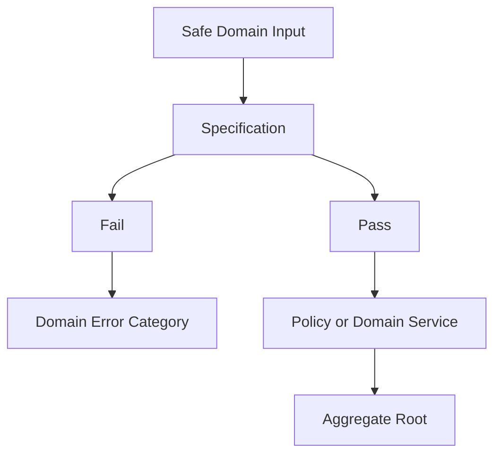

# OmniWA Domain Specifications

## Purpose

This document defines domain specifications for business-validity checks.

Specifications express product conditions such as "can send message" or "is webhook deliverable". They are not DTO validators, REST validators, database constraints, SQL predicates, ORM scopes, middleware, or source code.

## Specification Rules

- A specification checks one business condition.
- A specification must produce a domain error category when it fails.
- A specification must not load data, call repositories, call providers, publish events, or perform side effects.
- Specifications may be composed by aggregates, policies, and domain services.
- Specifications validate product semantics, not transport shape.

## Specification Catalog

| Specification | Meaning | Inputs | Pass Condition | Fail Condition | Error Produced |
| --- | --- | --- | --- | --- | --- |
| CanSendMessage | Determines whether outbound message intent can become accepted work. | MessageType, session usability, GuardrailDecision outcome, media readiness when applicable, provider capability classification, intent scope. | Type is supported; session is usable; guardrail allows; media is ready or explicitly pending under allowed workflow; provider capability supports approved feature; intent is not broadcast/campaign/group-admin. | Any required condition missing, blocked, throttled, unsupported, or out-of-scope. | BusinessRuleViolation, UnsupportedCapability, PolicyViolation, or ConsistencyError. |
| IsMessageTypeSupported | Confirms the message type is part of MVP send scope. | MessageType. | Type is text, image, video, document, or audio. | Type is sticker, location, contact, reaction, poll, interactive, status, newsletter, group-admin, campaign, broadcast, or unknown. | UnsupportedCapability. |
| IsMediaTypeSupported | Confirms media category can participate in MVP media workflow. | MediaCategory. | Category is image, video, document, or audio. | Category is unsupported, provider-native only, unknown, or advanced/out-of-scope. | UnsupportedCapability. |
| IsSessionUsable | Determines whether a session can support messaging work. | Session lifecycle, revocation/expiry marker, recovery/action-required marker, Secret-safe availability summary. | Session is active/usable and not revoked, expired, action-required, or recovery-required. | Session missing, pending, expired, revoked, logged out, recovery-required, or unsafe. | BusinessRuleViolation or InvalidStateTransition. |
| CanReconnectInstance | Determines whether reconnect workflow is valid for an Instance. | Instance lifecycle, current session availability, action-required reason, provider failure classification. | Instance is not Destroyed; state is disconnected/recoverable or connection refresh is allowed; no concurrent reconnect marker is active; session state allows recovery or pairing. | Instance destroyed, logged out requiring manual pairing, concurrent reconnect active, or provider/account action required. | InvalidStateTransition, PolicyViolation, or ConsistencyError. |
| IsGuardrailDecisionPassing | Confirms guardrail outcome can be used by Message acceptance. | GuardrailDecision outcome, expiry marker, evaluated intent reference. | Outcome is passed/allow for the same intent and still valid. | Outcome blocked, throttled, action-required, missing, expired, or for a different intent. | PolicyViolation or ConsistencyError. |
| IsRateLimitAllowed | Determines whether rate-limit portion of guardrail allows work. | RateLimitWindowSpec, actor/context reference, intent classification, current safe rate classification. | Current classification remains within allowed finite window and does not trigger throttle/action-required. | Rate window exceeded, window missing/unsafe, configuration attempts to disable mandatory rate limit, or actor classified unsafe. | PolicyViolation. |
| IsWebhookDeliverable | Determines whether a product signal can be scheduled for webhook delivery. | WebhookSubscription state, WebhookSignalSelection, SourceSignalRef, data classification, idempotency key. | Subscription is active/valid; signal is approved; payload classification is safe for integration; idempotency key exists. | Subscription invalid/suspended/retired, signal not selected, unsafe data classification, missing idempotency, or source signal not approved. | BusinessRuleViolation, PolicyViolation, or SensitiveDataViolation. |
| IsWebhookSubscriptionActive | Confirms a subscription can receive approved integration events. | WebhookSubscription lifecycle and validation status. | Subscription is validated and active. | Subscription proposed, invalid, suspended, retired, or missing validation. | InvalidStateTransition. |
| CanRetryWebhookDelivery | Determines whether failed WebhookDelivery may retry. | WebhookDelivery state, RetryPolicy, AttemptNumber, safe failure category. | Delivery is not terminal; retry budget remains; failure is retryable; idempotency context is valid. | Delivered, dead-lettered, cancelled, retry budget exhausted, non-retryable failure, or missing idempotency. | InvalidStateTransition or PolicyViolation. |
| CanReserveWorkerJob | Determines whether a WorkerJob can move into reserved/running work. | WorkerJob state, owner context reference, reservation marker, retry policy. | Job is queued or retrying, not already reserved/running/dead/completed, and owner context is valid. | Job already reserved/running/completed/dead, owner reference invalid, or retry policy exhausted. | InvalidStateTransition or ConsistencyError. |
| CanCompleteWorkerJob | Determines whether a WorkerJob can be completed from Operations perspective. | WorkerJob state, owner context reference, result classification. | Job is running and result is safe product classification; owner context remains responsible for business outcome. | Job not running, result unsafe, or completion attempts to decide owner aggregate state. | InvalidStateTransition or ConsistencyError. |
| IsMediaReadyForMessage | Determines whether MediaAsset can be attached to Message workflow. | MediaAsset lifecycle, MediaCategory, retention decision, MessageType, optional MessageId reference. | Media category matches message type, media is accepted/processed according to workflow, retention decision is safe, binary retention is not required by default. | Media unsupported, failed, expired/cleaned, unsafe retention, or mismatched type. | BusinessRuleViolation, UnsupportedCapability, or RetentionRuleViolation. |
| CanCleanMedia | Determines whether media cleanup or expiry may proceed. | MediaAsset lifecycle, MediaRetentionPolicy, DiagnosticCapturePolicy, active workflow marker. | Retention window expired or cleanup requested safely; no active workflow requires retained metadata; diagnostic capture expired or absent. | Cleanup would remove data required by active workflow, diagnostic capture still valid, or retention policy unclear. | InvalidStateTransition or RetentionRuleViolation. |
| CanActivateSession | Determines whether Session can become active. | Session lifecycle, InstanceId reference, provider readiness classification, existing active-session snapshot. | Session belongs to one Instance; not revoked/expired; provider readiness is translated; one-active-session precondition is satisfied. | Session belongs to different instance, revoked/expired, provider signal unclassified, or active-session conflict exists. | InvalidStateTransition or ConsistencyError. |
| CanPerformPrivilegedMutation | Determines whether a privileged product change can proceed. | AccessDecision outcome, capability, target context reference, expiry marker, audit eligibility marker. | Access is granted for same actor/capability/target and decision is unexpired; audit eligibility is marked when required. | Missing/expired decision, denied access, wrong target/capability, or missing audit marker. | AccessDecisionViolation or PolicyViolation. |
| CanActivateConfiguration | Determines whether a configuration snapshot may become active. | ConfigurationSnapshot safety classification, validation outcome, guardrail-affecting settings, access decision snapshot. | Snapshot is validated and safe; guardrail bypass is not present; privileged activation has granted access. | Invalid/unsafe snapshot, guardrail bypass, missing access decision, or Secret value exposure. | PolicyViolation, SensitiveDataViolation, or InvalidStateTransition. |
| IsProviderCapabilitySupported | Determines whether provider profile can satisfy a product capability. | ProviderProfile capability classification, requested product capability, configuration safety. | Capability is supported or acceptable under known degraded behavior without expanding product scope. | Capability unsupported, degraded beyond safe operation, unknown, or provider-only feature outside product scope. | UnsupportedCapability or ExternalSignalClassificationError. |
| IsAuditEvidenceSafe | Determines whether source signal can become audit evidence. | SourceSignalRef, data classification, redaction marker, audit category, retention category. | Source reference is safe; no Secret/raw Confidential payload included; redaction and retention categories are explicit. | Secret/raw Confidential present, missing redaction, missing retention category, or source reference unsafe. | SensitiveDataViolation or RetentionRuleViolation. |
| IsTelemetryProjectionSafe | Determines whether telemetry can be projected. | Telemetry category, data classification, redaction marker, correlation context, source context reference. | Secret absent; Confidential data redacted; correlation does not encode payload; projection category is approved. | Secret present, raw Confidential present, unsafe correlation, unknown category, or projection would become business state. | SensitiveDataViolation or PolicyViolation. |

## Specification Diagram

## Specification Composition

| Composite Decision | Specifications Used | Owner |
| --- | --- | --- |
| Outbound acceptance | IsMessageTypeSupported, IsSessionUsable, IsGuardrailDecisionPassing, IsMediaReadyForMessage, IsProviderCapabilitySupported, CanSendMessage | Messaging |
| Reconnect eligibility | CanReconnectInstance, IsSessionUsable, IsProviderCapabilitySupported | Instance / Session through Application coordination |
| Webhook scheduling | IsWebhookSubscriptionActive, IsWebhookDeliverable | Webhook Delivery |
| Webhook retry | CanRetryWebhookDelivery, CanReserveWorkerJob | Webhook Delivery / Operations |
| Media cleanup | CanCleanMedia, IsAuditEvidenceSafe when auditable | Media / Audit |
| Configuration activation | CanActivateConfiguration, CanPerformPrivilegedMutation | Configuration / Security and Access |
| Audit recording | IsAuditEvidenceSafe, CanPerformPrivilegedMutation when privileged | Audit / Security and Access |
| Telemetry projection | IsTelemetryProjectionSafe | Observability |

## Specification Constraints

- Specifications must not replace aggregate invariants.
- Specifications must not replace Interface shape validation.
- Specifications must not query storage or provider state.
- Specifications must not return raw payload or Secret details in failure output.
- Specifications must use product error categories from `DOMAIN_ERRORS.md`.
- A failed specification must not silently coerce invalid product state into an allowed state.
