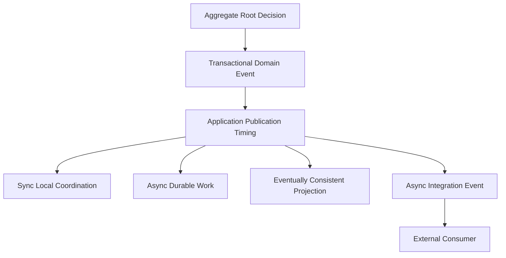

# OmniWA Event Consistency

## Purpose

This document defines event consistency expectations for OmniWA Phase 2.3.

It does not design database transactions, event stores, outbox tables, queues, Kafka, BullMQ, locks, retry implementation, or event bus implementation.

## Consistency Principles

- Aggregate-owned state and its Domain Event fact are one business decision.
- Application controls when an event is published, transformed, queued, ignored, or converted into an Integration Event.
- Synchronous handling is allowed only for local coordination that must protect business invariants.
- Asynchronous handling is required for external webhook delivery and durable background work.
- Eventually consistent projections must remain observable and must not hide terminal failures.

## Consistency Categories

| Category | Meaning | Examples | Rule |
| --- | --- | --- | --- |
| Transactional Domain Fact | Event must be created as part of the same aggregate business decision that changes state. | MessageAccepted, SessionRevoked, WebhookDeliveryDeadLettered. | Strong inside aggregate boundary; no persistence mechanics specified. |
| Synchronous Local Coordination | Event or outcome must be considered before a dependent aggregate change proceeds. | GuardrailPassed before MessageAccepted; WebhookSubscriptionValidated before WebhookDeliveryScheduled. | Application coordinates; no direct aggregate mutation across boundaries. |
| Asynchronous Durable Work | Event leads to visible background work. | OutboundMessageSendRequested, MediaProcessingRequested, WebhookDeliveryRequested. | WorkerJob lifecycle required. |
| Eventually Consistent Projection | Event updates health, audit, telemetry, or webhook delivery projection after source fact. | HealthDegraded, AuditRecorded, TelemetryProjected, Integration Events. | Lag allowed; source business fact remains source of truth. |
| Infrastructure Observation Translation | External observation must be translated before domain state changes. | ProviderMessageStatusObserved to MessageDelivered. | Provider-native event is not Domain Event. |

## Synchronous Events

These are synchronous at business-decision level, usually as Application-coordinated preconditions:

| Event / Outcome | Synchronous Need | Protected Invariant | Trade-off |
| --- | --- | --- | --- |
| GuardrailPassed / GuardrailBlocked / GuardrailThrottled | Must be known before MessageAccepted or rejection. | Guardrails run before outbound acceptance. | Adds precondition step before accepting work. |
| AccessGranted / AccessDenied | Must be known before privileged mutation. | Denied access cannot mutate product state. | Requires explicit access decision in workflows. |
| ConfigurationValidated / ConfigurationRejected | Must be known before ConfigurationActivated. | Invalid or unsafe config cannot become active. | Slower configuration activation, safer operation. |
| WebhookSubscriptionValidated | Must be known before WebhookDeliveryScheduled. | Invalid subscription cannot schedule delivery. | Delivery scheduling depends on subscription status. |
| SessionActivated / SessionRevoked effect on send eligibility | Must be considered before send execution. | Revoked/expired session is not send-capable. | Send flow needs session availability snapshot. |

## Asynchronous Events

These events or their derived Application Events should be asynchronous and visible:

| Event / Derived Work | Why Async | Required Visibility |
| --- | --- | --- |
| MessageQueued -> OutboundMessageSendRequested | Provider send should not block API acceptance until final delivery. | WorkerJobQueued/Started/Completed/Dead. |
| MediaAccepted -> MediaProcessingRequested | Media processing may be slow or provider-dependent. | WorkerJob lifecycle and MediaAsset lifecycle. |
| Domain Event -> WebhookDeliveryRequested | External receiver delivery must be async and retry-visible. | WebhookDeliveryScheduled/Started/Succeeded/Failed/DeadLettered. |
| InstanceDisconnected -> ReconnectRequested | Reconnect may retry and require provider/session coordination. | WorkerJob lifecycle and Instance/Session status. |
| Retention-related facts -> RetentionCleanupRequested | Cleanup should be visible and bounded. | WorkerJob lifecycle and owning aggregate cleanup fact. |
| HealthRefreshRequested | Health probes/projections may lag source facts. | HealthStatusChanged/Degraded/Recovered. |

## Eventually Consistent Events

| Source Event | Eventually Consistent Consumer | Acceptable Lag | Required Guardrail |
| --- | --- | --- | --- |
| MessageAccepted | WorkerJobQueued, WebhookDeliveryScheduled, AuditRecorded, TelemetryProjected | Short operational lag. | Accepted work cannot disappear. |
| MessageDispatched/Delivered/Read/Failed | Integration Event, HealthStatus, Observability | Provider status and external delivery may lag. | Status must be translated and ordered by safe observation semantics. |
| MediaProcessed/MediaFailed | Message, Webhook Delivery, Observability | Media workflow lag acceptable. | Message cannot claim media readiness before MediaAsset supports it. |
| WebhookDeliveryFailed/DeadLettered | Health, Audit, Observability | Projection lag acceptable. | Dead-letter remains operator-visible. |
| SessionRevoked | Instance, Health, Audit, Webhook Delivery | Coordination should be prompt; external notifications may lag. | Messaging must not use revoked session for send. |
| ConfigurationActivated | Product contexts, Audit, Health | Consumers may observe snapshot update after Application orchestration. | Unsafe config never active. |
| HealthDegraded/Recovered | Observability, optional external Integration Event | Projection lag acceptable. | Health cannot mutate source state. |

## Transactional Requirements

Transactional here means business atomicity inside one aggregate decision, not a database transaction design.

| Domain Event | Must Be Transactional With | Why |
| --- | --- | --- |
| InstanceDestroyed | Instance lifecycle terminal state. | Prevents destroyed instance from appearing active. |
| SessionActivated | Session Active state. | Prevents event without usable session state. |
| SessionRevoked | Session Revoked state. | Prevents send eligibility ambiguity. |
| MessageAccepted | Message accepted state and supported type classification. | Prevents accepted event for unsupported/blocked work. |
| MessageQueued | Message queued state. | Accepted async work must be visible. |
| MessageFailed | Message failed state and failure category. | Failure visibility and observability. |
| MediaProcessed | Media processed state and retention decision. | Prevents unsafe media readiness claim. |
| WebhookDeliverySucceeded | Delivered terminal state. | Delivered is terminal. |
| WebhookDeliveryDeadLettered | Dead-letter terminal/operator-visible state. | Prevents hidden webhook failure. |
| GuardrailBlocked/Throttled/ActionRequired | GuardrailDecision outcome. | Prevents ambiguous guardrail result. |
| WorkerJobDead | WorkerJob dead terminal state. | Prevents hidden accepted work loss. |
| ConfigurationActivated | Active configuration snapshot. | Prevents invalid config activation. |
| AuditRecorded | Safe audit evidence and redaction marker. | Prevents unsafe audit evidence. |

## Ordering Requirements

| Event Family | Ordering Requirement | Notes |
| --- | --- | --- |
| Instance events | Per InstanceId ordering should be respected by consumers that maintain projections. | Destroyed is terminal. |
| Session events | Per SessionId ordering required; SessionRevoked supersedes active usability. | Secret data never included. |
| Message events | Per MessageId ordering required for lifecycle projection. | Stale provider observations must be ignored or classified. |
| Media events | Per MediaId ordering required. | Cleanup/expiry should not be applied before processing outcome is known. |
| WebhookDelivery events | Per WebhookDeliveryId ordering required. | Delivered/DeadLettered terminal. |
| WorkerJob events | Per JobId ordering required. | Retry creates visible lifecycle path. |
| Health/Telemetry/Audit events | Ordering best effort unless tied to same identity. | They are projections/evidence, not source state. |

## Idempotency Requirements

| Event Type | Idempotency Key Basis | Rule |
| --- | --- | --- |
| Domain Event | Event identity plus aggregate identity and aggregate version/safe occurrence marker. | Reprocessing same event must not duplicate state changes. |
| Application Work Request | Work type plus owner context reference plus idempotency key. | Duplicate work request should map to same visible job or be safely ignored. |
| Infrastructure Observation | Adapter observation identity plus safe provider/external reference. | Duplicate provider/transport observation must not create duplicate product facts. |
| Integration Event | Integration event identity plus source signal reference plus webhook subscription. | Duplicate delivery attempts must be acceptable to consumers through idempotency guidance. |

## Event Consistency Diagram

## Trade-offs

| Choice | Benefit | Trade-off |
| --- | --- | --- |
| Keep Domain Events transactional with aggregate decision. | Preserves business truth. | Requires Application to handle publication timing carefully later. |
| Use sync only for invariant preconditions. | Prevents hidden coupling. | Some workflows require explicit orchestration steps. |
| Make webhook delivery async. | Reliable retries and no external receiver coupling. | External systems observe events later than source fact. |
| Treat health/audit/observability as projections/evidence. | Prevents them from owning business state. | They may lag source facts. |
| Translate infrastructure observations before domain. | Protects provider abstraction. | Additional mapping and stale-observation handling needed later. |
