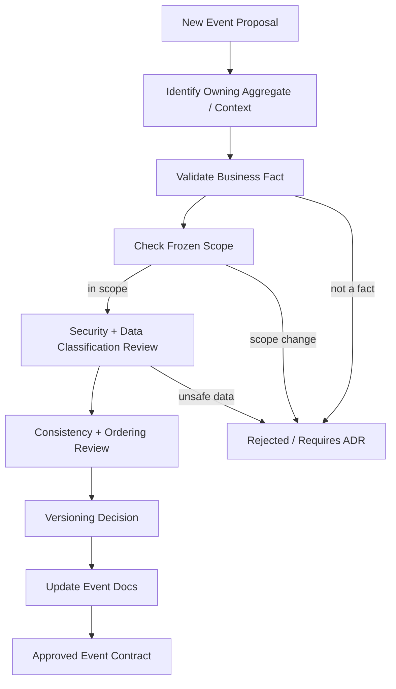

# OmniWA Event Governance

## Purpose

This document defines governance for OmniWA event language.

It does not create event bus implementation, queue implementation, Kafka, BullMQ, REST API, database, Prisma, schema registry, or source code.

## Governance Goals

- Keep event language aligned with approved bounded contexts and aggregates.
- Prevent provider-native, infrastructure, database, transport, or queue terminology from leaking into domain events.
- Prevent every internal event from becoming an external Integration Event.
- Preserve security and privacy rules for Secret and Confidential data.
- Make event ownership, versioning, documentation, and deprecation explicit.

## Naming Convention

| Event Type | Naming Rule | Examples | Notes |
| --- | --- | --- | --- |
| Domain Event | PascalCase past-tense business fact. | MessageAccepted, SessionRevoked, WebhookDeliveryDeadLettered. | Created by aggregate root only. |
| Signal Name | Lowercase dot-separated product name. | `message.accepted`, `session.revoked`. | Documentation language, not implementation topic. |
| Application Event | PascalCase request/workflow fact. | OutboundMessageSendRequested, HealthRefreshRequested. | May be request-like because it starts workflow work. |
| Infrastructure Event | Boundary-qualified observation. | ProviderMessageStatusObserved. | Must be translated before domain. |
| Integration Event | Dot-separated product name plus version. | `message.delivered.v1`, `health.degraded.v1`. | External contract owned by Webhook Delivery. |

Forbidden naming:

- Provider-native callback names as Domain Event names.
- Queue, topic, table, endpoint, controller, DTO, ORM, or adapter names.
- Present-tense commands as Domain Events.
- Campaign/broadcast/group-admin names in MVP events.

## Event Ownership

| Event Family | Owner | Ownership Rule |
| --- | --- | --- |
| Instance events | Instance Context / Instance aggregate. | Only Instance decides instance lifecycle meaning. |
| Session events | Session Context / Session aggregate. | Session material is Secret and never included. |
| Message events | Messaging Context / Message aggregate. | Messaging owns message lifecycle and supported type scope. |
| Media events | Media Context / MediaAsset aggregate. | Media owns metadata, processing, and retention facts. |
| Webhook subscription/delivery events | Webhook Delivery Context. | Webhook owns external delivery lifecycle only. |
| Guardrail events | Guardrails Context / GuardrailDecision aggregate. | Guardrails own responsible-usage outcomes. |
| Provider profile events | Provider Integration Context / ProviderProfile aggregate. | ProviderProfile owns compatibility language, not business policy. |
| Worker job events | Operations Context / WorkerJob aggregate. | WorkerJob owns async lifecycle, not owner business outcome. |
| Access events | Security and Access Context / AccessDecision aggregate. | Security owns capability decision. |
| Audit events | Audit Context / AuditRecord aggregate. | Audit owns safe evidence semantics. |
| Health events | Health Context / HealthStatus aggregate. | Health owns projection/classification only. |
| Configuration events | Configuration Context / ConfigurationSnapshot aggregate. | Configuration owns validation and safety classification. |
| Telemetry events | Observability Context / TelemetrySignal aggregate. | Observability owns sanitized projection language only. |
| Integration events | Webhook Delivery Context. | External event contract and delivery lifecycle are Webhook-owned. |

## Documentation Rule

Any new event must update:

1. `EVENT_CATALOG.md`.
2. `EVENT_CONTRACTS.md`.
3. `EVENT_LIFECYCLE.md` if lifecycle order changes.
4. `EVENT_CONSISTENCY.md` if ordering, idempotency, sync/async, or transactional expectations change.
5. `EVENT_VERSIONING.md` if compatibility changes.
6. Owning aggregate documentation if the event implies an aggregate behavior change.
7. Architecture ADR/product decision if the event changes frozen architecture or product scope.

## Review Checklist For New Events

| Question | Required Answer |
| --- | --- |
| Which approved aggregate root creates this Domain Event? | Exactly one aggregate root, or event is not a Domain Event. |
| What business fact happened? | A past-tense fact, not a command. |
| Which invariant does it protect or expose? | Explicit invariant or observability/reliability requirement. |
| Does it include Secret data? | No. |
| Does it include raw Confidential data? | No. |
| Does it use provider-native language? | No. |
| Is it external? | Only if Webhook Delivery owns and approves Integration Event. |
| Is it in MVP scope? | Yes, or product decision/ADR required. |
| Does it need versioning change? | Documented per `EVENT_VERSIONING.md`. |

## Backward Compatibility

- Existing event meaning must remain stable inside a version.
- Optional safe data may be added when consumers can ignore it.
- Required data removal requires a new version.
- New external Integration Event exposure requires governance review even if it reuses an internal Domain Event.
- Consumers must not depend on undocumented optional data.
- Producers must not change event semantics to match provider behavior.

## Deprecation

| Step | Requirement |
| --- | --- |
| Identify | Name event/version and consumers. |
| Justify | Explain business reason and risk. |
| Replace | Define replacement event/version if needed. |
| Migrate | Define compatibility window and dual-emission expectations if applicable. |
| Monitor | Track failures, webhook success, and consumer migration. |
| Retire | Remove old version only after review. |

## Security Governance

- Secret data is never present in event data.
- Raw message bodies, media payloads, webhook payloads, phone numbers, JIDs, contact names, and provider payloads are not included raw.
- Events use safe references and classifications.
- Audit and Observability events must document redaction state.
- Integration Events require sanitization review before external exposure.
- Provider events require translation review before becoming Domain Events.

## Event Constraints

- Entity does not publish event.
- Value Object does not publish event.
- Aggregate Root is the place where Domain Event facts originate.
- Infrastructure does not create Domain Event.
- Provider only creates Infrastructure Event or translated observation for Application.
- Webhook only consumes Integration Event and owns external delivery lifecycle.
- Application only orchestrates; it does not become source of business truth.
- Domain Event must not carry queue, database, API, provider-native, or transport mechanics.
- Event handlers must not bypass use cases, guardrails, aggregate invariants, or redaction.

## Future Evolution

| Future Change | Reusable Events | Events Likely Needed | Governance Requirement |
| --- | --- | --- | --- |
| Telegram | MessageAccepted, MessageQueued, MessageFailed, MediaProcessed, WebhookDelivery events, WorkerJob events, Audit/Health/Telemetry events. | Channel-specific translated message/profile events only after product language review. | Product decision and ADR; avoid Telegram-native leakage. |
| Messenger | Message lifecycle, Media lifecycle, WebhookDelivery, Guardrails, Audit/Health/Telemetry. | Messenger capability/profile classification events if product semantics differ. | Product decision and ADR. |
| WhatsApp Cloud API | Most Instance, Session, Message, Media, Webhook, Guardrail events if contracts fit. | ProviderProfile and ProviderFailureClassified variants may expand. | Provider ADR and compatibility review. |
| Campaign | GuardrailBlocked/Throttled may be reused; Message lifecycle remains single-message. | CampaignCreated, CampaignApproved, AudienceSelected, CampaignMessageScheduled, CampaignStopped. | Product decision; Campaign must be a new context/aggregate, not hidden in Message. |
| Analytics | Existing Domain/Integration events can be consumed as projections. | AnalyticsProjectionBuilt, AnalyticsLagDetected if analytics context is approved. | Product decision; analytics must not become source of truth or raw payload sink. |
| Billing | MessageAccepted, MessageDispatched, WebhookDeliverySucceeded, WorkerJobCompleted may be usage signals. | UsageRecorded, BillingPeriodClosed, InvoicePrepared if billing context is approved. | Product decision and ADR; billing cannot alter source event meaning. |
| Multi Tenant | Most event names may be reused with new ownership boundary. | TenantCreated, TenantSuspended, TenantConfigurationActivated; many Integration Events likely v2 with TenantId. | Product decision, ADR, compatibility/version review. |
| Message Template | MessageAccepted/Rejected may be reused. | MessageTemplateApproved, MessageTemplateRejected, TemplateMessageAccepted. | Product decision; must not imply campaign support. |
| Interactive Message | Existing Message lifecycle can be reused if type becomes supported. | InteractiveMessageAccepted/Rejected or MessageType extension events. | Product decision and event version review. |

## Event Governance Diagram

## Phase 2.3 Checklist

| Item | Status |
| --- | --- |
| Domain events defined | PASS |
| Event catalog completed | PASS |
| Event contracts defined | PASS |
| Event lifecycle defined | PASS |
| Event governance defined | PASS |
| Event versioning defined | PASS |
| Event consistency defined | PASS |

**Phase 2.3 is ready for review.**
