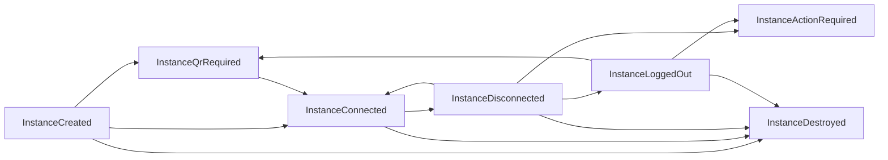
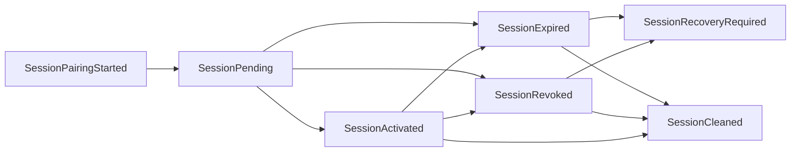
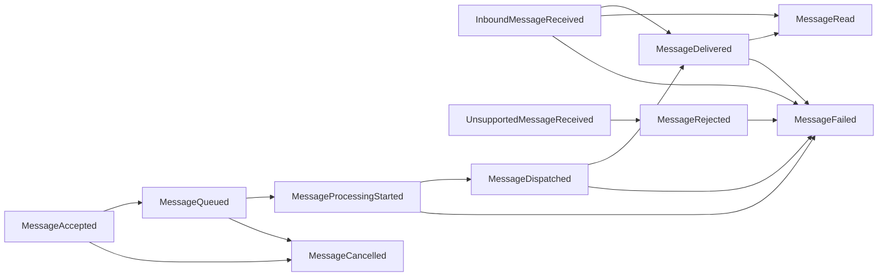
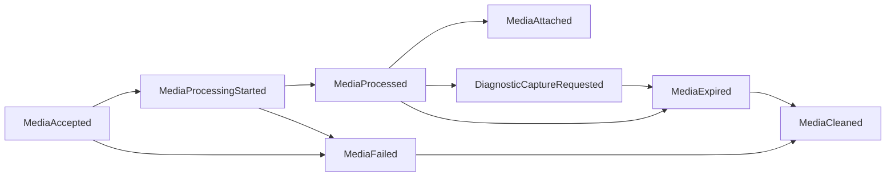
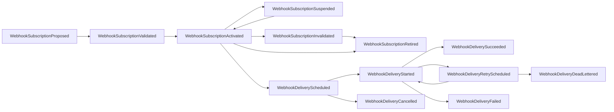
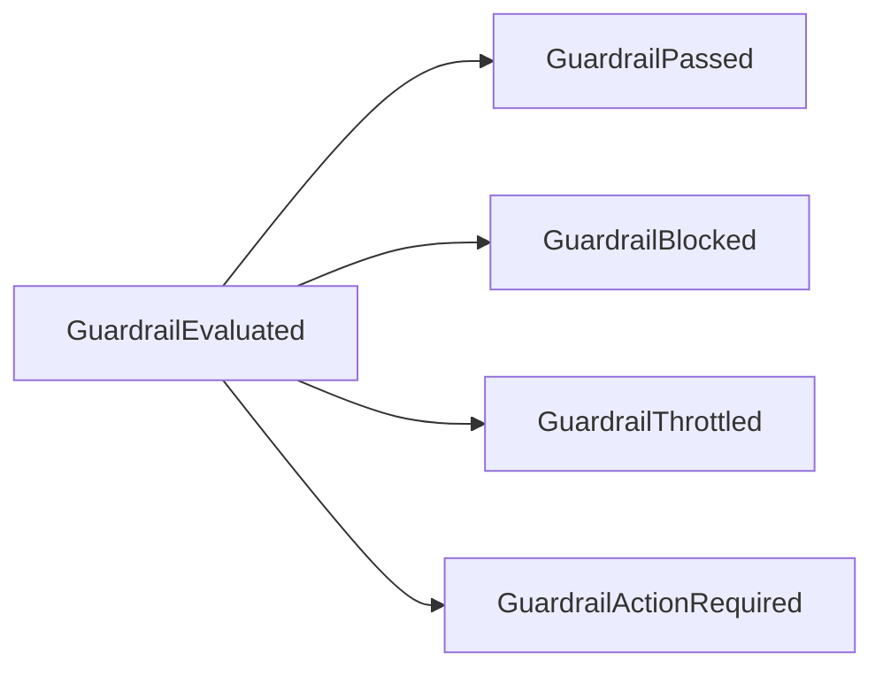
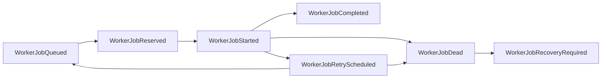
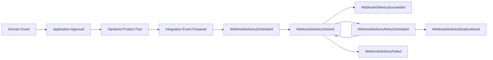

# OmniWA Event Lifecycle

## Purpose

This document defines business-level event lifecycles for Phase 2.3.

It does not redefine runtime state machines and does not design event bus, queue, Kafka, BullMQ, REST API, database, Prisma, repository, or service implementation.

## Event Lifecycle Principles

- Domain Events are created after aggregate invariants pass.
- Application decides publication timing and downstream transformation.
- Integration Events are prepared only by Webhook Delivery from approved and sanitized product facts.
- Event lifecycle must preserve observability without turning every event into an external contract.
- Event failure handling must not mutate original source facts unless Application invokes the owning aggregate through approved workflow.

## Generic Event Lifecycle

| Stage | Meaning | Owner | Rule |
| --- | --- | --- | --- |
| Fact Created | Aggregate root records a business fact. | Owning aggregate. | Only aggregate root creates Domain Event. |
| Captured By Application | Application receives event as part of aggregate outcome. | Application. | Domain does not publish directly. |
| Classified | Application classifies event as local, async, audit, health, observability, or integration candidate. | Application. | Classification must respect data sensitivity. |
| Sanitized | Sensitive values are removed or replaced with safe references. | Application / Observability / Audit / Webhook. | Secret never included; raw Confidential excluded. |
| Routed | Event is routed to approved consumer path. | Application. | No bypass of guardrails or ownership. |
| Projected Or Delivered | Event contributes to projection, async job, audit, health, telemetry, or external delivery. | Consumer context. | Consumer owns its own lifecycle only. |
| Archived Or Expired | Event is no longer needed for business visibility or retention. | Owning retention policy. | Retention rules are product-level; storage mechanics deferred. |

## Instance Event Lifecycle

Business rules:

- InstanceDestroyed is terminal.
- InstanceConnected requires translated provider/session readiness.
- InstanceDisconnected does not imply InstanceLoggedOut.

## Session Event Lifecycle

Business rules:

- Session material is Secret in every lifecycle event and is never included.
- SessionActivated and SessionRevoked cannot both represent the current session state.

## Message Event Lifecycle

Business rules:

- MessageAccepted requires prior GuardrailPassed for outbound work.
- MessageQueued means accepted async work is visible.
- MessageDelivered and MessageRead depend on translated provider status and are not delivery guarantees beyond available status.
- Message body is not retained by default.

## Media Event Lifecycle

Business rules:

- Media events contain metadata and safe references, not binary payloads.
- DiagnosticCaptureRequested requires explicit bounded policy.

## Webhook Event Lifecycle

Business rules:

- WebhookSubscription must be valid before WebhookDeliveryScheduled.
- WebhookDeliverySucceeded is terminal.
- WebhookDeliveryDeadLettered is operator-visible.
- Webhook delivery outcome does not mutate original business fact.

## Guardrail Event Lifecycle

Business rules:

- Exactly one final outcome should apply to one GuardrailDecision.
- Blocked, throttled, and action-required outcomes must be visible.

## Worker Job Event Lifecycle

Business rules:

- WorkerJobCompleted means job lifecycle success, not necessarily business outcome success.
- WorkerJobDead is terminal for the lineage unless explicit recovery creates new work.

## Configuration, Audit, Health, Telemetry Lifecycle

| Area | Normal Event Flow | Business Rule |
| --- | --- | --- |
| Configuration | ConfigurationValidated -> ConfigurationActivated -> ConfigurationSuperseded. Rejection path: ConfigurationRejected or ConfigurationGuardrailBypassRejected. | Invalid or unsafe configuration cannot become active. |
| Audit | AuditRecordRequested -> AuditRedactionApplied -> AuditRecorded -> AuditRetentionExpired. | No Secret or raw Confidential data. |
| Health | HealthStatusChanged -> HealthDegraded/HealthActionRequired -> HealthRecovered. | Health is projection and cannot mutate source business state. |
| Telemetry | TelemetryCaptured -> TelemetrySanitized -> TelemetryProjected, or TelemetryCaptured -> TelemetryDropped. | Telemetry is not source of business truth. |

## Integration Event Lifecycle

Integration rules:

- Integration Event lifecycle is owned by Webhook Delivery.
- Integration Event preparation does not change source aggregate facts.
- External delivery is asynchronous and retry-visible.
