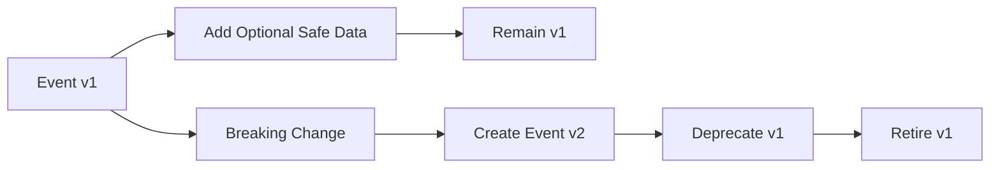

# OmniWA Event Versioning

## Purpose

This document defines versioning rules for OmniWA events.

It does not define schemas, JSON payloads, event registry implementation, code generation, event bus implementation, Kafka, BullMQ, REST APIs, database, or Prisma.

## Versioning Principles

- Event version belongs to event contract, not implementation format.
- v1 is the first approved contract for an event.
- Versioning applies most strictly to Integration Events because external consumers depend on them.
- Domain Event versioning protects internal product language and future refactoring.
- Infrastructure Event versions are adapter-private and not product contracts.
- Breaking changes require a new version.
- Non-breaking additions may remain in the same version when consumers can safely ignore them.

## Version Labels

| Version Label | Meaning | Use |
| --- | --- | --- |
| v1 | First approved event contract. | All Phase 2.3 events start here when implemented. |
| v2 | New contract version after breaking change. | Required when old consumers cannot safely process changed meaning. |
| Deprecated | Version still accepted/emitted for compatibility but should not be used for new consumers. | Migration window. |
| Retired | Version is no longer emitted or accepted. | After approved deprecation process. |

## Breaking Changes

| Change Type | Breaking? | Required Action |
| --- | --- | --- |
| Rename event. | Yes. | Create new version or new event name with migration note. |
| Change business meaning. | Yes. | New version and governance review. |
| Remove required data. | Yes. | New version. |
| Change data classification to more sensitive. | Yes. | New version and security review. |
| Change ordering guarantee. | Yes. | New version or explicit contract deprecation. |
| Change idempotency semantics. | Yes. | New version. |
| Promote internal event to external Integration Event. | Yes for external contract. | Governance review and Integration Event v1. |
| Add optional safe data. | No if consumers can ignore it. | Update docs; keep version. |
| Add new event that does not replace old one. | No for existing event. | New event starts at v1. |
| Clarify wording without semantic change. | No. | Documentation update. |

## Non-Breaking Changes

Allowed without a new version:

- Add optional safe metadata.
- Add optional safe reason category.
- Add optional correlation reference.
- Clarify documentation.
- Add a new consumer that respects existing contract.
- Add internal projection from existing Domain Event.

Not allowed without review:

- Adding raw Confidential data.
- Adding Secret references that can expose Secret values.
- Adding provider-native payload names.
- Adding external Integration Event exposure for a previously internal-only event.

## Compatibility Rules

| Rule | Description |
| --- | --- |
| Backward compatible first. | Existing consumers must continue to process old version during migration. |
| Versioned Integration Event names. | External event names include version suffix, such as `message.delivered.v1`. |
| Domain Event version in contract. | Domain event version is conceptual and can be carried by future implementation. |
| Consumer tolerance. | Consumers must ignore unknown optional data and rely on documented required data. |
| Producer restraint. | Producers must not change meaning without version bump. |
| Sensitive data review. | Any event contract change touching Secret/Confidential handling requires security review. |

## Versioning By Category

| Category | Versioning Rule |
| --- | --- |
| Domain Event | Version when business meaning, required data, ordering, or idempotency changes. |
| Application Event | Version if workflow meaning or required work identity changes. |
| Infrastructure Event | Adapter-private; translated product events must preserve product contract. |
| Integration Event | Public versioned contract; breaking changes require new version and deprecation plan. |

## Deprecation Process

1. Identify event version and affected consumers.
2. Document reason for deprecation.
3. Define replacement event/version if needed.
4. Define compatibility period.
5. Emit old and new version in approved migration window where feasible.
6. Monitor consumer migration and delivery success.
7. Retire old version only after approved review.

## Version Governance Table

| Scenario | Version Decision | Rationale |
| --- | --- | --- |
| Add `failureCategory` to MessageFailed as optional safe value. | Same version if optional. | Consumers can ignore. |
| Change MessageDelivered to mean "provider send accepted" instead of delivered. | New version and likely new event name. | Business meaning changed. |
| Expose ConfigurationActivated externally. | New Integration Event v1 plus governance review. | External contract newly created. |
| Add Telegram-specific provider status to MessageDelivered. | Not allowed in current event. | Would leak provider/channel semantics unless product decision approves language. |
| Add TenantId to Integration Events after multi-tenant decision. | Likely v2. | Required data and ownership boundary change. |

## Versioning Diagram

