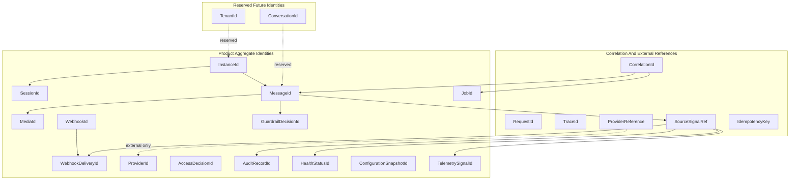

# OmniWA Identity Model

## Purpose

This document defines OmniWA's tactical identity strategy for Phase 2.2.

It does not define ID data types, database keys, schemas, ORM models, API parameters, or generation implementation.

## Identity Strategy

- Product identities are opaque.
- Product identities are stable for the lifetime of the aggregate/entity they identify.
- Product identities must not encode phone numbers, JIDs, message content, media content, provider-native IDs, secrets, tenant details, or deployment details.
- Provider-native identifiers may be stored only as external references after translation.
- Correlation identities are not aggregate identities.
- MVP is Single Tenant; TenantId is reserved for future product decisions and must not introduce multi-tenant behavior now.

## Aggregate Identities

| Identity | Owns | Scope | Strategy | Notes |
| --- | --- | --- | --- | --- |
| InstanceId | Instance | One product instance. | Opaque product identity. | Primary product unit for Single Tenant + Multi Instance. |
| SessionId | Session | One product session lifecycle for one instance. | Opaque product identity linked to InstanceId. | Does not expose session material. |
| MessageId | Message | One product message. | Opaque product identity independent of provider message ID. | Applies to inbound and outbound product messages. |
| MediaId | MediaAsset | One media metadata/processing lifecycle. | Opaque product identity independent of content hash. | Avoid deriving from binary content. |
| WebhookId | WebhookSubscription | One webhook subscription. | Opaque product identity independent of URL/secret. | Subscription identity, not delivery identity. |
| WebhookDeliveryId | WebhookDelivery | One delivery lifecycle for one integration signal. | Opaque product identity. | May reference WebhookId and SourceSignalRef. |
| GuardrailDecisionId | GuardrailDecision | One responsible-usage evaluation. | Opaque product identity. | Linked to evaluated intent snapshot. |
| ProviderId | ProviderProfile | One provider profile. | Opaque product identity for provider capability profile. | Not provider runtime/socket identity. |
| JobId | WorkerJob | One async job lineage. | Opaque product identity independent of queue engine. | Queue engine identifiers are external references only. |
| AccessDecisionId | AccessDecision | One access decision. | Opaque product identity. | Decision-scoped, not user identity. |
| AuditRecordId | AuditRecord | One audit record. | Opaque product identity. | Must not reveal sensitive action details. |
| HealthStatusId | HealthStatus | One health subject classification. | Opaque product identity. | Health subject may refer to another aggregate by identity. |
| ConfigurationSnapshotId | ConfigurationSnapshot | One effective configuration snapshot. | Opaque product identity. | Does not reveal secret values. |
| TelemetrySignalId | TelemetrySignal | One sanitized telemetry signal/projection. | Opaque product identity. | Must not encode payload. |

## Supporting Identities

| Identity | Purpose | Scope | Notes |
| --- | --- | --- | --- |
| CorrelationId | Connects related work across boundaries. | One workflow or operation chain. | Not an aggregate identity. |
| RequestId | Identifies one inbound boundary request. | One request at interface boundary. | Not a domain aggregate identity. |
| TraceId | Connects runtime traces. | One trace. | Must not reveal business payload. |
| ConversationId | Future conversation grouping/projection identity. | Future Messaging concept. | Reserved; does not create MVP Conversation aggregate. |
| TenantId | Future product ownership identity. | Future tenant boundary. | Reserved; MVP remains implicit single tenant. |
| ProviderReference | Safe external provider reference. | One provider-side observation/reference. | Not source of truth and not product identity. |
| SourceSignalRef | Safe reference to a product signal consumed by Webhook/Audit/Health/Telemetry. | One source signal. | Must not include raw payload. |
| IdempotencyKey | Duplicate-prevention value for accepted work/delivery. | One intended idempotency scope. | Not aggregate identity. |

## Identity Ownership

| Identity | Owning Context | Non-Owner Rule |
| --- | --- | --- |
| InstanceId | Instance | Other contexts may reference it but cannot derive meaning from its format. |
| SessionId | Session | Messaging cannot use it to mutate session state. |
| MessageId | Messaging | Webhook, Audit, Health, and Observability may reference it only as source reference. |
| MediaId | Media | Message may reference it but cannot change media lifecycle. |
| WebhookId | Webhook Delivery | External receiver does not own subscription identity. |
| WebhookDeliveryId | Webhook Delivery | Source aggregate does not own delivery lifecycle. |
| GuardrailDecisionId | Guardrails | Message may require it before acceptance but does not own decision meaning. |
| ProviderId | Provider Integration | Product contexts do not use provider profile identity to bypass ACL. |
| JobId | Operations | Owner context interprets job result but does not own job lifecycle. |
| AccessDecisionId | Security and Access | Product contexts may require it before privileged mutation. |
| AuditRecordId | Audit | Source contexts do not control audit retention. |
| HealthStatusId | Health | Source contexts do not let Health mutate business state. |
| ConfigurationSnapshotId | Configuration | Product contexts consume validated values but own business meaning. |
| TelemetrySignalId | Observability | Telemetry identity is never business identity. |

## Reference Rules

- Aggregate references to other aggregates use identity values, not object references.
- ProviderReference is an external reference and must not replace MessageId, SessionId, InstanceId, or MediaId.
- JID and PhoneNumber are Confidential value objects and must not be aggregate identities.
- URL, secret reference, media metadata, and message content must not be used as identity.
- Future TenantId must be added explicitly by product decision and ADR; it must not appear as hidden MVP behavior.

## Identity Diagram

## Identity Validation Checklist

| Rule | Status |
| --- | --- |
| Product IDs are opaque | PASS |
| Provider IDs are external references only | PASS |
| JID/PhoneNumber are not aggregate identities | PASS |
| Correlation IDs are not aggregate identities | PASS |
| TenantId remains future/reserved | PASS |
| No identity strategy depends on database/API implementation | PASS |
