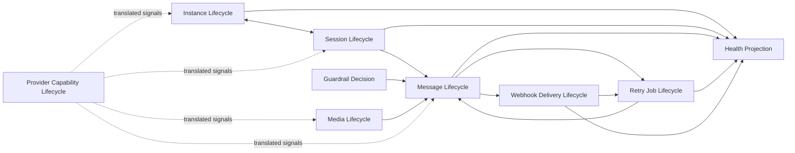

# OmniWA Lifecycle Rules

## Purpose

This document defines business lifecycle rules for Phase 2.2 tactical domain design.

It does not redefine Phase 1 state machines and does not design implementation, database schema, APIs, workers, providers, or services.

## Lifecycle Principles

- Lifecycle state exists because it affects business behavior, reliability, observability, or operator action.
- Provider-native lifecycle signals must be translated before they influence domain lifecycle.
- Accepted async work must be visible throughout its lifecycle.
- Terminal states must be explicit.
- Lifecycle transitions may create domain facts, but Application controls publication timing.

## Instance Business Lifecycle

| Stage | Business Meaning | Required Rule |
| --- | --- | --- |
| Created | Instance exists as product resource but is not send-capable. | Can be connected, paired, or destroyed. |
| Pairing / Connecting | OmniWA is attempting to establish usable provider/session readiness. | Must not expose provider-native details; action-required state must be visible when user action is needed. |
| Connected | Instance is ready for supported workflows according to translated provider/session state. | Does not guarantee upstream delivery; requires active/recoverable session and provider readiness. |
| Disconnected | Instance is not ready but may be recoverable. | Must not be treated as logged out unless session/provider signal confirms it. |
| Logged Out / Action Required | Instance cannot resume normal messaging without operator action. | Messaging must not treat instance as send-capable. |
| Destroyed | Instance identity lifecycle is ended. | Terminal. |

## Session Business Lifecycle

| Stage | Business Meaning | Required Rule |
| --- | --- | --- |
| Empty | No usable session material exists. | Not send-capable. |
| Pending | Pairing or restoration is in progress. | Session material remains Secret; timeout/failure must be visible. |
| Active | Product session is usable by provider runtime. | Cannot also be Revoked. |
| Expired | Session cannot be restored automatically or is no longer valid. | Requires recovery or new pairing. |
| Revoked | Session is invalidated by logout, unlink, policy, or provider/account signal. | Stronger than expired and usually action-required. |
| Cleanup | Session is removed under retention/deletion policy. | Must protect Secret data and audit sensitive actions. |

## Message Business Lifecycle

| Stage | Business Meaning | Required Rule |
| --- | --- | --- |
| Intent / Created | Outbound intent or inbound translated signal has entered product language. | Must be classified by direction and supported type. |
| Evaluated | Message intent has passed validation and guardrail evaluation or has been rejected. | Guardrails must run before outbound acceptance. |
| Accepted / Queued | Work is accepted for async processing. | Must have visible lifecycle and must not imply provider delivery. |
| Processing | OmniWA is attempting provider operation or inbound classification through Application. | Provider payloads must already be translated. |
| Provider-Acknowledged | Provider accepted send or reported status. | Must become product delivery status, not provider-native enum. |
| Delivered / Read Visibility | Provider reports delivery/read where available. | Does not create an OmniWA guarantee beyond translated signal. |
| Failed / Cancelled | Message cannot proceed or is intentionally stopped. | Must include safe failure category where possible. |

## Webhook Business Lifecycle

| Stage | Business Meaning | Required Rule |
| --- | --- | --- |
| Subscription Proposed | Webhook integration intent exists but is not necessarily valid. | Must not schedule delivery until valid. |
| Subscription Active | Approved product signals may be delivered to receiver. | Secret values remain behind secret boundary. |
| Delivery Scheduled | Approved integration signal has delivery work. | Delivery must be async and observable. |
| Delivery Attempted | A delivery attempt is in progress or completed. | Attempt result cannot mutate source business state. |
| Retry Visible | Delivery failed but may be retried. | Retry budget must be bounded. |
| Delivered | Receiver acknowledged delivery under future transport rules. | Terminal. |
| Failed / Dead Letter | Delivery cannot continue automatically. | Must be operator-visible. |

## Media Business Lifecycle

| Stage | Business Meaning | Required Rule |
| --- | --- | --- |
| Received / Referenced | Media metadata or reference enters product workflow. | Raw provider media payload must not become domain input. |
| Classified | Media category is identified. | Only image, video, document, and audio are supported for MVP. |
| Accepted | Media can participate in supported message workflow. | Retention decision must exist. |
| Processing | Media is prepared or translated for provider workflow. | Binary data must remain outside default retention. |
| Processed / Attached | Media metadata is ready for message workflow. | Message owns message lifecycle; Media owns metadata/processing lifecycle. |
| Failed | Media cannot proceed. | Failure category must be safe and visible. |
| Cleaned | Temporary content is removed according to retention policy. | Binary not retained by default. |

## Provider Business Lifecycle

| Stage | Business Meaning | Required Rule |
| --- | --- | --- |
| Candidate | Provider capability is being evaluated. | Cannot affect product scope. |
| Supported | Provider can satisfy product contracts for approved capabilities. | Product contexts still depend on provider ports/ACL, not provider-native payloads. |
| Degraded | Provider capability or compatibility is risky or partially unavailable. | Must be visible through health/failure classification. |
| Unsupported | Provider cannot satisfy current product contract. | Product behavior must not silently fall back to unsupported semantics. |
| Retired | Provider profile is no longer active. | Future use requires new validation/ADR where needed. |

## Retry Job Business Lifecycle

| Stage | Business Meaning | Required Rule |
| --- | --- | --- |
| Queued | Accepted work is waiting for execution. | Must be visible. |
| Reserved | Worker/runtime has claimed work. | Must not be reserved by two workers simultaneously. |
| Running | Work is executing through Application-owned behavior. | Worker must not call Interface and must not bypass owner aggregate. |
| Completed | Work finished from job perspective. | Owner context interprets business outcome. |
| Retrying | Failure is recoverable under retry policy. | Retry policy must be bounded. |
| Dead | Retry exhausted or non-retryable failure. | Terminal for lineage unless recovery creates new work. |

## Lifecycle Coupling Rules

| Coupling | Rule |
| --- | --- |
| Instance and Session | Session activation/revocation affects instance readiness, but Session remains owner of session state. |
| Message and GuardrailDecision | Message acceptance requires a guardrail outcome, but GuardrailDecision does not own message lifecycle. |
| Message and MediaAsset | Media-bearing message references MediaAsset readiness; MediaAsset does not own message status. |
| Message and WebhookDelivery | Message facts may lead to webhook deliveries; webhook outcome does not change message state. |
| WorkerJob and Owner Aggregate | WorkerJob tracks async execution; owner aggregate interprets business result. |
| ProviderProfile and Product Aggregates | ProviderProfile supplies capability/failure language; it does not mutate business state. |

## Lifecycle Diagram

