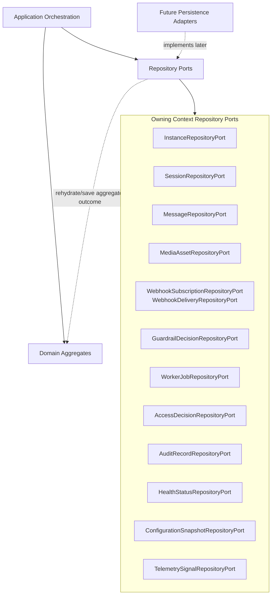

# OmniWA Repository Ports

## Purpose

This document defines repository ports for OmniWA aggregates at domain-contract level.

It does not define TypeScript interfaces, repository implementations, database schema, ORM models, SQL, indexes, transactions, migrations, REST APIs, queue mechanics, or source code.

## Repository Port Rules

- A repository port expresses how an aggregate can be rehydrated, persisted, and checked for owner-context consistency.
- A repository port is named by product language, not by storage technology.
- Repository ports must not expose database concepts, provider-native payloads, queue-engine identifiers, or transport details.
- Aggregate roots remain the only mutation entry point for aggregate-owned state.
- Application orchestration controls when repositories are used, how cross-aggregate preconditions are sequenced, and how transaction mechanics are implemented later.
- Domain services and policies must not use repositories to perform workflow orchestration.
- A context may use only its own repository contract directly. Cross-context state must be requested through Application orchestration, published language, safe snapshots, or approved ports.
- Repository results must respect data classification. Secret values and raw Confidential payloads must not be returned to general domain workflows.

## Persistence Need Classification

| Aggregate | Repository Need | Reason |
| --- | --- | --- |
| Instance | Required | Instance lifecycle, action-required state, and current safe session reference must survive runtime restarts. |
| Session | Required | Session lifecycle and recovery state must be explicit and recoverable, while Secret material remains behind secret boundaries. |
| Message | Required | Message acceptance, delivery visibility, failures, and idempotency must not disappear. |
| MediaAsset | Required | Media metadata, retention decision, processing state, and cleanup state must be recoverable without default binary retention. |
| WebhookSubscription | Required | Delivery cannot be scheduled unless subscription validity and lifecycle are known. |
| WebhookDelivery | Required | Retry, dead-letter, and delivered terminal states must be visible and recoverable. |
| GuardrailDecision | Required | Message acceptance depends on explicit guardrail outcomes and audit-visible blocked/throttled states. |
| ProviderProfile | Required for compatibility state | Provider capability and failure vocabulary must be stable enough for translated signals and health classification. |
| WorkerJob | Required | Accepted async work must have visible lifecycle and terminal classification. |
| AccessDecision | Required for privileged actions | Privileged mutation requires explicit access evidence and expiry semantics. |
| AuditRecord | Required | Audit evidence and retention categories must be recoverable and Secret-safe. |
| HealthStatus | Required as projection state | Operators need current product/dependency health classification, while source aggregates remain source of truth. |
| ConfigurationSnapshot | Required | Active configuration and guardrail-bypass rejection decisions must be recoverable. |
| TelemetrySignal | Conditional but constrained | Sanitized telemetry may be projected or persisted later; if persisted, it must use this safe contract and never become business truth. |

## Repository Port Catalog

| Repository Port | Purpose | Aggregate Root | Allowed Operations | Forbidden Operations | Consistency Expectation | Transaction Boundary | Query Limitations |
| --- | --- | --- | --- | --- | --- | --- | --- |
| InstanceRepositoryPort | Rehydrate and persist one Instance lifecycle and safe readiness summary. | Instance | Load by InstanceId; save one Instance aggregate outcome; check existence by InstanceId; find non-terminal instances for owner-context recovery; read current safe session reference. | Mutate Session state; read Session Secret material; infer provider connection from raw provider state; report analytics; expose phone/JID as identity. | Strong for one Instance aggregate; cross-aggregate session readiness is Application-coordinated. | One Instance lifecycle change. | Not a dashboard/reporting query surface; no provider-native connection search; no raw Confidential values. |
| SessionRepositoryPort | Rehydrate and persist one Session lifecycle, availability, recovery marker, and retention classification. | Session | Load by SessionId; save one Session outcome; find current session references for one Instance; find sessions requiring recovery or cleanup by owner context; check active-session candidate under Application coordination. | Return Secret session material to domain; mutate Instance state; decide send eligibility for Messaging; expose provider-native session payload; bypass backup/retention policy. | Strong for one Session; one-active-session rule is enforced through Session plus Instance precondition coordination. | One Session lifecycle or retention change. | Queries scoped by SessionId or InstanceId only; no raw session payload, token, QR, or credential search. |
| MessageRepositoryPort | Rehydrate and persist one Message lifecycle and safe delivery visibility. | Message | Load by MessageId; save one Message outcome; check idempotency for outbound intent; find accepted/queued/processing messages by owner context for recovery; read safe delivery state. | Store message body by default; perform campaign/broadcast/audience queries; update from provider-native status; mutate Media, Session, Guardrail, or WorkerJob state; guarantee WhatsApp delivery. | Strong for one Message; provider status and webhook/audit/health projections are eventual. | One Message classification or state transition. | No full-text body search; no marketing segmentation; no raw JID/phone body exposure; query only by identity, idempotency key, safe lifecycle state, or correlation. |
| MediaAssetRepositoryPort | Rehydrate and persist one MediaAsset metadata, processing, and retention decision. | MediaAsset | Load by MediaId; save one MediaAsset outcome; find media needing processing or cleanup; check supported media category and retention state; read safe metadata summary. | Store raw binary as default domain state; expose provider media payload; change Message lifecycle; query by binary content; retain diagnostic capture beyond bounded policy. | Strong for one MediaAsset; Message attachment/readiness is Application-coordinated. | One MediaAsset state or retention change. | Metadata-only by default; no binary retrieval; no raw payload search; diagnostic queries require explicit safe policy context. |
| WebhookSubscriptionRepositoryPort | Rehydrate and persist one WebhookSubscription lifecycle and signal selection. | WebhookSubscription | Load by WebhookId; save one subscription outcome; find active subscriptions for approved signal selection; verify active/valid status before delivery scheduling. | Expose webhook secret value; send webhooks; mutate WebhookDelivery; accept invalid destination as active; query by raw secret or unsafe URL fragment. | Strong for one WebhookSubscription; delivery scheduling precondition is Application-coordinated. | One subscription validation or lifecycle change. | Queries limited to subscription identity, active status, safe signal selection, and owner-approved lookup; not a transport implementation. |
| WebhookDeliveryRepositoryPort | Rehydrate and persist one WebhookDelivery lifecycle, retry state, and dead-letter state. | WebhookDelivery | Load by WebhookDeliveryId; save one delivery outcome; find pending/retrying/dead-letter deliveries; enforce idempotency for source signal plus subscription; read attempt summary. | Send HTTP requests; mutate source Message/Instance/Session state; store raw webhook payload in normal records; retry after Delivered; hide dead-letter state. | Strong for one WebhookDelivery; source product fact and health/audit projections are eventual. | One WebhookDelivery state transition. | Query by delivery identity, subscription reference, source signal reference, safe lifecycle state, or idempotency key only. |
| GuardrailDecisionRepositoryPort | Rehydrate and persist one GuardrailDecision outcome and visibility state. | GuardrailDecision | Load by GuardrailDecisionId; save one decision outcome; find active decision for an evaluated intent; check idempotent evaluation for one intent; read safe reason/outcome. | Disable mandatory guardrails; mutate Message state; expose message body, raw JID, or phone; act as legal compliance engine; store provider-native policy data. | Strong for one GuardrailDecision; Message acceptance uses outcome as synchronous precondition. | One guardrail evaluation outcome. | Query by decision identity, evaluated intent reference, safe actor/context reference, and bounded rate-limit window only. |
| ProviderProfileRepositoryPort | Rehydrate and persist product-level provider capability, compatibility, and failure vocabulary. | ProviderProfile | Load by ProviderId; save provider profile outcome; find active supported/degraded profile; read capability classification for approved MVP features; read safe failure classification vocabulary. | Store provider runtime socket/session object; expand product scope; own business policy; expose provider-native payload; mutate Instance, Session, Message, or Media state. | Strong for one ProviderProfile; product contexts consume translated classifications eventually or through Application preconditions. | One ProviderProfile compatibility or classification update. | Query by product ProviderId, capability category, compatibility status, or safe failure category only. |
| WorkerJobRepositoryPort | Rehydrate and persist one WorkerJob lineage and visible async lifecycle. | WorkerJob | Load by JobId; save one WorkerJob outcome; find queued/reserved/running/retrying/dead jobs by owner context; check idempotency for work request; read retry/dead-letter summary. | Execute work; call Interface/API; decide owner aggregate business outcome; expose queue-engine internals as domain state; run two active reservations for one lineage. | Strong for one WorkerJob; owner aggregate interpretation is Application-coordinated and may be eventual. | One WorkerJob lifecycle transition. | Query by JobId, owner context reference, job type, lifecycle status, and idempotency key; not a queue-engine query API. |
| AccessDecisionRepositoryPort | Rehydrate and persist one AccessDecision outcome and expiry. | AccessDecision | Load by AccessDecisionId; save one access outcome; find unexpired decision by actor/capability/target reference; read privileged/audit marker. | Authenticate actor; store secret credentials; mutate target aggregate; grant access by default; expose raw identity-provider token. | Strong for one AccessDecision; target mutation must have granted decision as precondition. | One AccessDecision outcome or expiry. | Query only by safe actor reference, capability, target context reference, and expiry scope; no identity-provider implementation detail. |
| AuditRecordRepositoryPort | Rehydrate and persist Secret-safe audit evidence and retention state. | AuditRecord | Load by AuditRecordId; save one audit record outcome; find records by safe source signal reference, audit category, retention category, or expiry eligibility; read redaction marker. | Store Secret values; store raw Confidential payloads; serve as telemetry dump; mutate source business state; expose full message/media/webhook payload. | Strong for one AuditRecord; source product facts are source of truth. | One AuditRecord creation, redaction, or retention change. | Query limited to safe metadata, category, source references, and retention state; no raw evidence search. |
| HealthStatusRepositoryPort | Rehydrate and persist current HealthStatus classification for one health subject. | HealthStatus | Load by HealthStatusId; save one HealthStatus outcome; find current status by health subject; find degraded/action-required subjects; read safe cause category. | Mutate source aggregate state; perform dependency probes; store raw logs; decide provider/account policy; trigger lifecycle changes by itself. | Strong for one HealthStatus projection; source facts remain eventually consistent inputs. | One HealthStatus classification change. | Projection-oriented queries only; no source aggregate internals; no raw dependency payload. |
| ConfigurationSnapshotRepositoryPort | Rehydrate and persist one ConfigurationSnapshot and active/superseded classification. | ConfigurationSnapshot | Load by ConfigurationSnapshotId; save one configuration outcome; find current active validated snapshot; find rejected guardrail-bypass snapshots for audit; check activation candidate. | Load environment variables or secret values directly; silently disable guardrails; mutate product aggregates; expose secret config; embed deployment mechanics. | Strong for one ConfigurationSnapshot; consuming contexts observe validated snapshot through Application coordination. | One configuration validation, activation, or superseding decision. | Query by snapshot identity, active status, safety classification, and safe setting category only. |
| TelemetrySignalRepositoryPort | Rehydrate or persist sanitized telemetry projection decisions when recoverable telemetry state is required. | TelemetrySignal | Load by TelemetrySignalId; save one TelemetrySignal outcome; find captured signals awaiting sanitization; read projection/drop decision; find unsafe-drop patterns by safe category. | Store Secret/raw Confidential values; become source of business truth; drive business mutation; expose log sink implementation; retain payloads beyond classification policy. | Strong for one TelemetrySignal redaction/projection decision; observability export is eventual. | One TelemetrySignal sanitization or projection decision. | Optional/projection queries only; no payload search; no source aggregate internals; no business decision queries. |

## Repository Port Diagram

## Repository Contract Constraints

| Constraint | Reason |
| --- | --- |
| Repository ports must return aggregate-owned state only. | Prevents hidden cross-context coupling and database-shaped aggregates. |
| Cross-aggregate preconditions must be explicit in Application orchestration. | Preserves small aggregate boundaries and Phase 1 transaction rules. |
| Query methods must not become reporting/search products. | Prevents scope creep into analytics, marketing, or dashboard implementation. |
| Repository ports must not expose raw provider identifiers as source of truth. | Preserves Provider Integration as anti-corruption layer. |
| Repository ports must not expose Secret or raw Confidential values. | Preserves Phase 0 data classification and ADR-010 logging strategy. |
| Repository ports must not publish events. | Domain creates facts; Application controls publication timing. |
| Repository ports must not implement retention, retry, or provider behavior. | Those decisions belong to owner aggregates, policies, and future infrastructure adapters. |

## Review Questions

| Question | Required Answer |
| --- | --- |
| Does the port name use product language? | Yes. |
| Does the port expose storage or ORM concepts? | No. |
| Does the port allow mutation of another context's aggregate? | No. |
| Does the port return raw payload, Secret, or provider-native data? | No. |
| Is the consistency boundary one aggregate unless Application coordinates otherwise? | Yes. |
| Can the port be implemented later by different persistence technologies without changing domain language? | Yes. |
