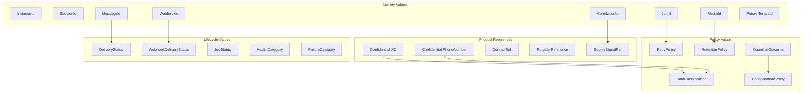

# OmniWA Value Objects

## Purpose

This document defines value objects for OmniWA Phase 2.2.

It defines meaning, validation, equality, and immutability only. It does not define code, fields, database columns, schemas, serializers, or framework types.

## Value Object Rules

- Value objects are immutable.
- Equality is based on value, not identity.
- Value objects have no side effects.
- Value objects do not call infrastructure, providers, queues, logs, telemetry, or persistence.
- Value objects must not contain provider-native payloads.
- Value objects that contain Secret or Confidential values must carry handling expectations.

## Identifier Value Objects

| Value Object | Meaning | Validation | Equality | Immutability |
| --- | --- | --- | --- | --- |
| InstanceId | Opaque product identity for an Instance aggregate. | Must be present, product-generated or product-accepted, and not derived from phone/JID/provider data. | Same opaque value. | Immutable for instance lifetime. |
| SessionId | Opaque identity for a Session aggregate. | Must be present and scoped to one Instance. | Same opaque value. | Immutable for session lifetime. |
| MessageId | Opaque identity for a Message aggregate. | Must be present and independent of provider-native message IDs. | Same opaque value. | Immutable for message lifetime. |
| MediaId | Opaque identity for a MediaAsset aggregate. | Must be present and not derived from media content. | Same opaque value. | Immutable for media asset lifetime. |
| WebhookId | Opaque identity for a WebhookSubscription aggregate. | Must be present and not derived from URL or secret. | Same opaque value. | Immutable for subscription lifetime. |
| WebhookDeliveryId | Opaque identity for a WebhookDelivery aggregate. | Must be present and unique for one delivery lifecycle. | Same opaque value. | Immutable for delivery lifetime. |
| GuardrailDecisionId | Opaque identity for a GuardrailDecision aggregate. | Must be present and associated with one evaluated intent. | Same opaque value. | Immutable for decision lifetime. |
| ProviderId | Product identity for a provider profile. | Must identify provider profile, not runtime socket or provider-native object. | Same opaque value. | Immutable for provider profile lifetime. |
| JobId | Opaque identity for a WorkerJob aggregate. | Must be present and not derived from queue-engine identifiers. | Same opaque value. | Immutable for job lineage. |
| AccessDecisionId | Opaque identity for one access decision. | Must be present and scoped to one decision. | Same opaque value. | Immutable for decision lifetime. |
| AuditRecordId | Opaque identity for one audit record. | Must be present and not reveal sensitive data. | Same opaque value. | Immutable for audit record lifetime. |
| HealthStatusId | Opaque identity for one health classification subject. | Must identify product/dependency health subject, not raw metric identity. | Same opaque value. | Immutable for health subject lifecycle. |
| ConfigurationSnapshotId | Opaque identity for one effective configuration snapshot. | Must be present and version-safe without exposing secrets. | Same opaque value. | Immutable for snapshot lifetime. |
| TelemetrySignalId | Opaque identity for one sanitized telemetry signal. | Must be present and not encode raw payload. | Same opaque value. | Immutable for telemetry signal lifecycle. |
| ConversationId | Future product identity for conversation grouping or projection. | Reserved; must not imply MVP conversation aggregate. | Same opaque value. | Immutable once introduced. |
| TenantId | Future product ownership identity. | Reserved; MVP uses implicit single tenant and must not introduce multi-tenant behavior. | Same opaque value. | Immutable once introduced. |
| CorrelationId | Workflow correlation value across boundaries. | Must be present where workflow tracing is required and must not encode sensitive data. | Same opaque value. | Immutable for a workflow. |
| RequestId | Boundary request correlation value. | Must be present at external entry where available and safe. | Same opaque value. | Immutable for one request. |
| TraceId | Runtime tracing correlation value. | Must not reveal business payload. | Same opaque value. | Immutable for trace lifetime. |

## Product Reference Value Objects

| Value Object | Meaning | Validation | Equality | Immutability |
| --- | --- | --- | --- | --- |
| JID | WhatsApp identifier handled as Confidential data. | Must be syntactically acceptable after provider translation; must not be logged raw. | Same normalized JID value under redaction policy. | Immutable once captured. |
| PhoneNumber | Phone number handled as Confidential data. | Must be normalized enough for product use and never used as aggregate identity. | Same normalized phone value. | Immutable value. |
| ContactRef | Product-safe reference to a contact. | Must avoid raw provider payload and respect Confidential handling. | Same contact reference value. | Immutable value. |
| ParticipantRef | Product-safe group participant reference for inbound observations only. | Must not introduce MVP group administration capability. | Same participant reference value. | Immutable value. |
| ProviderReference | Safe reference to a provider-side identifier. | Must be treated as external reference and not source of truth. | Same provider/kind/reference tuple. | Immutable once translated. |
| SourceSignalRef | Product reference to the source signal behind webhook delivery or audit evidence. | Must not include raw payload. | Same source context and signal identity. | Immutable value. |
| OwnerContextRef | Reference to the context that owns a job, audit record, health projection, or telemetry signal. | Must name a known bounded context. | Same context and target identity. | Immutable value. |

## Messaging Value Objects

| Value Object | Meaning | Validation | Equality | Immutability |
| --- | --- | --- | --- | --- |
| MessageType | Product message type. | Must be one of text, image, video, document, or audio for MVP. | Same type. | Immutable for message classification. |
| MessageDirection | Inbound or outbound product direction. | Must be explicit. | Same direction. | Immutable once message is classified. |
| DeliveryStatus | Product-level delivery visibility state. | Must follow Messaging lifecycle and not use provider-native enum directly. | Same status. | Changes by replacing value through Message root. |
| FailureCategory | Product-level business, validation, provider, webhook, network, configuration, queue, worker, media, session, security, or unexpected category. | Must be classified before crossing boundaries where possible. | Same category and safe reason code. | Immutable once attached to a failure observation. |
| MessageRetentionPolicy | Retention decision for message metadata/body handling. | Must enforce no default message body retention. | Same retention policy values. | Immutable for the decision instance. |
| IdempotencyKey | Product key for duplicate prevention of accepted work. | Must not be derived from raw content; must be stable for intended deduplication scope. | Same key value. | Immutable for scope. |

## Media Value Objects

| Value Object | Meaning | Validation | Equality | Immutability |
| --- | --- | --- | --- | --- |
| MediaCategory | Product media category. | Must be image, video, document, or audio for MVP. | Same category. | Immutable for media asset classification. |
| MediaMetadata | Safe metadata summary for media. | Must not include raw binary; must respect Confidential classification. | Same normalized metadata values. | Immutable once captured; updates create a new value. |
| MediaRetentionPolicy | Retention decision for media binary and metadata. | Must enforce no default binary retention and bounded diagnostic capture. | Same retention settings. | Immutable for the decision instance. |
| DiagnosticCapturePolicy | Explicit diagnostic capture permission and expiration. | Must be explicit, bounded, and auditable. | Same permission and expiry meaning. | Immutable for the decision instance. |

## Webhook Value Objects

| Value Object | Meaning | Validation | Equality | Immutability |
| --- | --- | --- | --- | --- |
| WebhookUrl | Destination URL for webhook subscription. | Must be a valid external destination under future transport policy; must not include secrets. | Same normalized destination. | Immutable until subscription is changed through root. |
| WebhookSecretRef | Safe reference to webhook secret. | Must not expose secret value. | Same secret reference. | Immutable for configured secret reference. |
| WebhookSignalSelection | Approved signal selection for subscription. | Must include only product-approved integration signals. | Same selected signal set. | Immutable for a subscription version. |
| WebhookDeliveryStatus | Product delivery state. | Must follow WebhookDelivery lifecycle. | Same status. | Changes by replacement through WebhookDelivery root. |
| RetryPolicy | Bounded retry policy for jobs or webhook delivery. | Must be finite, explicit, and compatible with dead-letter visibility. | Same retry limits and timing semantics. | Immutable once attached to work. |
| DeadLetterReason | Product reason for dead-letter state. | Must be safe, operator-readable, and not include raw payload. | Same reason code and safe context. | Immutable once dead-lettered. |

## Guardrail And Security Value Objects

| Value Object | Meaning | Validation | Equality | Immutability |
| --- | --- | --- | --- | --- |
| GuardrailOutcome | Allow, block, throttle, or action-required decision. | Must be explicit and non-empty. | Same outcome. | Immutable for one decision. |
| GuardrailReason | Safe reason for guardrail decision. | Must not include raw message body or sensitive identifiers. | Same reason code/context. | Immutable for one decision. |
| RateLimitWindowSpec | Product rate-limit window used during guardrail evaluation. | Must be finite and cannot disable mandatory guardrails. | Same window semantics. | Immutable value. |
| AbuseRiskLevel | Product risk classification. | Must be one of approved product risk levels and not provider-native. | Same risk level. | Immutable for one evaluation. |
| Capability | Product action an actor may request. | Must be a known product capability, not transport endpoint. | Same capability. | Immutable value. |
| AccessOutcome | Granted or denied decision. | Must be explicit. | Same outcome and reason. | Immutable for one access decision. |
| SecretClassification | Indicates Secret handling expectation. | Must mark API keys, webhook secrets, session material, tokens, and private keys as Secret. | Same classification. | Immutable once attached. |
| DataClassification | Public, Internal, Confidential, or Secret. | Must match frozen data classification. | Same classification. | Immutable value. |

## Operations, Audit, Health, Configuration, Observability Value Objects

| Value Object | Meaning | Validation | Equality | Immutability |
| --- | --- | --- | --- | --- |
| JobType | Product category of async work. | Must name approved work type without queue-engine detail. | Same job type. | Immutable for job lineage. |
| JobStatus | Product-visible job lifecycle state. | Must follow WorkerJob lifecycle. | Same status. | Replaced through WorkerJob root. |
| AttemptNumber | Ordinal attempt count for retries. | Must be positive and within retry policy. | Same number. | Immutable value. |
| AuditCategory | Category of auditable fact. | Must be approved and Secret-safe. | Same category. | Immutable value. |
| RetentionPolicy | Data retention rule for a category. | Must be bounded and comply with Phase 0 decisions. | Same retention semantics. | Immutable for the decision instance. |
| HealthCategory | Healthy, degraded, unavailable, action-required, recovered, or unknown. | Must distinguish product/dependency health where possible. | Same category. | Replaced through HealthStatus root. |
| DependencyCategory | OmniWA, provider/account, downstream receiver, data service, queue, secret provider, configuration, or observability dependency. | Must be product-level and not raw implementation type. | Same category. | Immutable value. |
| ConfigurationSafety | Valid, invalid, unsafe, or guardrail-bypass-rejected classification. | Must reject unsafe guardrail bypass. | Same safety classification. | Immutable for snapshot. |
| RedactionMarker | Indicates redaction applied or required. | Must be present for Confidential or Secret-adjacent facts. | Same marker. | Immutable value. |
| TelemetryCategory | Log, metric, trace, health, or audit-adjacent projection category. | Must be safe and not source of business truth. | Same category. | Immutable value. |

## Value Object Diagram

