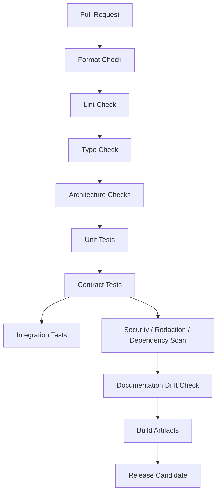

# OmniWA CI/CD Strategy

## Purpose

This document defines the CI/CD strategy for OmniWA implementation.

It does not create GitHub Actions, workflow files, scripts, package files, Docker files, deployment manifests, or release automation.

## CI/CD Principles

- CI validates frozen architecture boundaries.
- CI must fail fast on formatting, type, lint, dependency, test, and security problems.
- CI must not require real WhatsApp accounts or real provider credentials for normal pull requests.
- Secrets must never be printed in CI logs.
- Release automation must preserve SemVer and changelog discipline.
- Deployment automation must verify health, readiness, backup status, and rollback path before production use.

## Pipeline Overview

## Pull Request Pipeline

Required checks:

| Check | Purpose | Merge Impact |
|---|---|---|
| Format | Enforce consistent formatting. | Blocker |
| Lint | Detect unsafe code patterns and style violations. | Blocker |
| Type Check | Enforce TypeScript type safety. | Blocker |
| Architecture Check | Enforce dependency rules and fitness functions. | Blocker |
| Unit Tests | Verify Domain/Application and local package behavior. | Blocker |
| Contract Tests | Verify ports and API mapping contracts when affected. | Blocker when affected |
| Redaction Tests | Verify safe logging/telemetry/error/webhook behavior. | Blocker when affected |
| Docs Drift Check | Ensure changed behavior references frozen docs or updates allowed docs. | Blocker when affected |
| Dependency Review | Detect vulnerable or unapproved dependency changes. | Blocker for critical findings |

## Build Pipeline

Build pipeline should eventually:

- build each runtime app,
- build each package,
- verify app composition does not introduce forbidden dependencies,
- verify production packages do not import test-only packages,
- verify build artifacts do not include secrets,
- generate a build manifest for release review.

No build pipeline file is created in Phase 7.

## Test Pipeline

Test pipeline stages:

| Stage | Runs On | Notes |
|---|---|---|
| Domain tests | Every PR | Fast, no infrastructure. |
| Application tests | Every PR | Uses fake ports. |
| Architecture tests | Every PR | Must always run. |
| API contract tests | API/interface changes | No real provider dependency. |
| Repository contract tests | Persistence changes | Use controlled test storage when implementation exists. |
| Queue/worker tests | Async changes | Must verify retry/dead-letter and idempotency. |
| Provider adapter tests | Provider changes | Use fake/simulated provider by default. |
| E2E smoke tests | Main/release candidate | Controlled environment only. |
| Performance tests | Scheduled/release candidate | Not required for every PR. |

## Security Pipeline

Security checks should include:

- dependency vulnerability scanning,
- license compatibility scanning,
- secret scanning,
- generated artifact secret scanning,
- redaction regression tests,
- no raw Confidential/Secret fixture leakage in logs,
- API/auth boundary tests,
- webhook signing/replay tests when implemented,
- session material handling tests.

Critical security failures block merge.

## Documentation Validation

Documentation checks should verify:

- new implementation modules trace to approved docs,
- ADR is present for boundary exceptions,
- changed public behavior updates docs,
- freeze documents are not modified without explicit review,
- README remains an accurate project portal,
- engineering docs remain consistent with Phase 7 freeze.

## Release Pipeline

Release pipeline should eventually:

1. Validate `main` is green.
2. Run full test suite.
3. Run architecture and security gates.
4. Build runtime artifacts.
5. Generate changelog candidate.
6. Tag release candidate.
7. Run smoke tests in a controlled environment.
8. Validate backup/restore readiness for production release.
9. Publish release notes.

No release automation is created in Phase 7.

## Deployment Controls

Deployment pipeline must eventually check:

- configuration validation,
- required secrets present without logging values,
- database migration review gates when persistence implementation begins,
- health/readiness gates,
- backup status before risky changes,
- rollback plan,
- post-deploy smoke checks,
- action-required states after deploy.

## Branch Policy

| Branch | Purpose |
|---|---|
| `main` | Latest accepted project state. Must stay releasable once implementation starts. |
| short-lived feature branches | Focused implementation work. |
| release branches | Introduced when public releases require stabilization. |
| hotfix branches | Urgent fixes from release branch or `main` depending on release model. |

## CI/CD Constraints

- CI/CD must not rely on real WhatsApp credentials for ordinary PR checks.
- CI/CD must not print secrets.
- CI/CD must not hide architecture violations behind optional checks.
- CI/CD must not allow direct API-to-infrastructure or Application-to-concrete-adapter dependencies.
- CI/CD must not publish artifacts from a failing test/security/architecture state.

## Checklist

| Item | Status |
|---|---|
| Build pipeline strategy defined | PASS |
| Test pipeline strategy defined | PASS |
| Lint/type/format gates defined | PASS |
| Security scan strategy defined | PASS |
| Documentation validation defined | PASS |
| Release pipeline strategy defined | PASS |
| Deployment controls defined | PASS |

**CI/CD strategy is ready.**
