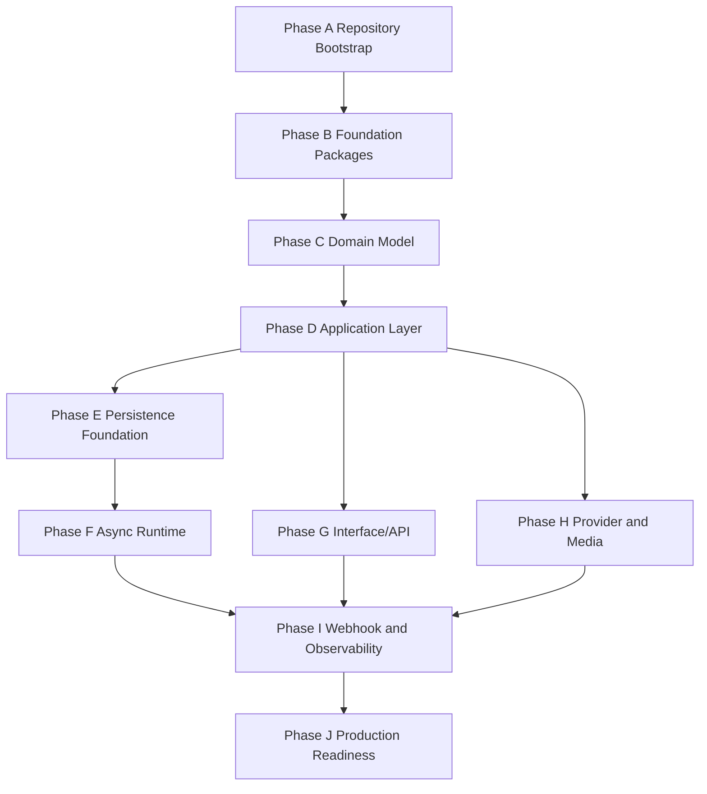

# OmniWA Implementation Roadmap

## Purpose

This document defines the engineering roadmap for turning frozen design into implementation.

It does not create source code, package manager files, Docker files, GitHub Actions, Prisma schema, REST API handlers, or Baileys integration.

## Roadmap Principles

- Build foundations before product flows.
- Prove dependency boundaries before integrating external systems.
- Implement Domain before Application orchestration.
- Implement Application ports and fakes before Infrastructure adapters.
- Make accepted async work durable and visible before broad messaging/webhook feature work.
- Build observability and redaction alongside the first workflow, not after.
- Keep each implementation increment traceable to approved docs.

## Roadmap Overview

| Phase | Theme | Primary Outcome |
|---|---|---|
| A | Repository Bootstrap | Source structure, workspace conventions, architecture gates, CI gate design. |
| B | Foundation Packages | Shared primitives, errors, config, logging, correlation, Clock, UUID, test foundations. |
| C | Domain Model | Frozen aggregates, value objects, policies, specifications, factories, domain errors, event facts. |
| D | Application Layer | Commands, queries, workflows, application services, ports, idempotency, transaction boundaries. |
| E | Persistence Foundation | Repository implementations, persistence mappings, projections, retention markers, recovery state. |
| F | Async Runtime | WorkerJob lifecycle, QueueProvider adapter, retry/dead-letter, scheduler signals, job recovery. |
| G | Interface/API | API adapter mapping, auth boundary, authorization invocation, response/error/async contracts. |
| H | Provider and Media | Baileys provider adapter behind ports, media artifact flow, translated provider signals. |
| I | Webhook and Observability | Webhook dispatcher, signing boundary, retry visibility, logs, metrics, tracing, health, audit. |
| J | Production Readiness | Backup/restore validation, runbooks, release checks, security review, load validation. |

## Phase Details

### Phase A - Repository Bootstrap

Goal:

- Create implementation-ready repository structure and enforceable boundaries.

Deliverables:

- Future monorepo source folders based on `MONOREPO_STRUCTURE.md`.
- Workspace/tooling files only when implementation is explicitly requested.
- Architecture fitness check plan and initial checks.
- Documentation drift check design.
- Branch and review workflow.

Exit Criteria:

- Source layout mirrors approved package boundaries.
- Architecture checks can fail a boundary violation.
- No business code exists before the skeleton is reviewable.

### Phase B - Foundation Packages

Goal:

- Implement primitives used by every later module without putting product policy into shared code.

Deliverables:

- Shared identity/correlation/request context primitives.
- Clock and UUID abstraction.
- Base error classification and safe result primitives.
- Structured logging/redaction vocabulary.
- Configuration and SecretProvider contracts.
- Testing fakes and deterministic providers.

Exit Criteria:

- Shared package has no OmniWA package dependency.
- Redaction tests exist before sensitive workflows.
- Foundation packages do not contain business rules.

### Phase C - Domain Model

Goal:

- Implement frozen Domain Model faithfully.

Deliverables:

- Value objects and identity model.
- Aggregates and aggregate roots.
- Domain invariants and lifecycle rules.
- Domain services, policies, specifications, factories, and domain errors.
- Domain event facts with version/governance conventions.

Exit Criteria:

- Domain tests cover invariants, lifecycle transitions, policies, specifications, factories, and errors.
- Domain imports only shared/policy-neutral primitives.
- No provider, persistence, queue, HTTP, logging sink, or framework dependency exists in Domain.

### Phase D - Application Layer

Goal:

- Implement orchestration without moving business policy out of Domain.

Deliverables:

- Command and query handlers.
- Application services by ownership area.
- Workflow orchestration.
- Repository/provider/queue/event/config/secret/clock/UUID/observability ports.
- Idempotency and transaction boundary orchestration.
- Application error mapping.

Exit Criteria:

- Every command maps to an approved use case.
- Every query is read-only and maps to approved query catalog.
- Accepted async work requires visible owner or WorkerJob state.
- Application uses fake ports in tests.

### Phase E - Persistence Foundation

Goal:

- Implement repository persistence while preserving aggregate ownership.

Deliverables:

- Reviewed physical data model before any migration or ORM model exists.
- Repository implementations for approved repository ports.
- Read projection implementation for approved queries.
- Retention marker and idempotency state support.
- Backup/recovery state representation.

Exit Criteria:

- Repository implementations preserve Domain port semantics.
- Projections are read-only and never source of truth.
- PostgreSQL is source of truth; Redis remains ephemeral; Object Storage remains artifact-only.
- No physical identifier leaks into API/Domain/Application messages.

### Phase F - Async Runtime

Goal:

- Implement reliable visible async processing.

Deliverables:

- WorkerJob lifecycle handling.
- QueueProvider adapter.
- Retry/dead-letter strategy.
- Scheduler signals.
- Recovery scans and reconciliation.
- Worker shutdown/release behavior.

Exit Criteria:

- No accepted work can silently disappear.
- Duplicate and retry behavior is idempotent.
- Worker does not call Interface/API.
- Redis queue support does not become source of truth.

### Phase G - Interface/API

Goal:

- Implement public/admin/health/monitoring adapters over Application.

Deliverables:

- API boundary implementation for approved resource groups.
- Transport validation and mapping to commands/queries.
- API key/admin key authentication boundary.
- Application authorization invocation.
- Response envelope and error mapping.
- Idempotency-key handling for duplicate-prone commands.

Exit Criteria:

- API does not call Domain or Infrastructure directly.
- Query requests are side-effect free.
- Async responses distinguish accepted/queued/waiting from final provider/webhook completion.
- No Secret/raw Confidential/provider-native payload exposure.

### Phase H - Provider and Media

Goal:

- Integrate provider behavior behind approved ports.

Deliverables:

- Baileys adapter behind MessagingProvider/provider ports.
- Translated provider connection, auth, message, media, and failure signals.
- Provider capability classification.
- Media artifact handling behind MediaStore/Object Storage boundaries.
- Baileys upgrade regression checklist.

Exit Criteria:

- Only provider adapter imports Baileys.
- Provider does not own guardrails or business policy.
- Provider-native payloads do not enter Domain/API contracts.
- Media binary retention follows frozen retention rules.

### Phase I - Webhook and Observability

Goal:

- Implement reliable outbound integrations and operational visibility.

Deliverables:

- Webhook dispatcher and transport adapter.
- Signing/replay protection implementation after approved detail decision.
- Webhook retry/dead-letter visibility.
- Structured logs, metrics, tracing, audit evidence, health projections.
- Redaction checks and sensitive fixture tests.

Exit Criteria:

- Webhook delivery is asynchronous and retry-visible.
- Webhook dispatcher does not mutate source business facts.
- Logs/metrics/traces/audit never contain Secret/raw Confidential values.
- Health and metrics expose actionable states.

### Phase J - Production Readiness

Goal:

- Prove the implementation is operable and releasable.

Deliverables:

- Backup and restore validation.
- Recovery runbooks.
- Upgrade/rollback runbooks.
- Load and soak validation against MVP targets.
- Security review.
- Release candidate checklist.

Exit Criteria:

- RPO/RTO assumptions are validated in a replacement environment.
- Core workflows pass acceptance and regression tests.
- Release notes and changelog are prepared.
- Production readiness review approves release candidate.

## Dependency Flow

## Roadmap Constraints

- Do not implement API before Application command/query boundaries exist.
- Do not implement provider integration before provider ports and contract tests exist.
- Do not implement queue behavior before WorkerJob visibility and idempotency rules exist.
- Do not implement physical persistence before reviewed physical data model.
- Do not implement production runtime workflows before redaction and secret handling tests.
- Do not introduce product scope not approved by freeze documents.

## Readiness Checklist

| Item | Status |
|---|---|
| Roadmap phases defined | PASS |
| Dependency order defined | PASS |
| Exit criteria defined | PASS |
| Architecture constraints preserved | PASS |
| Production readiness included | PASS |

**Implementation roadmap is ready.**
