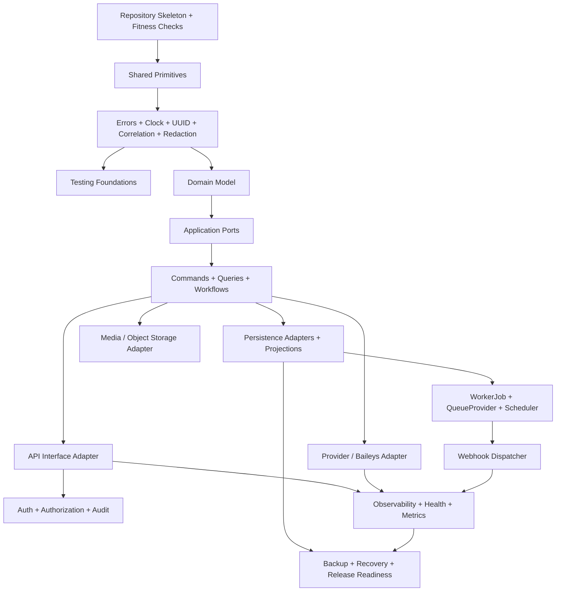

# OmniWA Module Implementation Order

## Purpose

This document defines the implementation order for OmniWA modules.

The order is designed to preserve frozen dependency rules and reduce rework. It does not create packages, source code, package manager files, APIs, Prisma schema, migrations, Docker files, or GitHub Actions.

## Ordering Principles

- Inner layers are implemented before outer adapters.
- Shared primitives are implemented before Domain.
- Domain is implemented before Application orchestration.
- Application ports and fakes are implemented before Infrastructure adapters.
- Persistence and async visibility are implemented before provider-driven workflows.
- Interface/API adapters are implemented only after Application commands and queries exist.
- Observability and security are implemented continuously, not as final polish.

## Implementation Order

| Order | Module / Area | Depends On | Why This Comes Here |
|---:|---|---|---|
| 1 | Repository skeleton and architecture checks | Frozen docs | Boundaries must exist before code can violate them. |
| 2 | Shared primitives | None | Used by every other package and must remain policy-neutral. |
| 3 | Errors and result classification | Shared | Error taxonomy is needed by Domain, Application, API, Infrastructure, and tests. |
| 4 | Clock, UUID, correlation, request context | Shared | Required for deterministic tests and trace propagation. |
| 5 | Configuration and SecretProvider contracts | Shared, errors | Required before runtime, security, and adapters can safely start. |
| 6 | Logging/redaction primitives | Shared, errors, config | Sensitive data rules must be enforced from first workflow. |
| 7 | Testing foundations | Shared, errors, Clock, UUID | Fake ports and fixtures are needed before Domain/Application tests grow. |
| 8 | Domain value objects and identities | Shared | Aggregates depend on stable identity/value semantics. |
| 9 | Domain aggregates | Value objects | Aggregate roots own invariants and lifecycle. |
| 10 | Domain events, policies, specifications, factories, services, errors | Aggregates | Domain behavior becomes complete and testable. |
| 11 | Application ports | Domain, shared | Ports define infrastructure boundaries without implementations. |
| 12 | Application commands and queries | Domain, ports | Every product behavior enters through approved use cases. |
| 13 | Application workflows/services | Commands, queries, domain | Orchestration, transaction timing, and idempotency are implemented here. |
| 14 | Internal event bus abstraction and fakes | Application | Application controls publication timing. |
| 15 | Repository adapter planning and physical data model review | Domain repository ports, persistence freeze | Prevents storage from reshaping Domain. |
| 16 | Persistence adapters and projections | Repository ports, physical data model | Enables durable state and approved queries. |
| 17 | WorkerJob and QueueProvider implementation | Application, persistence | Accepted async work must be visible and recoverable. |
| 18 | Scheduler and background jobs | Application, WorkerJob | Maintenance and recovery signals need durable state first. |
| 19 | API/interface adapter | Application commands/queries, auth contracts | API must map to Application only. |
| 20 | Auth, authorization, audit integration | Application, security/access domain, audit domain | Privileged mutations need explicit access and audit evidence. |
| 21 | Provider adapter boundary and Baileys integration | Provider ports, app workflows, tests | Baileys enters only at provider infrastructure boundary. |
| 22 | Media/Object Storage adapter | Media domain, application, object storage boundary | Media lifecycle and retention are already defined. |
| 23 | Webhook dispatcher and transport | Webhook domain/application, WorkerJob | Delivery must be async and retry-visible. |
| 24 | Observability/health/metrics/tracing runtime | Application, infrastructure ports, runtime roles | Product states must become operable. |
| 25 | Backup/restore and recovery validation | Persistence, infrastructure, operations | Production readiness requires recoverability. |
| 26 | Production hardening and release readiness | All previous areas | Final integration, security, performance, docs, and release checks. |

## Phase Grouping

### Phase A - Engineering Foundation

Includes items 1 through 7.

Outcome:

- Repo is ready to accept source code with enforceable boundaries and test foundations.

### Phase B - Domain Foundation

Includes items 8 through 10.

Outcome:

- Domain model is implemented and testable without infrastructure.

### Phase C - Application Foundation

Includes items 11 through 14.

Outcome:

- Use cases, commands, queries, workflows, ports, and event publication timing exist with fakes.

### Phase D - Durable State and Async Safety

Includes items 15 through 18.

Outcome:

- Accepted work, aggregate state, projections, idempotency, and recovery-visible state are durable.

### Phase E - External Boundaries

Includes items 19 through 23.

Outcome:

- API, auth/audit, provider, media, and webhook adapters are implemented behind approved boundaries.

### Phase F - Operability and Release

Includes items 24 through 26.

Outcome:

- Observability, health, backup/restore, runbooks, release checks, and production readiness are complete.

## Dependency Diagram

## Guardrails

- Do not start provider implementation before provider contract tests exist.
- Do not start API implementation before command/query mapping exists.
- Do not start worker implementation before WorkerJob persistence visibility exists.
- Do not start migrations or ORM models before physical data model review.
- Do not start release hardening before backup/restore and redaction checks exist.

## Checklist

| Item | Status |
|---|---|
| Implementation order defined | PASS |
| Dependency rationale defined | PASS |
| Phase grouping defined | PASS |
| Guardrails defined | PASS |

**Module implementation order is ready.**
