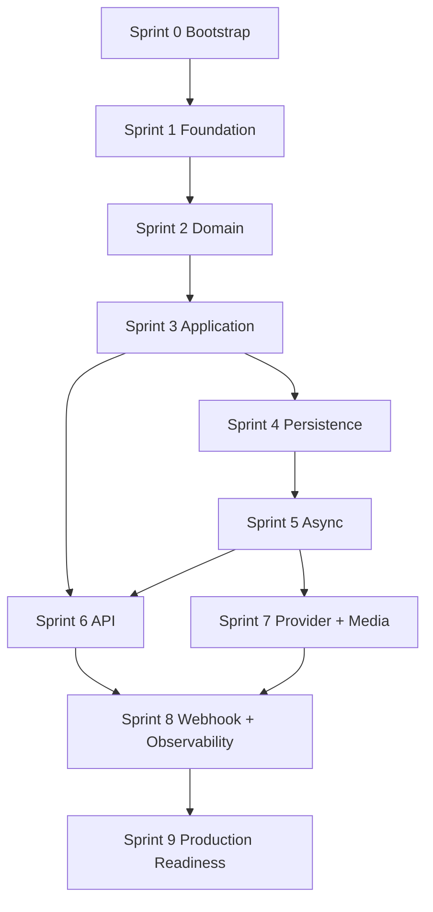

# OmniWA Sprint Plan

## Purpose

This document organizes OmniWA implementation into engineering sprints.

It does not create source code, package files, CI workflows, Docker files, Prisma schema, REST APIs, or Baileys implementation.

## Sprint Planning Principles

- Each sprint must preserve frozen architecture and traceability.
- Each sprint must end with reviewable, tested, documented progress.
- Sprints should build vertical confidence without violating layer order.
- Security, redaction, and architecture checks start early.
- A sprint is not complete if its work cannot be traced to approved documents.

## Sprint Catalog

| Sprint | Name | Goal |
|---:|---|---|
| 0 | Repository Bootstrap | Prepare implementation skeleton and gates. |
| 1 | Foundation Packages | Build shared primitives, errors, config, observability contracts, test fakes. |
| 2 | Domain Model | Implement frozen Domain model. |
| 3 | Application Layer | Implement commands, queries, workflows, services, ports. |
| 4 | Persistence Foundation | Implement repository adapters, read projections, retention/idempotency foundations. |
| 5 | Async Runtime | Implement WorkerJob, QueueProvider, retry/dead-letter, scheduler recovery paths. |
| 6 | API Interface | Implement API adapter, auth boundary, response/error/async mapping. |
| 7 | Provider and Media | Implement Baileys provider adapter and media/object storage path behind ports. |
| 8 | Webhook and Observability | Implement webhook delivery, audit, logs, metrics, tracing, health. |
| 9 | Integration and Production Readiness | Validate E2E flows, recovery, performance, security, release readiness. |

## Sprint 0 - Repository Bootstrap

Goal:

- Create implementation skeleton and enforcement gates.

Deliverables:

- Future source folders and package skeletons.
- Workspace/tooling config when implementation is requested.
- Architecture test harness.
- Initial CI gate plan.
- Documentation drift check plan.

Dependencies:

- Phase 7 Engineering Freeze.

Exit Criteria:

- Repository structure follows `MONOREPO_STRUCTURE.md`.
- Boundary checks can detect forbidden imports.
- No business code is introduced before skeleton review.

## Sprint 1 - Foundation Packages

Goal:

- Implement primitives required by all later modules.

Deliverables:

- Shared primitives.
- Error classification base.
- Clock/UUID/correlation/request context.
- ConfigurationProvider and SecretProvider contracts.
- Observability contracts and redaction primitives.
- Testing fakes and fixtures.

Dependencies:

- Sprint 0.

Exit Criteria:

- Shared package has no OmniWA package imports.
- Redaction tests cover Secret and Confidential fixture categories.
- Deterministic Clock/UUID fakes are available for tests.

## Sprint 2 - Domain Model

Goal:

- Implement frozen Domain model.

Deliverables:

- Value objects and identity model.
- Aggregates and aggregate roots.
- Policies, specifications, factories, domain services, domain errors.
- Domain event facts.
- Domain unit tests.

Dependencies:

- Sprint 1.

Exit Criteria:

- Domain tests pass for approved invariants and lifecycle rules.
- Domain imports no Application, Infrastructure, Interface, provider, queue, persistence, or framework code.
- No business behavior is missing for MVP-supported message types.

## Sprint 3 - Application Layer

Goal:

- Implement orchestration over Domain and ports.

Deliverables:

- Commands and queries.
- Workflows and application services.
- Application ports.
- Idempotency and transaction orchestration.
- Event publication timing.
- Application tests with fake ports.

Dependencies:

- Sprint 2.

Exit Criteria:

- Every command maps to an approved use case.
- Every query is side-effect free.
- Async acceptance requires visible state.
- Application imports no concrete Infrastructure.

## Sprint 4 - Persistence Foundation

Goal:

- Implement durable state and approved read models.

Deliverables:

- Reviewed physical data model.
- Repository implementations.
- Read projections.
- Idempotency persistence.
- Retention markers.
- Repository contract tests.

Dependencies:

- Sprint 3.

Exit Criteria:

- Repository semantics match Domain repository ports.
- Projection does not mutate source aggregates.
- PostgreSQL remains source of truth; Redis is not durable state.
- No raw Secret/Confidential payload stored by default.

## Sprint 5 - Async Runtime

Goal:

- Implement visible async execution.

Deliverables:

- WorkerJob lifecycle.
- QueueProvider adapter.
- Retry/dead-letter behavior.
- Scheduler signals.
- Worker shutdown/release and recovery scans.
- Worker and queue tests.

Dependencies:

- Sprint 4.

Exit Criteria:

- Accepted work cannot silently disappear.
- Retry exhaustion becomes terminal failed/dead-letter/action-required state.
- Worker does not call Interface/API.
- Queue behavior is idempotent and recoverable.

## Sprint 6 - API Interface

Goal:

- Implement API boundary over Application.

Deliverables:

- Resource group handlers.
- Request mapping to commands/queries.
- Response envelope and error mapping.
- API key/admin key authentication boundary.
- Authorization invocation.
- Idempotency key handling.
- API contract tests.

Dependencies:

- Sprint 3, Sprint 4 for queries, Sprint 5 for async accepted visibility.

Exit Criteria:

- API calls Application only for product behavior.
- API does not expose session secrets or raw Confidential data.
- Query paths do not mutate state.
- Async responses do not claim final provider/webhook delivery early.

## Sprint 7 - Provider and Media

Goal:

- Implement provider and media adapters behind ports.

Deliverables:

- Baileys provider adapter.
- Translated provider signals.
- Provider capability classification.
- Media object storage adapter.
- Baileys upgrade regression checks.
- Provider/media contract tests.

Dependencies:

- Sprint 3, Sprint 4, Sprint 5.

Exit Criteria:

- Only provider adapter imports Baileys.
- Provider does not own product policy.
- Provider-native payloads do not leak into Domain/API.
- Media retention and diagnostic capture rules pass tests.

## Sprint 8 - Webhook and Observability

Goal:

- Implement outbound integration delivery and operational visibility.

Deliverables:

- Webhook dispatcher and transport.
- Webhook signing/replay protection once detail decision is accepted.
- Webhook retry/dead-letter visibility.
- Logs, metrics, traces, audit, health.
- Observability and redaction tests.

Dependencies:

- Sprint 5, Sprint 6, Sprint 7.

Exit Criteria:

- Webhook delivery is async and retry-visible.
- Webhook dispatcher does not mutate source business state.
- Logs/metrics/traces/audit contain no Secret/raw Confidential data.
- Health and metrics expose required operational signals.

## Sprint 9 - Integration and Production Readiness

Goal:

- Validate MVP readiness for implementation release candidate.

Deliverables:

- E2E smoke tests.
- Performance and soak validation.
- Backup/restore validation.
- Recovery runbooks.
- Security review.
- Release candidate checklist and changelog.

Dependencies:

- Sprints 0 through 8.

Exit Criteria:

- Core MVP flows pass E2E.
- Queue, webhook, reconnect, and provider failure paths are visible.
- RPO/RTO assumptions are validated.
- No Critical or Major security findings remain.

## Sprint Dependency Diagram

## Checklist

| Item | Status |
|---|---|
| Sprints defined | PASS |
| Goals defined | PASS |
| Deliverables defined | PASS |
| Dependencies defined | PASS |
| Exit criteria defined | PASS |

**Sprint plan is ready.**
