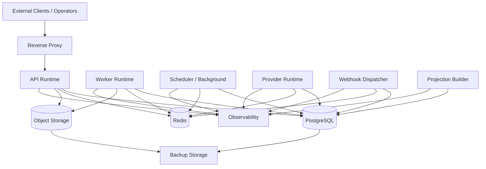

# Deployment Topology

## Purpose

This document defines OmniWA Phase 6 deployment topology.

It describes environment and topology design without creating Docker Compose, Kubernetes, Terraform, GitHub Actions, manifests, runtime commands, or configuration files.

## Topology Principles

- Development, testing, and production use the same logical runtime roles.
- Production separates latency-sensitive API work from async Worker work.
- PostgreSQL is the durable source of truth in every environment.
- Redis is ephemeral in every environment.
- Object Storage is artifact-only in every environment.
- Public ingress is through Reverse Proxy only.
- Direct public access to data services is forbidden.

## Deployment Topology Diagram

## Development Topology

| Area | Decision |
|---|---|
| Runtime | May run all runtime roles on one developer machine or development host as separate logical roles. |
| Data services | Development PostgreSQL, Redis, and object-storage-compatible adapter may be local or isolated development services. |
| Network boundary | Public internet exposure is not required; local reverse proxy boundary is optional but recommended for parity. |
| Observability | Local structured logs and lightweight metrics/traces are acceptable. |
| Backup | Backup flow may use test artifacts; no production secrets. |
| Constraint | Development shortcuts must not change architecture rules or leak into production assumptions. |

## Testing Topology

| Area | Decision |
|---|---|
| Runtime | API and Worker roles should be separate to validate async behavior. |
| Data services | Isolated PostgreSQL, Redis, and Object Storage per test environment. |
| Network boundary | Reverse proxy or equivalent ingress boundary should be tested for auth, size limits, request IDs, and failure behavior. |
| Observability | Tests must capture logs/metrics/traces enough to validate correlation and redaction. |
| Backup | Restore validation should run against non-production data. |
| Constraint | Test topology must make race conditions, retry, idempotency, and recovery observable. |

## Production Topology

| Area | Decision |
|---|---|
| Runtime | API, Worker, Scheduler/Background, Provider, Webhook, Projection, Metrics/Health roles are independently deployable runtime roles. |
| Data services | PostgreSQL, Redis, Object Storage, Observability, Secret Provider, and Backup Storage are internal infrastructure components. |
| Network boundary | Public traffic reaches Reverse Proxy only. Data services are private. |
| Service boundary | API is public-facing; all other runtime roles are internal. |
| Storage boundary | PostgreSQL, Redis, Object Storage, and Backup Storage use separate access roles and network restrictions. |
| Backup | Encrypted daily backup with 14-day retention and restore validation. |
| Constraint | Production cannot rely on in-memory state for accepted work. |

## Single Node Topology

Single node is acceptable for MVP controlled deployments when:

- API and Worker can still be run as separate process roles,
- PostgreSQL, Redis, and Object Storage are explicit services or managed dependencies,
- backup artifacts are stored outside the primary runtime boundary,
- process restart and restore procedures are documented,
- provider connection ownership remains one active owner per instance,
- resource limits protect API latency from worker pressure.

Trade-off:

- Lower operational complexity and cost.
- Higher blast radius and limited horizontal capacity.
- Suitable for MVP only when reliability targets are honestly documented.

## Future Multi Node Topology

Future multi-node requires:

- distributed provider ownership per instance,
- distributed worker leasing and idempotency,
- scheduler leader election or single-active ownership,
- Redis or equivalent coordination hardening,
- PostgreSQL connection pooling,
- read replica strategy,
- stronger deployment rollout controls,
- restore and failover runbooks.

Future multi-node must not:

- introduce multi-tenant product scope,
- bypass Application boundaries,
- make Redis a source of truth,
- allow two active provider runtimes for one instance.

## Network Boundary

| Boundary | Production Rule |
|---|---|
| Public network | Reverse Proxy only. |
| API network | API can reach Application dependencies and data services through approved adapters. |
| Worker network | Worker can reach PostgreSQL, Redis, Object Storage, Provider/Webhook external targets as needed through ports. |
| Provider network | Provider Runtime can reach provider network; provider payloads translated before product use. |
| Webhook egress | Webhook Dispatcher can reach configured webhook receivers; source facts are not mutated by receiver responses. |
| Data network | PostgreSQL, Redis, Object Storage are internal only. |
| Observability network | Runtime roles export sanitized telemetry only. |

## Service Boundary

- API Runtime is the only public product runtime.
- Admin and monitoring surfaces require stronger authentication/authorization or network restriction.
- Worker, Scheduler, Provider, Webhook, Projection, PostgreSQL, Redis, Object Storage, Backup, and Secret Provider are internal.
- Runtime identities must be separated by role.

## Storage Boundary

| Storage | Boundary |
|---|---|
| PostgreSQL | Private durable state store with role-based runtime access. |
| Redis | Private ephemeral coordination/cache store. |
| Object Storage | Private artifact store; controlled temporary access only when future implementation defines it. |
| Backup Storage | Privileged recovery artifact store with separate access from product runtime. |

## Topology Constraints

- No deployment topology may require API to call Worker directly.
- No deployment topology may require Worker to call API.
- No deployment topology may expose PostgreSQL, Redis, or Object Storage publicly.
- No deployment topology may use provider runtime state as durable truth.
- No deployment topology may skip backup/restore validation for production readiness.
