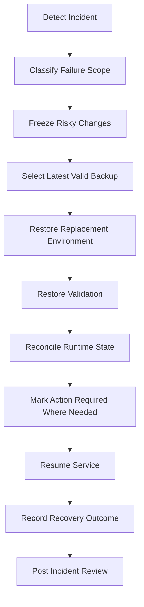

# Disaster Recovery

## Purpose

This document defines OmniWA Phase 6 disaster recovery design.

It operationalizes the frozen backup and recovery requirements: encrypted daily backup, 14-day backup retention, 24-hour RPO, 4-hour RTO for P1 OmniWA-controlled service recovery, and documented restore to replacement environment.

## Recovery Targets

| Target | MVP Requirement |
|---|---|
| Backup Frequency | Encrypted recoverable-state backup at least once every 24 hours. |
| Backup Retention | 14 days. |
| RPO | 24 hours for OmniWA-owned recoverable state. |
| RTO | 4 hours for P1 OmniWA-controlled service recovery. |
| DR Model | Replacement-environment restore; active-active and multi-region are out of scope. |

## Failure Scenarios

| Scenario | Impact | Recovery Strategy |
|---|---|---|
| API Runtime loss | Public API unavailable or degraded | Restart/replace API process; validate readiness; no data restore needed. |
| Worker Runtime loss | Async work delayed | Restart Worker; reconcile WorkerJob reservations; retry/release work safely. |
| Scheduler loss | Maintenance/reconnect/cleanup delayed | Restart Scheduler; run idempotent missed schedule scan. |
| Provider Runtime loss | Instance connectivity degraded | Re-establish ownership, reconnect eligible instances, mark action-required when needed. |
| Webhook Dispatcher loss | Webhook delivery delayed | Resume pending/retrying WebhookDelivery state; avoid duplicate delivered transitions. |
| PostgreSQL loss | Product state unavailable | Restore latest valid encrypted backup to replacement environment. |
| Redis loss | Cache/locks/queue support unavailable | Rebuild cache/queue-support state from PostgreSQL; fail closed where lock certainty is required. |
| Object Storage loss | Artifact workflows degraded | Restore approved retained artifacts; mark missing temporary artifacts expired/unavailable. |
| Secret Provider loss | Runtime cannot authenticate dependencies or access secrets | Fail closed; restore secret provider or rotate/re-provision secrets under audit. |
| Observability loss | Reduced operational visibility | Keep product state safe; alert on observability degradation where possible. |
| Backup corruption | Recovery point unavailable | Use previous valid backup within retention; open incident if RPO risk exists. |
| Region/host loss | Runtime and storage unavailable | Restore PostgreSQL and approved artifacts into replacement environment. |

## Backup Validation

Backup validation must check:

- backup artifact exists,
- backup manifest exists,
- backup artifact is encrypted,
- backup integrity marker passes validation,
- included storage areas are listed,
- retention expiry is correct,
- backup age is within 24-hour target,
- approved Object Storage artifacts are included where required,
- Secret material is protected.

## Restore Validation

Restore validation must check:

- PostgreSQL durable state restored,
- product identity continuity preserved,
- instance inventory restored,
- session availability checked without Secret exposure,
- WorkerJob state restored,
- queue/retry/dead-letter state visible,
- webhook delivery state visible,
- idempotency markers restored,
- retention markers preserved,
- audit continuity available where retained,
- projections rebuilt or marked stale/unavailable,
- Redis rebuilt or invalidated,
- approved object artifacts accessible,
- recovery outcome recorded in audit.

## Failure Recovery Flow

## Recovery Strategy By Store

| Store | Recovery Strategy |
|---|---|
| PostgreSQL | Restore latest valid encrypted backup; validate state and identity continuity. |
| Redis | Rebuild/invalidate from PostgreSQL; do not restore as source of truth. |
| Object Storage | Restore approved retained artifacts only; temporary artifacts may be expired/unavailable. |
| Backup Storage | Validate backup artifact and manifest before restore. |
| Observability | Restore observability pipeline if possible; product recovery must not depend on telemetry as source of truth. |

## Chaos Testing Recommendations

Phase 6 recommends but does not implement:

- API process restart while requests are active.
- Worker crash during reserved work.
- Redis loss during queue backlog.
- PostgreSQL read-only/degraded mode simulation.
- Webhook receiver failure and retry exhaustion.
- Provider disconnect and reconnect storm.
- Projection lag and rebuild.
- Object Storage temporary artifact failure.
- Backup restore drill into replacement environment.
- Secret rotation failure simulation.

Chaos testing must not use production secrets or unsafe payloads.

## DR Constraints

- Recovery must not resurrect expired data.
- Recovery must not expose Secret data in logs or validation output.
- Recovery must not assume WhatsApp/provider account state is recoverable by OmniWA.
- Recovery must not re-deliver webhooks unless idempotency safety is satisfied.
- Recovery must not mark WorkerJob complete unless durable state supports it.
- Recovery must record audit-safe outcome.
