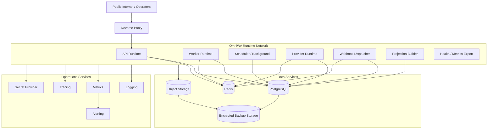

# Infrastructure Architecture

## Purpose

This document defines OmniWA Phase 6 infrastructure architecture.

It identifies infrastructure components, boundaries, responsibilities, and interactions without creating Docker Compose, Kubernetes, Terraform, GitHub Actions, manifests, source code, or configuration files.

## Infrastructure Architecture Decision

OmniWA MVP uses a single-region, single-tenant, multi-instance infrastructure design with independently scalable runtime roles and managed-or-self-hosted infrastructure components selected behind stable boundaries.

## Infrastructure Components

| Component | Responsibility | Source Of Truth? | Notes |
|---|---|---|---|
| Reverse Proxy | Public ingress, TLS termination boundary, request routing, basic request limits | No | Does not own auth, API contract, or product routing. |
| API Runtime | Public/Admin/Monitoring interface adapter over Application commands/queries | No | Does not call DB/Redis/Object Storage directly for product behavior. |
| Worker Runtime | Executes async work through Application workflows | No | WorkerJob state is durable in PostgreSQL. |
| Scheduler/Background Runtime | Scheduled maintenance, retention, health refresh, recovery checks | No | One active scheduler per environment initially. |
| Provider Runtime | Provider connection ownership and translated signal ingress | No | One active provider runtime per instance. |
| Webhook Dispatcher | Outbound webhook delivery, retry, failure classification | No | WebhookDelivery state persists in PostgreSQL. |
| Projection Builder | Read projection refresh/rebuild | No | Projections are derived and non-mutating. |
| PostgreSQL | Durable Aggregate/repository/projection/audit/recovery state | Yes | MVP source of truth for approved persistence. |
| Redis | Ephemeral cache, locks, rate windows, queue-support hints | No | Never source of truth or backup source. |
| Object Storage | Temporary/diagnostic/backup/archive artifacts | No for metadata | Business metadata remains PostgreSQL-owned. |
| Observability Stack | Logs, metrics, traces, health, alerts | No | Sanitized signals only. |
| Backup Storage | Encrypted backup artifacts and manifests | Recoverable artifact | 14-day retention; restore validation required. |
| Secret Provider | Runtime secret delivery and rotation boundary | Secret source | Does not expose Secret values to logs or projections. |

## Infrastructure Diagram

## Network Boundary

| Boundary | Allowed Traffic | Not Allowed |
|---|---|---|
| Public ingress | Client/operator/admin traffic to Reverse Proxy only | Direct access to API runtime, PostgreSQL, Redis, Object Storage, Provider runtime |
| Runtime network | Runtime processes to approved data services and external provider/webhook boundaries | Cross-process calls that bypass Application boundaries |
| Data network | Runtime service identities to PostgreSQL/Redis/Object Storage under least privilege | Public ingress and provider direct access |
| Observability network | Sanitized logs, metrics, traces, and alerts | Secret/raw Confidential telemetry |
| Backup network | Backup/restore roles to PostgreSQL and approved artifacts | Runtime components writing unvalidated backup artifacts |

## Service Boundary

- API Runtime is externally reachable only through Reverse Proxy.
- Worker, Scheduler, Provider, Webhook, Projection, PostgreSQL, Redis, and Object Storage are internal.
- Monitoring and health endpoints are authenticated or network-restricted except minimal public liveness if explicitly approved later.
- Backup and restore roles are operational and privileged; they are not product surfaces.

## Storage Boundary

| Store | Boundary |
|---|---|
| PostgreSQL | Durable product state boundary; internal runtime access through ports/adapters only. |
| Redis | Ephemeral runtime coordination boundary; no permanent data or Secret/raw Confidential data. |
| Object Storage | Artifact boundary; business metadata remains PostgreSQL-owned. |
| Backup Storage | Encrypted artifact boundary; restore validation required before product operation resumes. |

## Backup Boundary

Backup infrastructure must:

- capture PostgreSQL durable state at least every 24 hours,
- include approved Object Storage artifacts when they are recoverable state,
- produce a backup manifest,
- retain encrypted artifacts for 14 days,
- support replacement-environment restore,
- exclude Redis as a source-of-truth backup target.

## Infrastructure Constraints

- Infrastructure contains no business logic.
- Infrastructure must not change Repository Port semantics.
- Infrastructure must not expose physical identifiers through API/webhook/audit/telemetry.
- Infrastructure must not add multi-tenant behavior.
- Infrastructure must not expand message, group, contact, chat, campaign, analytics, or SDK scope.
- Infrastructure must not log Secret or raw Confidential payloads.
- Infrastructure must not make provider-native payloads stable product state.

## Infrastructure Traceability

| Product Capability | Runtime Process | Infrastructure Component | Storage |
|---|---|---|---|
| Instance lifecycle and QR | API, Worker, Provider, Scheduler | Reverse Proxy, API runtime, provider runtime, scheduler | PostgreSQL Instance/Session, Redis locks |
| Messaging | API, Worker, Provider | API runtime, worker runtime, provider runtime | PostgreSQL Message/Guardrail/WorkerJob, Redis queue support |
| Media | API, Worker, Background | API runtime, worker runtime, object artifact boundary | PostgreSQL Media metadata, Object Storage artifacts |
| Webhook | API, Webhook Dispatcher, Worker | Webhook dispatcher, outbound network, worker runtime | PostgreSQL WebhookSubscription/WebhookDelivery, Redis retry support |
| Observability | Metrics Exporter, Health Runtime | Logs, metrics, traces, alerts | PostgreSQL Health/Telemetry projections |
| Administration/Security | API, Background | Admin boundary, secret provider, audit boundary | PostgreSQL AccessDecision/Audit/Configuration |
| Backup/Recovery | Background, Operations | Backup storage, restore process | PostgreSQL backup, approved Object artifacts |
