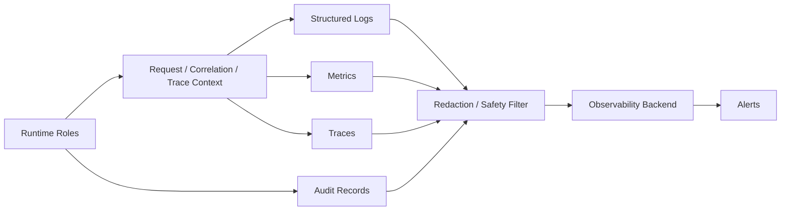

# Observability

## Purpose

This document defines OmniWA Phase 6 observability design.

It covers logging, metrics, tracing, alerting, audit, correlation IDs, health checks, readiness, liveness, SLI, SLO, and error budget posture without selecting a concrete vendor or creating configuration.

## Observability Principles

- Observability must separate OmniWA-controlled behavior from provider/downstream behavior.
- Observability must be structured, correlated, and redacted.
- Secret data must never be logged, traced, metered, or included in alerts.
- Raw Confidential payloads must not enter normal logs, metrics, traces, audit, or alerts.
- Accepted async work, retry, dead-letter, and action-required states must be observable.
- Observability cannot mutate Domain state or repair projections.

## Logging

| Log Type | Required Fields | Forbidden Fields |
|---|---|---|
| API request log | request_id, correlation_id, runtime_role, safe key_id, operation, result category, latency bucket | API key secret, message body, phone/JID, raw request payload |
| Application workflow log | correlation_id, command/query name, owner context, safe resource id, outcome category | Domain internals that expose Secret/raw Confidential values |
| Worker log | correlation_id, job id, job type, lifecycle transition, retry count, failure category | Raw job payload, raw webhook payload, provider payload |
| Provider log | correlation_id, provider id, instance id, translated failure category | Raw provider payload, session material, phone/JID |
| Webhook log | correlation_id, delivery id, receiver category, attempt count, terminal state | Webhook secret, raw webhook payload |
| Security/audit support log | safe actor/key id, capability, target ref, allow/deny category | Secret values, raw identity-provider token |

## Metrics

| Metric Area | Examples |
|---|---|
| API | Request rate, latency, error rate, auth failures, rate-limit/guardrail rejections. |
| Queue/Worker | Queue depth, oldest pending age, reservation failures, processing latency, retry count, dead-letter count. |
| Messaging | Accepted, queued, dispatched, delivered/read observation, failed, cancelled, unknown outcome rate. |
| Webhook | First-attempt success, eventual success, latency, retry backlog, dead-letter growth, receiver failure categories. |
| Provider | Connection duration, reconnect count, provider event lag, disconnect categories, action-required rate. |
| Persistence | PostgreSQL availability, connection saturation, backup success, restore validation result, projection lag. |
| Redis | Availability, lock failures, cache hit/miss, queue support lag, keyspace pressure. |
| Object Storage | Artifact write/read failures, cleanup failures, backup artifact validation. |
| Security | Auth failure rate, denied access rate, secret access requests, redaction drops. |

Metric labels must avoid high-cardinality raw identifiers such as phone numbers, JIDs, message bodies, webhook URLs, provider payload identifiers, or secrets.

## Tracing

Tracing requirements:

- Preserve trace_id and correlation_id across API, Application, Worker, Provider, Webhook, Projection, and persistence boundaries.
- Use request_id for one external request; preserve correlation_id across async workflows.
- Trace metadata must be safe and redacted.
- Trace sampling is acceptable for MVP, but error, dead-letter, and recovery traces should be preferentially retained where safe.
- Tracing must not become a dependency path that bypasses Application boundaries.

## Alerting

| Alert | Trigger |
|---|---|
| API availability degraded | Availability below SLO window or sustained 5xx/internal error rate. |
| API latency degraded | P95 common operation latency over target for sustained window. |
| Queue backlog | Oldest pending work age or queue depth exceeds threshold by work type. |
| Dead-letter growth | Dead-letter count increases beyond normal operating baseline. |
| Webhook failure spike | First-attempt or eventual success rate below SLO. |
| Provider reconnect failures | Reconnect success below target or action-required spike. |
| Backup failure | Last backup missing, failed, or manifest invalid. |
| Restore validation failure | Restore drill or validation fails. |
| Secret/redaction failure | Unsafe telemetry detected or redaction uncertain. |
| PostgreSQL/Redis/Object degradation | Dependency unavailable or sustained degraded health. |

## Audit

Audit is not debug logging.

Audit records are required for:

- privileged admin actions,
- configuration validation/activation,
- secret access request,
- key rotation or revocation,
- diagnostic capture enablement,
- recovery/restore actions,
- destructive operations,
- retention cleanup where policy requires evidence,
- webhook dead-letter/replay decisions.

Audit must remain Secret-safe and retention-bound.

## Correlation ID

| Identifier | Scope | Rule |
|---|---|---|
| request_id | One external request | Created at API boundary; not reused across async work except as reference. |
| correlation_id | Business workflow | Propagates through async, provider, webhook, audit, and telemetry. |
| trace_id | Observability trace | Safe operational identifier; can map to correlation_id. |
| job_id | Worker lifecycle | Product-safe worker identifier, not queue engine internal identity. |

Correlation identifiers must not contain Secret or raw Confidential content.

## Health Check

| Check Type | Meaning | Scope |
|---|---|---|
| Liveness | Process event loop/runtime is alive enough to be restarted if broken | Local runtime process only |
| Readiness | Process can safely receive work for its role | Dependency and configuration aware |
| Startup | Runtime initialized and required configuration/secret boundaries are validated | Startup lifecycle |
| Dependency health | PostgreSQL, Redis, Object Storage, provider, webhook transport, observability availability | Classified by dependency |
| Product health | Instance/session/message/webhook/worker action-required status | Derived from product state |

## Readiness

Readiness requirements:

- API readiness requires validated configuration, secret boundary, PostgreSQL availability, and auth boundary readiness.
- Worker readiness requires PostgreSQL and queue-support path readiness.
- Provider readiness requires provider profile, session reference access, ownership guard, and provider adapter readiness.
- Webhook readiness requires webhook configuration, transport boundary, PostgreSQL, and queue-support path.
- Scheduler readiness requires ownership/single-active guard and durable state access.
- Projection readiness requires source-state access and projection storage access.

## Liveness

Liveness must be shallow:

- It must not depend on external provider success.
- It must not perform business mutations.
- It should detect stuck runtime process conditions.
- It must not leak operational secrets or detailed dependency internals publicly.

## SLI / SLO / Error Budget

| Area | SLI | MVP SLO | Error Budget Position |
|---|---|---|---|
| API availability | Percentage of successful non-upstream product surface requests | 99.0% for controlled deployments | Track monthly; burn triggers incident review and capacity/backpressure review |
| API latency | P95 common non-media operation latency excluding upstream behavior | Under 500 ms | Burn when sustained above target |
| Text message enqueue | P95 accepted/queued latency | Under 300 ms under normal MVP load | Burn indicates API/Application/persistence pressure |
| Media enqueue | P95 enqueue latency excluding upload/download dominated by network/provider | Under 1 second | Burn indicates media boundary pressure |
| Webhook eventual delivery | Percentage delivered within 15 minutes for healthy receivers | 99.0% | Receiver-caused failures tracked separately |
| Queue visibility | Accepted work with visible WorkerJob/owner lifecycle | 100%; silent drops target 0 known cases | Any silent drop is incident |
| Reconnect | Successful recoverable reconnect workflows | Track against frozen reliability target | Provider/account-caused failures separated |
| Recovery | P1 OmniWA-controlled service recovery time | RTO 4 hours | Breach requires post-incident review |
| Backup | Valid encrypted backup within last 24 hours | 100% production readiness expectation | Missing valid backup is P1/P2 depending exposure |

## Observability Flow

## Observability Constraints

- Observability must not store Secret values.
- Observability must not become an analytics product store.
- Observability must not mutate product state.
- Observability failures must be visible but cannot roll back source business facts.
- Runtime and dependency health must be separated from upstream WhatsApp/provider health.
