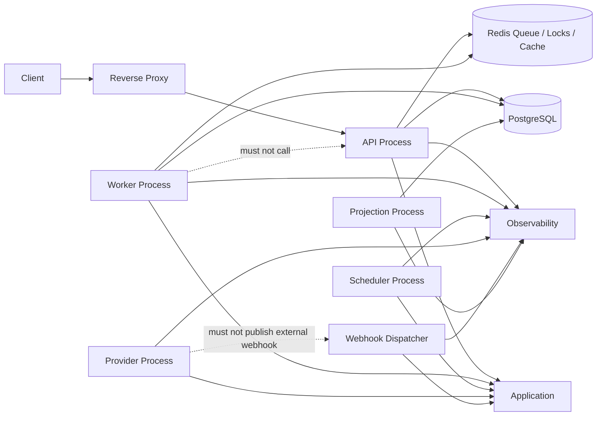

# Process Model

## Purpose

This document defines OmniWA Phase 6 process boundaries and co-location decisions.

Processes are runtime deployment roles. They do not define source files, Docker Compose services, Kubernetes workloads, Terraform resources, or process manager configuration.

## Process Boundary Decision

OmniWA should support separate process roles even when MVP starts with co-located processes on a single node.

| Process | Required For MVP? | Can Be Co-Located? | Dedicated Process Recommended? | Reason |
|---|---|---|---|---|
| API Process | Yes | No with Worker in production once load exists | Yes | Public request boundary, latency-sensitive, authentication and query handling. |
| Worker Process | Yes | Development only | Yes | Async work must be isolated from API latency and restart independently. |
| Scheduler Process | Yes | Can co-locate with Background in MVP | Conditional | Scheduled work should avoid duplicate execution; one active scheduler per environment. |
| Provider Process | Yes | Can co-locate in MVP for small deployments | Conditional, then yes when provider count grows | Provider connections are stateful and must be isolated from API restarts. |
| Webhook Dispatcher Process | Yes | Can run as Worker specialization | Conditional | Webhook retry/backoff can consume capacity and should be isolated under load. |
| Projection Process | Yes | Can run as Background specialization | Conditional | Projection lag should not block command handling. |
| Metrics/Health Process | No as separate process | Yes | No initially | Each runtime exposes health/metrics; central exporter can be added later. |
| Background Maintenance Process | Yes | Can co-locate with Scheduler | Conditional | Retention, cleanup, backup validation, and recovery checks are operational work. |

## Recommended MVP Process Model

| Environment | Recommended Process Layout |
|---|---|
| Development | Single node with API, Worker, Scheduler/Background, Provider, Webhook, Projection, PostgreSQL, Redis, Object Storage-compatible service or stub as separate logical roles. |
| Testing | Separate API and Worker roles; Scheduler/Background enabled under controlled tests; isolated PostgreSQL/Redis/Object Storage per test environment. |
| Production MVP | API Process, Worker Process, Scheduler/Background Process, Provider/Webhook/Projection roles as separate or worker-specialized roles, PostgreSQL, Redis, Object Storage, Reverse Proxy, Observability, Backup. |

## Should Processes Be Split?

| Split | Decision | Trade-off |
|---|---|---|
| API vs Worker | Split for production | Increases operational complexity but prevents worker backlog from degrading API latency. |
| Worker vs Webhook Dispatcher | Split when webhook volume or receiver failures grow | Dedicated retry/backoff isolation, but more process management. |
| Worker vs Provider Runtime | Split when provider connections become numerous or unstable | Prevents provider reconnect churn from affecting general work, but requires provider ownership coordination. |
| Scheduler vs Worker | Split or single active scheduler | Avoids duplicate schedules; requires leader/ownership model in future multi-node. |
| Projection vs Command Runtime | Split when projection lag matters | Keeps queries fresh without blocking commands, but projection lifecycle needs monitoring. |
| Metrics/Health separate | Not required initially | Simpler to expose per-process health/metrics; central aggregation later. |

## Dedicated Worker Need

Dedicated workers are required for production because:

- accepted async work must not disappear,
- provider/webhook/media retries must be independent of API request handling,
- worker shutdown needs draining and reservation handling,
- dead-letter and action-required state must be visible,
- retry/backoff and queue pressure require independent scaling.

Worker specialization is recommended later by work type:

- message worker,
- media worker,
- webhook worker,
- reconnect worker,
- retention/recovery worker,
- projection worker.

Specialization must not change Application Service ownership or Repository semantics.

## Process Communication

## Startup Order

| Order | Runtime | Requirement |
|---|---|---|
| 1 | Configuration and Secret boundary | Required configuration and Secret references validated before product work. |
| 2 | PostgreSQL | Durable source state and recovery state available. |
| 3 | Redis | Cache/lock/queue support available or runtime enters degraded/fail-closed mode where required. |
| 4 | Object Storage | Required only for artifact workflows and backup validation. |
| 5 | API and Worker | Start after durable dependencies are ready. |
| 6 | Scheduler/Background/Projection | Start after API/Worker dependencies and ownership checks are ready. |
| 7 | Provider Runtime | Start after Instance/Session/ProviderProfile state is readable and ownership guards are available. |

## Shutdown Rules

- API stops accepting new requests and drains in-flight requests.
- Worker stops reserving new work, completes or releases current reservations safely, and records retry/action-required state when needed.
- Scheduler stops creating new scheduled work before shutdown.
- Provider Runtime releases or expires provider ownership safely and classifies affected instances where needed.
- Webhook Dispatcher records attempt result, retry, or safe unknown state before shutdown.
- Projection Builder stops at checkpoint boundaries and leaves stale markers if incomplete.
- Metrics and logs flush sanitized records only.

## Process Invariants

- API Process must not depend on Worker Process availability to answer queries for already visible state.
- Worker Process must operate without API Process calls.
- One instance has at most one active provider runtime owner.
- No process may call Domain directly outside Application Layer.
- Infrastructure process boundaries must not bypass frozen dependency rules.
- Process role separation must not change Product, API, Domain, Application, or Persistence semantics.
