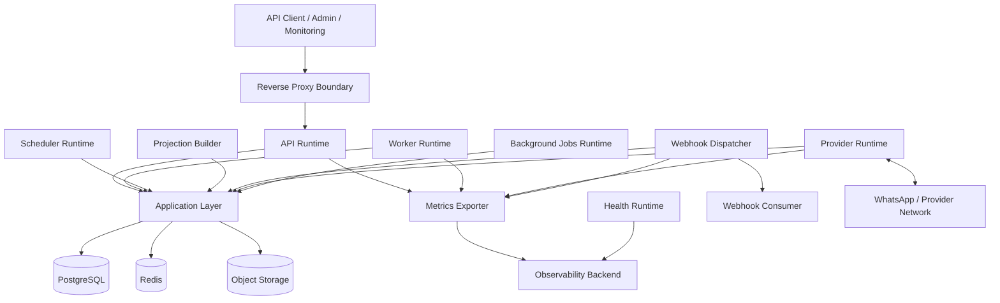

# Runtime Platform

## Purpose

This document defines OmniWA Phase 6 runtime platform design.

It translates the frozen runtime architecture, Application boundaries, Persistence freeze, and API contract into deployable runtime roles without creating code, Docker Compose, Kubernetes, Terraform, GitHub Actions, or deployment configuration.

## Runtime Principles

- OmniWA remains a modular monolith with multiple runtime roles.
- All product behavior enters through Application commands, queries, workflows, or approved ports.
- Infrastructure implements adapters and runtime wiring; it does not own business logic.
- Accepted async work must have durable visibility before a caller receives accepted/queued status.
- PostgreSQL is the durable source of truth; Redis is ephemeral; Object Storage is artifact-only.
- API, Worker, Scheduler, Provider, Webhook, Projection, Metrics, and Health responsibilities are isolated even when deployed together.

## Runtime Component Catalog

| Runtime | Responsibility | Lifecycle | Failure Isolation | Scaling Strategy | Communication Model |
|---|---|---|---|---|---|
| API Runtime | Handles public/admin/monitoring request boundaries, authentication, validation, request/correlation context, and Application command/query invocation | Starts after configuration, secret, PostgreSQL, and required health dependencies are available; drains requests on shutdown | API failure must not execute background work directly; accepted work remains visible through PostgreSQL/WorkerJob | Horizontal API process replicas after shared storage/lock safety is proven; vertical scaling first for MVP | Inbound HTTP through reverse proxy; calls Application layer and ports only |
| Worker Runtime | Executes visible async work: outbound message work, media processing, webhook delivery, reconnect, cleanup, recovery, and worker lifecycle transitions | Starts after PostgreSQL and queue-support dependencies are ready; reserves work; releases/retries on shutdown | Worker failure must not lose accepted work; WorkerJob state remains durable | Dedicated workers by work type when needed; concurrency bounded by instance/message/webhook ownership | Consumes QueueProvider work; calls Application workflows; writes through repositories |
| Scheduler Runtime | Emits scheduled signals for reconnect scans, health refresh, retention cleanup, backup validation triggers, and recovery checks | Starts after configuration and durable state access; scheduled execution is idempotent | Scheduler failure delays maintenance but must not mutate source state directly | Usually single active scheduler per environment; future leader election for multi-node | Emits Application commands/internal messages through scheduler boundary |
| Projection Builder | Refreshes and rebuilds read projections, metrics snapshots, action-required views, and query read models | Runs after source state and projection storage are available; rebuilds only retained source facts | Projection failure must not roll back source state; stale markers remain visible | Separate process or worker pool when projection lag becomes significant | Consumes internal facts/work items; writes projection state only |
| Webhook Dispatcher | Prepares, signs/verifies conceptually, delivers, retries, and classifies outbound webhook delivery attempts | Starts after webhook subscription/delivery state and transport configuration are valid | Receiver failures must not mutate source business facts; failures become retry/dead-letter/action-required states | Dedicated dispatcher concurrency by delivery type and receiver health; bounded backoff | Consumes WebhookDelivery work through Application/WebhookTransport port |
| Provider Runtime | Maintains provider-facing connection ownership per instance and translates provider events into OmniWA concepts | Starts after Session, Instance, Configuration, and ProviderProfile readiness; reconnects under ownership guard | Provider runtime failure affects provider connectivity, not API/runtime availability; instances move to degraded/action-required where needed | One active provider runtime per instance; horizontal scaling requires distributed ownership | Talks to provider through provider adapter; reports translated signals to Application-owned provider ports |
| Background Jobs Runtime | Runs maintenance work that is not latency-sensitive: retention enforcement, cleanup, backup manifest checks, diagnostic expiry, and recovery validation | Scheduled or queue-triggered; safe to repeat through idempotency | Failure creates Health/ActionRequired signal and does not silently delete state | Batch size and concurrency bounded by retention/recovery safety | Calls Application workflows and storage/object adapters through ports |
| Metrics Exporter | Exposes or exports safe metrics, runtime health, queue depth, latency, retry, dead-letter, and dependency signals | Starts with observability configuration; should not block product runtime startup unless required by environment policy | Metrics exporter failure must not stop product behavior; health should mark observability degraded | Usually lightweight per runtime plus optional aggregator | Pull or push-compatible metric boundary; sanitized metrics only |
| Health Runtime | Computes readiness, liveness, startup, dependency health, and action-required classifications | Always available inside each runtime role; deeper checks depend on dependency class | Health check failure must distinguish product/runtime/dependency/provider causes | Per runtime; future central health aggregator allowed | Reads safe runtime state and HealthStatus projection; no business mutation |

## Runtime Platform Diagram

## Runtime Communication Rules

- API Runtime does not call Worker Runtime directly for product behavior.
- Worker Runtime does not call API Runtime.
- Scheduler emits Application-owned signals; it does not mutate Domain or persistence directly.
- Provider Runtime reports translated provider signals; it does not publish external webhooks directly.
- Webhook Dispatcher delivers Integration Events; it does not mutate source business facts.
- Projection Builder writes projection state only and never source Aggregate state.
- Metrics Exporter exports sanitized telemetry only.
- Health Runtime classifies health and action-required signals but does not repair source state.

## Runtime Traceability

| Runtime Component | Product Capability | Application Use Case / Query | Application Service | Repository / Storage | Infrastructure Component |
|---|---|---|---|---|---|
| API Runtime | Instance, Messaging, Media, Webhook, Monitoring, Admin | All approved command/query triggers | Owning Application Services and QueryApplicationService | Repository ports through Application only | Reverse Proxy, API process, auth boundary |
| Worker Runtime | Messaging, Media, Webhook, Queue, Recovery | ProcessOutboundMessageWork, ProcessMediaWork, DeliverWebhookWork, ReconnectInstance, retention/recovery work | Messaging, Media, Webhook, Operations, Instance services | WorkerJob, Message, Media, WebhookDelivery, Instance, Session storage | Worker process, Redis queue support, PostgreSQL |
| Scheduler Runtime | Reliability, Retention, Health, Backup validation | Reconnect scans, RefreshHealthStatus, CleanupMediaRetention, backup validation triggers | Instance, Media, Monitoring, Administration services | Health, WorkerJob, retention markers, backup manifest | Scheduler process |
| Projection Builder | API Query, Observability | Read projection refresh/rebuild, metrics snapshots | Monitoring and Query services | Read projections, HealthStatus, TelemetrySignal | Projection process, PostgreSQL |
| Webhook Dispatcher | Webhook delivery reliability | DeliverWebhookWork, RetryWebhookDelivery, MoveWebhookDeliveryToDeadLetter | WebhookApplicationService, OperationsApplicationService | WebhookDelivery, WorkerJob, Audit | Worker/Webhook process, outbound network |
| Provider Runtime | Provider abstraction, Instance reliability, Messaging | Provider signal handlers, reconnect, capability refresh | Provider, Instance, Session, Messaging services | ProviderProfile, Instance, Session, Message, Health | Provider process, provider adapter |
| Background Jobs Runtime | Retention, Recovery, Audit | Cleanup, recovery validation, diagnostic expiry | Administration, Monitoring, owner services | Audit, retention markers, Object Storage refs | Background process |
| Metrics Exporter | Observability | CaptureTelemetrySignal, metrics queries | MonitoringApplicationService | TelemetrySignal, HealthStatus, read projections | Metrics endpoint/exporter |
| Health Runtime | Health, Operations | GetHealthStatus, GetActionRequiredItems | MonitoringApplicationService | HealthStatus projection | Health endpoints/checks |
