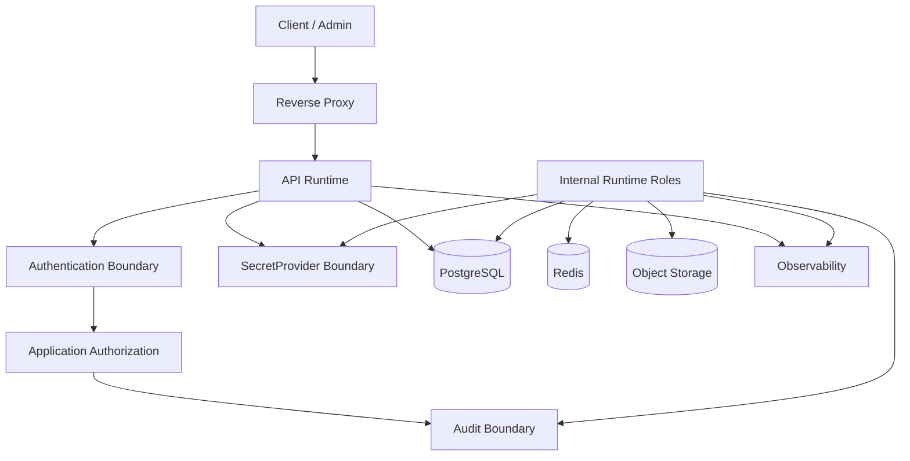

# Runtime Security

## Purpose

This document defines OmniWA Phase 6 runtime security design.

It covers secret management, key rotation, API key handling, session protection, encryption boundaries, runtime isolation, least privilege, and audit logging without choosing a concrete secret product or creating configuration.

## Security Principles

- Secret data is never logged, cached in plaintext, projected, included in metrics/traces, placed in object paths, or exposed through API/webhook/error/audit responses.
- Raw Confidential payloads are excluded from normal persistence, logs, telemetry, audit raw evidence, and object artifacts by default.
- API authentication creates identity; Application authorization decides product access.
- Runtime service identities are separate by role.
- Infrastructure enforces access boundaries but does not own business authorization policy.
- Secret rotation must be auditable and should not require product identity changes.

## Secret Management

| Secret Class | Examples | Runtime Handling |
|---|---|---|
| API credentials | API key secret, admin key secret, monitoring key secret | Stored and verified through SecretProvider boundary; safe key_id may be logged. |
| Webhook signing secrets | Outbound webhook signing material | Delivered only to Webhook Dispatcher through SecretProvider; never logged. |
| Session material | WhatsApp/session auth material | Treated as Secret; access limited to Session/Provider workflows and backup encryption boundary. |
| Provider credentials | Provider auth/session tokens, provider runtime sensitive values | Provider Runtime only; never product state or public API. |
| Encryption keys | Storage, backup, artifact encryption keys | SecretProvider/KMS-style boundary; rotation requires recovery review. |
| Operational secrets | Database credentials, Redis credentials, object storage credentials, observability tokens | Role-scoped, least privilege, not available to modules that do not need them. |

## Key Rotation

| Key Type | Rotation Requirement |
|---|---|
| API Key | Planned rotation window 7 to 30 days; immediate revocation for compromise; old/new overlap supported. |
| Admin Key | Stronger controls, immediate revocation support, all use audited. |
| Webhook Signing Secret | Rotation must support overlapping verification windows where needed by receivers. |
| Session Secret | Rotation is provider/session controlled; compromised session leads to revoke/re-pair/action-required. |
| Backup Encryption Key | Rotation requires restore validation and old-backup decryptability review during retention window. |
| Infrastructure Credentials | Rotate under maintenance or emergency procedure; service identity scoped per runtime role. |

## API Key Handling

- API key secret is accepted only at authentication boundary.
- API key secret is never logged or returned.
- Safe key_id may appear in logs, audit, and metrics.
- API keys can be scoped by operation and instance boundary.
- Revoked keys fail new requests.
- Failed authentication uses generic errors and safe audit metadata.

## Session Protection

Session protection requirements:

- Session material is Secret.
- Session material must not be exposed through API, logs, metrics, traces, audit, webhook, object paths, or projection state.
- Provider Runtime can access session material only through approved SecretProvider/Session boundary.
- Backups may include session material only when encrypted and retained under backup policy.
- Restore must validate session availability and mark instances action-required when re-pairing is needed.
- A Session can be associated with one active provider runtime ownership path at a time.

## Data Encryption Boundary

| Boundary | Requirement |
|---|---|
| External transport | TLS or equivalent secure transport at public/admin/webhook/provider boundaries where applicable. |
| Internal transport | Internal runtime-to-data/service communication protected by network isolation and credentialed access; encryption preferred for production. |
| PostgreSQL | Confidential and Secret-sensitive data encrypted at rest; access roles separated by runtime role. |
| Redis | No Secret/raw Confidential values; internal network only; authentication required. |
| Object Storage | Artifact encryption at rest; object paths and metadata must not include Secret/raw Confidential values. |
| Backup Storage | Encrypted backup artifacts; integrity verification required. |
| Observability | Redaction before export; no Secret/raw Confidential data. |

## Runtime Isolation

| Runtime | Isolation Requirement |
|---|---|
| API Runtime | Public ingress only through Reverse Proxy; no direct DB behavior outside Application/ports. |
| Worker Runtime | Internal only; no public ingress; no API calls; role-scoped data access. |
| Scheduler/Background | Internal only; one-active ownership for scheduled work. |
| Provider Runtime | Internal only; provider network egress allowed; provider payload translated before product use. |
| Webhook Dispatcher | Outbound egress to configured receivers; no inbound product API role. |
| Projection Builder | Internal only; projection write access only; no source mutation. |
| Metrics/Health | Network-restricted or authenticated when detailed; public health if any must be minimal. |

## Least Privilege

| Role | Minimum Access |
|---|---|
| API Runtime | Auth/authorization context, Application commands/queries, repository access through Application, safe query projections. |
| Worker Runtime | WorkerJob state, owner repository state through Application workflows, queue support, required external port access. |
| Scheduler Runtime | Scheduling ownership, Application workflow triggers, health and retention scopes. |
| Provider Runtime | Provider/session secrets for owned instances, provider network, translated signal port. |
| Webhook Dispatcher | WebhookDelivery state, webhook signing secret, outbound network to configured receiver. |
| Projection Builder | Read retained source state and write projection state only. |
| Backup/Restore Role | Backup/restore access only during operational procedure; audited. |
| Observability Role | Sanitized logs/metrics/traces only; no Secret access. |

## Audit Logging

Audit required for:

- admin key use,
- privileged access decisions,
- secret access requests,
- API/admin key rotation and revocation,
- webhook signing secret rotation,
- configuration validation and activation,
- destructive instance operations,
- diagnostic capture,
- backup and restore operations,
- recovery outcome,
- dead-letter replay or operator override,
- retention cleanup where policy requires evidence.

Audit records must be Secret-safe and retention-bound.

## Security Runtime Diagram

## Security Constraints

- Infrastructure must fail closed when authentication, authorization, secret, or redaction state is uncertain.
- Runtime security must not bypass Application access decisions.
- Infrastructure access controls do not replace product authorization.
- Object Storage pre-signed or temporary access, if introduced later, requires separate review.
- Secret provider failure must not degrade into plaintext fallback.
- Security telemetry must be safe and actionable, not raw evidence dumps.
