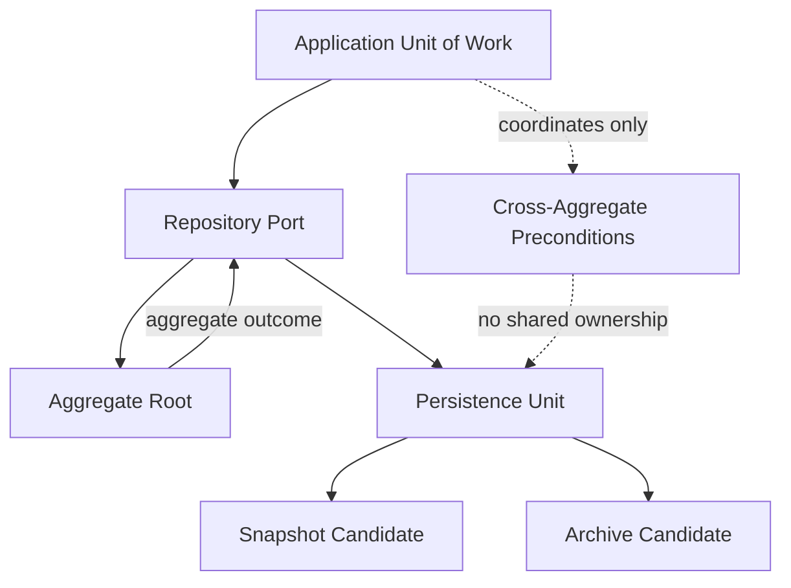

# Aggregate Persistence

## Purpose

This document defines aggregate persistence strategy for OmniWA Phase 5.1.

It does not design database tables, columns, SQL, indexes, ORM models, Prisma schema, migrations, or source code.

## Aggregate Persistence Principles

- Aggregate root is the primary write persistence unit.
- One aggregate persistence unit owns one aggregate's durable source state.
- Atomic boundary is conceptual and follows Application transaction strategy.
- Cross-aggregate state is coordinated by Application, not by shared persistence ownership.
- Persistence snapshots may optimize recovery/read operations later but must not change aggregate meaning.
- Archive candidates must preserve retention and sensitive-data rules.

## Aggregate Persistence Catalog

| Aggregate | Persistence Unit | Persistence Boundary | Atomic Boundary | Persistence Lifecycle | Consistency Requirement | Snapshot Candidate | Archive Candidate |
|---|---|---|---|---|---|---|---|
| Instance | Instance State | One Instance lifecycle and safe readiness summary | One Instance lifecycle change | Created through Destroyed | Strong inside Instance; session readiness Application-coordinated | Current instance status snapshot | Destroyed instance summary after retention |
| Session | Session State | One Session lifecycle, recovery, retention, safe secret reference | One Session lifecycle/retention change | Pending/Active/Expired/Revoked/Cleaned | Strong inside Session; one-active-session coordinated with Instance | Current safe session availability snapshot | Expired/revoked/cleaned session metadata |
| Message | Message State | One Message lifecycle and delivery visibility | One Message state/classification change | Accepted/Queued/Processing/Sent/Delivered/Read/Failed/Cancelled | Strong inside Message; provider/webhook projections eventual | Current message status snapshot | Delivery history after active retention; body not archived by default |
| MediaAsset | Media Metadata State | One media metadata, processing, retention decision | One MediaAsset state/retention change | Accepted/Processing/Processed/Attached/Failed/Cleaned | Strong inside MediaAsset; message attachment Application-coordinated | Media status snapshot | Metadata/diagnostic summary if policy allows; binary excluded by default |
| WebhookSubscription | Webhook Subscription State | One subscription lifecycle and signal selection | One subscription validation/lifecycle change | Proposed/Validated/Active/Suspended/Invalid/Retired | Strong inside subscription | Current subscription status snapshot | Retired subscription metadata |
| WebhookDelivery | Webhook Delivery State | One delivery lifecycle, attempts, retry/dead-letter | One delivery state transition | Pending/Delivering/Delivered/Retrying/Failed/DeadLetter/Cancelled | Strong inside delivery; source fact eventual | Delivery attempt summary snapshot | Delivery history/dead-letter summary |
| GuardrailDecision | Guardrail Decision State | One responsible-usage decision for one intent | One decision outcome | Requested/Evaluated/Passed/Blocked/Throttled/ActionRequired | Strong; required before message acceptance | Decision outcome snapshot | Expired/evaluated decision summary |
| ProviderProfile | Provider Profile State | One product provider capability/compatibility profile | One provider profile update | Candidate/Supported/Degraded/Unsupported/Retired | Strong inside ProviderProfile; consumers may lag | Capability status snapshot | Old capability/profile versions |
| WorkerJob | Worker Job State | One async job lineage and retry/dead lifecycle | One WorkerJob lifecycle transition | Queued/Reserved/Running/Completed/Retrying/Dead | Strong inside WorkerJob; owner interpretation Application-coordinated | Current job status snapshot | Completed/dead job history |
| AccessDecision | Access Decision State | One actor/capability/target decision | One decision grant/deny/expiry | Requested/Granted/Denied/Expired | Strong; privileged mutation precondition | Current decision snapshot until expiry | Expired decision audit summary |
| AuditRecord | Audit State | One Secret-safe evidence record | One record/redaction/retention change | Requested/Recorded/Retained/Expired | Strong for audit safety and retention category | Audit record is already an evidence snapshot | Retention-managed audit archive if policy allows |
| HealthStatus | Health Projection State | One health subject classification | One health classification change | Unknown/Healthy/Degraded/Unavailable/ActionRequired/Recovered | Strong for one health subject; source facts eventual | Current health snapshot | Health history/projection archive |
| ConfigurationSnapshot | Configuration State | One validated configuration snapshot | One validation/activation/superseding decision | Proposed/Validated/Rejected/Active/Superseded/Retired | Strong; active configuration uniqueness later must be Application-coordinated | Snapshot is the persistence form | Superseded/rejected snapshots |
| TelemetrySignal | Telemetry Projection State | One sanitized telemetry signal/projection decision | One sanitization/projection decision | Captured/Sanitized/Projected/Dropped | Strong for redaction decision; export eventual | Sanitized telemetry snapshot | Aggregated/sanitized telemetry archive only |

## Persistence Unit Traceability

| Persistence Unit | Aggregate | Repository Port | Application Use Case | API Resource | Product Capability |
|---|---|---|---|---|---|
| Instance State | Instance | InstanceRepositoryPort | UC-INS-001, UC-INS-003, UC-INS-008, UC-INS-010, UC-INS-011 | Instance | Instance lifecycle |
| Session State | Session | SessionRepositoryPort | UC-INS-004, UC-INS-005, UC-INS-006, UC-INS-009 | Session, QR | Pairing and connection reliability |
| Message State | Message | MessageRepositoryPort | UC-MSG-001, UC-MSG-002, UC-MSG-005, UC-MSG-008, UC-MSG-010 | Message | Messaging |
| Media Metadata State | MediaAsset | MediaAssetRepositoryPort | UC-MED-001, UC-MED-002, UC-MED-005, UC-MED-006 | Media | Media handling |
| Webhook Subscription State | WebhookSubscription | WebhookSubscriptionRepositoryPort | UC-WEB-001 through UC-WEB-005, UC-WEB-010 | WebhookSubscription | Webhook configuration |
| Webhook Delivery State | WebhookDelivery | WebhookDeliveryRepositoryPort | UC-WEB-006 through UC-WEB-010 | WebhookDelivery | Webhook delivery reliability |
| Guardrail Decision State | GuardrailDecision | GuardrailDecisionRepositoryPort | UC-MSG-003 | Message | Product guardrails |
| Provider Profile State | ProviderProfile | ProviderProfileRepositoryPort | UC-PRV-001, UC-PRV-006 | Provider | Provider abstraction |
| Worker Job State | WorkerJob | WorkerJobRepositoryPort | UC-OPS-001 through UC-OPS-004 | WorkerJob | Queue and worker visibility |
| Access Decision State | AccessDecision | AccessDecisionRepositoryPort | UC-ADM-001 | Admin resources | Security and access |
| Audit State | AuditRecord | AuditRecordRepositoryPort | UC-ADM-004, UC-MON-004 | AuditRecord | Audit |
| Health Projection State | HealthStatus | HealthStatusRepositoryPort | UC-MON-001, UC-MON-003 | Health | Observability |
| Configuration State | ConfigurationSnapshot | ConfigurationSnapshotRepositoryPort | UC-ADM-002, UC-ADM-003 | Configuration | Configuration |
| Telemetry Projection State | TelemetrySignal | TelemetrySignalRepositoryPort | UC-MON-002, metrics snapshot queries | Metrics | Observability |

## Aggregate Persistence Diagram

## Snapshot Strategy

Snapshot candidates exist to support recovery, status queries, and operational visibility.

Rules:

- Snapshot is derived from owner aggregate state.
- Snapshot must not become independent source of truth.
- Snapshot must include stale/fresh marker when used as read projection.
- Snapshot must obey data classification and retention.
- Snapshot must not include provider-native payloads, session secrets, raw phone/JID, raw message body, raw media binary, or raw webhook payload.

## Archive Strategy

Archive candidates exist for terminal, expired, completed, or retention-bound state.

Rules:

- Archive does not change aggregate ownership.
- Archive must preserve enough safe metadata for audit/recovery where policy requires.
- Archive must not resurrect expired data into API reads.
- Archive must not store raw payloads excluded by Product/API freezes.
- Archive policy depends on owning context retention policy.
