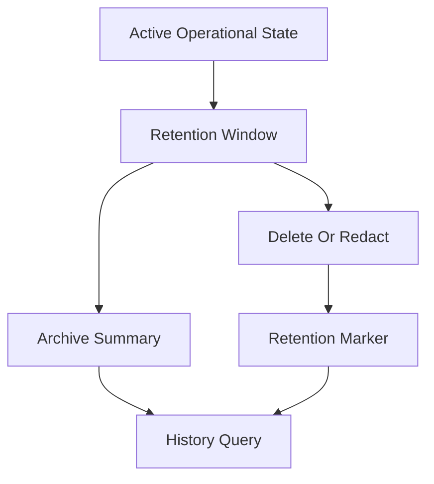

# Archive And Retention

## Purpose

This document defines OmniWA Phase 5.3 archive and retention architecture.

Archive and retention are physical persistence concerns governed by the frozen Product decisions, data classification model, Domain ownership, and API query contracts.

This document does not create cleanup jobs, SQL, physical tables, object bucket policies, or implementation code.

## Retention Baseline

| Data Category | Default Retention | Physical Implication |
|---|---|---|
| Audit Log | 180 days | Retain Secret-safe audit metadata and redaction markers. |
| Webhook Log | 30 days for delivery metadata and redacted payload references | Retain delivery attempts, retry/dead-letter state, and safe failure categories. |
| Message Log | 30 days for metadata; message body not retained by default; diagnostic content max 7 days | Retain lifecycle metadata and safe failure categories; clean content artifacts. |
| Queue | Completed work 7 days; terminal failed or action-required work 30 days | Keep WorkerJob lifecycle visible for recovery and operations. |
| Media | Binary not retained by default after processing; metadata 30 days; diagnostic media max 7 days | Keep metadata in PostgreSQL; clean object artifacts quickly. |
| Session | Retained while instance is active; deleted within 24 hours after instance deletion except encrypted backups | Session cleanup must be auditable and action-required if unsafe. |
| Backup | Encrypted backups retained 14 days | Backup artifact lifecycle must enforce expiry. |

## Archive Strategy

| Archive Area | Strategy | Constraint |
|---|---|---|
| Message archive | Retain metadata summary only within policy | Message body cannot be restored if not retained. |
| Webhook archive | Retain delivery metadata, attempt summary, failure category, and redacted references | Raw webhook payload is excluded by default. |
| Audit archive | Retain Secret-safe audit evidence and redaction marker | Archive access is admin/security governed. |
| Projection archive | Expire or rebuild projections from retained source state | Projection is not source of truth. |
| Worker job archive | Retain completed jobs 7 days; failed/action-required 30 days | Recovery state must remain visible until terminal handling expires. |
| Backup archive | Encrypted backup artifacts retained 14 days | Backup cannot exceed retention without future policy. |

## Message Archive

Message archive stores safe metadata only:

- MessageId,
- Instance reference,
- direction,
- supported type category,
- lifecycle state,
- safe failure category,
- idempotency marker,
- correlation and request references where safe,
- retention marker.

It must not retain message body by default. If diagnostic content capture is enabled, content expires within 7 days maximum.

## Webhook Archive

Webhook archive stores delivery metadata only:

- WebhookDeliveryId,
- subscription reference,
- source signal reference,
- attempt summary,
- retry state,
- terminal/dead-letter state,
- safe failure category,
- redacted payload reference where policy permits.

Raw webhook payload is not archived by default.

## Audit Archive

Audit archive preserves:

- audit identity,
- safe actor reference,
- source reference,
- event/action category,
- retention category,
- redaction marker,
- integrity marker where future implementation supports it.

Audit archive must not store Secret values or raw Confidential payloads.

## Projection Archive

Projection archive is optional and derived.

Rules:

- projections may expire before source state when rebuild is possible,
- projections may outlive source state only as safe summaries if retention permits,
- projections cannot restore expired source facts,
- projection archive must carry projection version and freshness marker.

## Cleanup Policy

| Cleanup Target | Cleanup Action |
|---|---|
| Expired message metadata | Delete, redact, or reduce to safe retention marker according to approved policy. |
| Diagnostic message content | Delete within 7 days maximum. |
| Temporary media binary | Delete after processing unless diagnostic capture is enabled. |
| Diagnostic media binary | Delete within 7 days maximum. |
| Webhook delivery metadata | Delete/archive after 30 days according to policy. |
| Completed WorkerJob | Delete/archive after 7 days. |
| Failed/action-required WorkerJob | Delete/archive after 30 days after terminal handling. |
| Session after instance deletion | Delete within 24 hours except encrypted backup retention. |
| Backup artifact | Delete after 14 days. |
| Projection snapshot | Expire when source retention or projection version requires rebuild. |

## Retention Enforcement

Retention enforcement requires:

- explicit retention category,
- retention expiry marker,
- cleanup eligibility check,
- audit-safe cleanup record where required,
- object artifact cleanup verification where applicable,
- failure visibility through Health or ActionRequiredProjection,
- no reconstruction of expired payloads.

## Archive And Retention Diagram

## Archive Constraints

- Archive remains owned by the source context.
- Archive does not create a new source of truth.
- Archive cannot restore expired sensitive data into normal API responses.
- Archive must preserve or strengthen data classification.
- Archive access must be authorized and auditable.
- Retention cleanup must not delete state required by running work.
