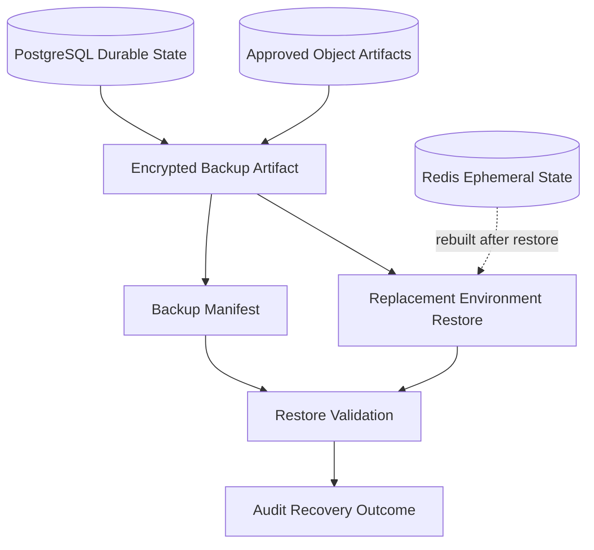

# Backup And Recovery

## Purpose

This document defines OmniWA Phase 5.3 backup and recovery architecture.

Backup and recovery must preserve OmniWA-owned recoverable state without claiming control over WhatsApp, device, account, or upstream provider state.

This document does not choose a backup product, storage vendor, restore tool, SQL process, or implementation.

## Backup Targets

| Target | Included? | Reason |
|---|---|---|
| PostgreSQL durable state | Yes | Source-of-truth aggregate state, projections, audit, WorkerJob, idempotency, retention markers. |
| Object Storage backup artifacts | Yes, when artifact is part of recoverable state | Encrypted backup bundles and approved retained artifacts. |
| Object Storage temporary media | No by default | Temporary media is not recoverable product state. |
| Redis | No as source backup | Redis is ephemeral and rebuildable from PostgreSQL where required. |
| Provider runtime state | No | Provider runtime state is external/ephemeral and must be recovered through session/provider workflows. |
| Logs and telemetry exports | Conditional | Only sanitized observability state within retention; not required as product source of truth. |

## Backup Frequency

| Backup Type | Frequency | Scope |
|---|---|---|
| Encrypted recoverable-state backup | At least once every 24 hours | PostgreSQL durable state and approved backup artifacts. |
| Backup manifest capture | With every backup | Backup identity, time, integrity marker, included storage areas, retention expiry. |
| Restore validation sample | Before production readiness and on a regular operational cadence | Verifies restore procedure and data integrity. |

## Backup Type

| Type | Phase 5.3 Position |
|---|---|
| Full backup | Required baseline for MVP recoverable state. |
| Incremental backup | Future optimization if recovery targets require it. |
| Continuous recovery stream | Future optimization for better RPO. |
| Object artifact backup | Required only for approved retained artifacts and encrypted backup bundles. |
| Redis backup | Not a source-of-truth backup. |

## Recovery Targets

| Target | MVP Decision |
|---|---|
| Backup retention | 14 days |
| Recovery Point Objective | 24 hours for OmniWA-owned recoverable state |
| Recovery Time Objective | 4 hours for P1 OmniWA-controlled service recovery |
| Disaster Recovery | Restore to replacement environment; active-active and multi-region DR are out of scope |

## Restore Validation

Restore validation must verify:

- backup integrity,
- instance inventory,
- product identity continuity,
- session state availability without exposing Secret material,
- queue and WorkerJob state,
- webhook retry/dead-letter state,
- idempotency state,
- retention markers,
- audit continuity where available,
- projection rebuild or freshness markers,
- object artifact reference validity where artifacts are recoverable.

## Recovery Procedure

1. Identify incident category and affected instances.
2. Select latest valid encrypted backup within retention.
3. Restore PostgreSQL durable state into replacement environment.
4. Restore approved Object Storage artifacts needed for recoverable state.
5. Rebuild or invalidate Redis cache, locks, queue-support hints, and runtime hints.
6. Validate instance inventory and product identities.
7. Validate session availability and mark instances requiring re-pairing as action-required.
8. Validate WorkerJob, retry, dead-letter, and idempotency state.
9. Reconcile webhook delivery state and re-deliver only when safe and idempotent.
10. Rebuild projections from retained source state or mark stale/unavailable where retention prevents rebuild.
11. Record recovery outcome in audit.

## Disaster Recovery

MVP disaster recovery is replacement-environment restore.

| Scenario | Required Response |
|---|---|
| PostgreSQL primary loss | Restore latest valid encrypted backup and validate recoverable state. |
| Redis loss | Rebuild cache/coordination state from PostgreSQL; fail closed where locks cannot be proven. |
| Object artifact loss | Restore only approved retained artifacts; mark missing temporary artifacts as expired/unavailable. |
| Region or host loss | Restore PostgreSQL and approved artifacts in replacement environment. |
| Provider session mismatch after restore | Mark instance/session action-required; do not assume WhatsApp state can be restored automatically. |

## Backup And Recovery Diagram

## Recovery Constraints

- Recovery cannot resurrect expired data.
- Recovery cannot expose Secret data in validation logs.
- Recovery cannot assume WhatsApp account or provider runtime state is healthy.
- Recovery cannot re-deliver webhooks without idempotency safety.
- Recovery cannot mark work completed unless durable state supports that conclusion.
- Backup artifacts must expire after 14 days unless a future approved policy changes retention.
