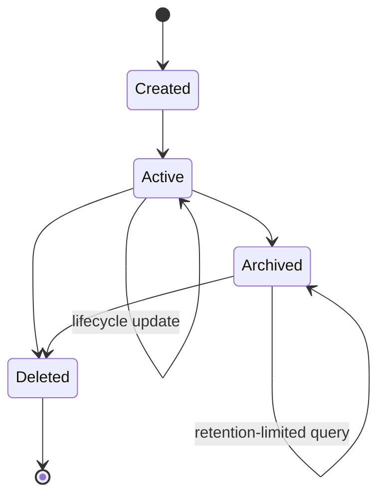
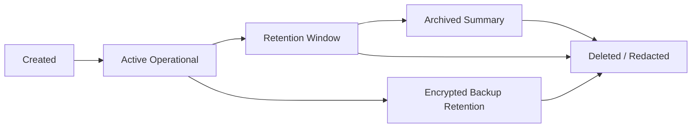

# Data Lifecycle

## Purpose

This document defines OmniWA Phase 5.3 data lifecycle rules across physical persistence stores.

The lifecycle model covers Instance, Session, Message, Media Metadata, Webhook, Audit, Projection, and Job data without designing tables, SQL, Prisma, or implementation.

## Lifecycle Principles

- Lifecycle state is owned by the appropriate Aggregate or projection owner.
- Physical storage must support lifecycle visibility without deciding business state.
- Retention cleanup must be explicit and auditable where required.
- Expired sensitive data must not be recoverable through normal queries.
- Redis state expires before or with its owning durable state.
- Object Storage artifacts must not outlive retention policy.

## Data Lifecycle Matrix

| Data Type | Created | Active | Archived | Deleted | Retention |
|---|---|---|---|---|---|
| Instance | When an Instance aggregate is created | While instance can be managed, connected, disconnected, or action-required | Destroyed summary may archive after retention | After approved destruction and retention cleanup | Lifecycle summary retained as policy permits; no provider-native payload |
| Session | During pairing, restore, or provider session creation | While instance is active and session is usable/recoverable | Expired/revoked/cleaned metadata may archive | Within 24 hours after instance deletion except encrypted backup retention | Retained while instance active; Secret material protected |
| Message | When outbound/inbound message lifecycle is accepted | While queued, processing, sent, delivered, read, failed, cancelled, or visible for status | Metadata history may archive within 30-day retention | Body not retained by default; metadata cleaned after retention | Metadata 30 days; diagnostic content max 7 days |
| Media Metadata | When media asset is registered or received | While processing, attached, failed, retained, or cleanup-pending | Metadata summary may archive within policy | Binary deleted after processing by default; metadata cleaned after 30 days | Metadata 30 days; diagnostic binary max 7 days |
| Webhook Subscription | When subscription is registered | While active, suspended, or retired but visible | Retired metadata may archive | Cleaned after retention if no longer needed | Subscription metadata per configuration/audit policy |
| Webhook Delivery | When delivery is scheduled | While pending, delivering, retrying, delivered, failed, or dead-letter | Delivery summary may archive within 30-day retention | Cleaned after webhook log retention | Delivery metadata 30 days |
| Audit | When audit-safe evidence is recorded | While within audit retention and authorized for query | May archive as Secret-safe evidence | Deleted/redacted after retention | 180 days |
| Projection | When projection is built or refreshed | While queryable and within source retention | Optional derived archive if policy permits | Expired or rebuilt when stale/versioned/unsupported | Bound by source retention and query contract |
| Job | When async work is accepted | While queued, reserved, running, retrying, completed, dead, or action-required | Completed/dead summary may archive | Completed after 7 days; failed/action-required after 30 days | Completed 7 days; terminal failed/action-required 30 days |

## Lifecycle Flow

## Data Lifecycle Diagram

## Lifecycle By Physical Store

| Physical Store | Lifecycle Responsibility |
|---|---|
| PostgreSQL | Owns durable lifecycle state, retention markers, source state, projections, and audit-safe metadata. |
| Redis | Owns transient lifecycle hints only; every entry must expire or be rebuildable. |
| Object Storage | Owns binary/artifact lifecycle under explicit retention and object cleanup policy. |
| Backup Artifacts | Own encrypted recovery snapshots for 14 days. |

## Lifecycle Guardrails

- Message body lifecycle is shorter than message metadata lifecycle by default.
- Media binary lifecycle is shorter than media metadata lifecycle by default.
- Session cleanup must not expose Secret material.
- Webhook delivery cleanup must not hide unresolved dead-letter state before retention permits cleanup.
- WorkerJob cleanup must not delete active, retrying, or action-required work.
- Projection lifecycle must not outlive source retention unless it is a safe summary approved by policy.
- Backup lifecycle must expire encrypted artifacts after 14 days.

## Lifecycle Traceability

| Data Type | Repository Port | Aggregate / Projection | Application Service / Query | API Resource | Product Capability |
|---|---|---|---|---|---|
| Instance | InstanceRepositoryPort | Instance | Instance services, GetInstanceStatus, ListInstances | Instance | Instance lifecycle |
| Session | SessionRepositoryPort | Session | QR/reconnect services, GetInstanceStatus | Session, QR | Pairing and reliability |
| Message | MessageRepositoryPort | Message | Messaging services, GetMessageStatus, GetMessageDeliveryHistory | Message | Messaging |
| Media Metadata | MediaAssetRepositoryPort | MediaAsset | Media services, GetMediaStatus | Media | Media handling |
| Webhook Subscription | WebhookSubscriptionRepositoryPort | WebhookSubscription | Webhook config services, GetWebhookStatus | WebhookSubscription | Webhook configuration |
| Webhook Delivery | WebhookDeliveryRepositoryPort | WebhookDelivery | Webhook delivery services, GetWebhookDeliveryHistory | WebhookDelivery | Webhook delivery reliability |
| Audit | AuditRecordRepositoryPort | AuditRecord | Audit services, QueryAuditRecords | AuditRecord | Audit |
| Projection | HealthStatusRepositoryPort, TelemetrySignalRepositoryPort, read projection access | HealthStatus, TelemetrySignal, read projections | Health, metrics, action-required, status/list queries | Health, Metrics, status resources | Observability and API query |
| Job | WorkerJobRepositoryPort | WorkerJob | Worker services, GetWorkerJobStatus, GetQueueMetricsSnapshot | WorkerJob | Queue and worker visibility |

## Phase 5.3 Checklist

| Item | Status |
|---|---|
| Physical persistence defined | PASS |
| PostgreSQL architecture defined | PASS |
| Redis architecture defined | PASS |
| Object storage defined | PASS |
| Index strategy defined | PASS |
| Partition strategy defined | PASS |
| Backup & recovery defined | PASS |
| Data lifecycle defined | PASS |
| Traceability completed | PASS |

**Phase 5.3 is ready for review.**
