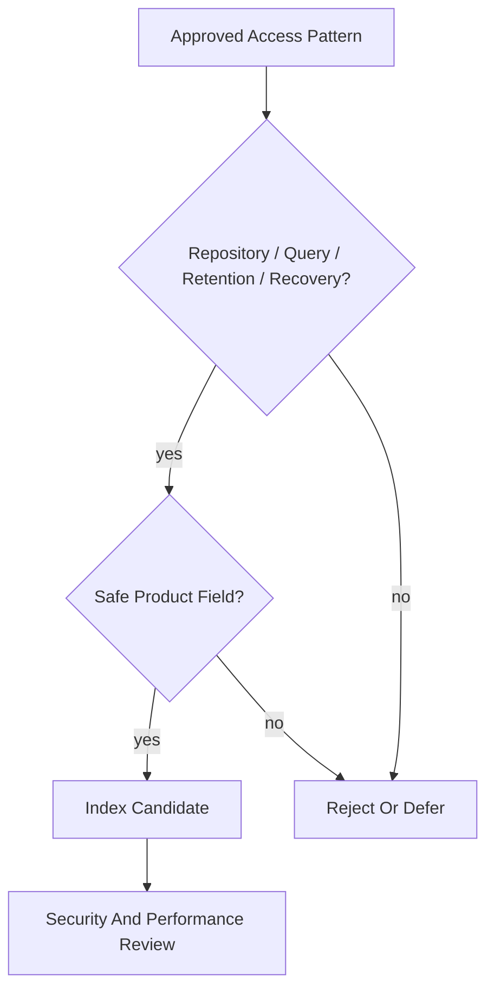

# Index Strategy

## Purpose

This document defines OmniWA Phase 5.3 index strategy at the access-pattern level.

It does not create index DDL, SQL, physical tables, or implementation code.

## Index Principles

- Indexes support approved repository operations and Application queries only.
- Indexes must be based on safe product fields, not provider-native identifiers or raw sensitive data.
- Indexes must not introduce new query capabilities outside Product Scope.
- Indexes must support retention cleanup and recovery workflows.
- Write-heavy indexes must be justified by command/query frequency and recovery needs.
- Full-text indexing of message bodies is out of scope for MVP.

## Primary Access Patterns

| Storage Area | Primary Access Pattern | Index Candidate Type | Reason |
|---|---|---|---|
| Instance State | Lookup by InstanceId; find non-terminal instances for recovery | Identity and lifecycle candidate | Supports status reads and recovery. |
| Session State | Lookup by SessionId; find current session reference by InstanceId | Identity and owner-reference candidate | Supports pairing, reconnect, and cleanup. |
| Message State | Lookup by MessageId; idempotency for outbound intent; active lifecycle recovery | Identity, idempotency, lifecycle candidate | Supports send/retry/cancel/status and crash recovery. |
| Media Metadata | Lookup by MediaId; find processing or cleanup candidates | Identity and lifecycle/retention candidate | Supports media processing and retention. |
| Webhook Subscription | Lookup by WebhookId; find active subscriptions for signal selection | Identity and active-state candidate | Supports webhook configuration and delivery scheduling. |
| Webhook Delivery | Lookup by WebhookDeliveryId; source signal plus subscription idempotency; pending/retrying/dead lookup | Identity, idempotency, lifecycle, retry candidate | Supports delivery reliability and dead-letter visibility. |
| Guardrail Decision | Lookup by GuardrailDecisionId; evaluated intent and rate window | Identity, intent-reference, window candidate | Supports compliance guardrail decisions. |
| Provider Profile | Lookup by ProviderId; active supported/degraded provider profile | Identity and capability-state candidate | Supports provider compatibility checks. |
| Worker Job | Lookup by JobId; owner context; queued/reserved/running/retrying/dead states | Identity, owner-reference, lifecycle candidate | Supports workers, recovery, and metrics. |
| Access Decision | Lookup by AccessDecisionId; actor/capability/target/expiry | Identity, authorization-scope, expiry candidate | Supports fail-closed authorization. |
| Audit | Lookup by AuditRecordId; source reference, category, retention window | Identity, source-reference, time/retention candidate | Supports admin audit queries and retention. |
| Health Projection | Lookup by HealthStatusId and health subject; degraded/action-required subjects | Identity, subject, classification candidate | Supports health and action-required queries. |
| Configuration | Lookup by ConfigurationSnapshotId; active validated snapshot | Identity and active-state candidate | Supports safe active configuration reads. |
| Telemetry Projection | Lookup by TelemetrySignalId; projection category and retention | Identity, category, time/retention candidate | Supports metrics snapshots and sanitization. |
| Read Projections | Query-specific cursor and filter access | Projection-specific candidate | Supports approved API query contracts. |

## Secondary Access Patterns

| Pattern | Applies To | Purpose |
|---|---|---|
| Correlation ID / Request ID lookup | Message, WebhookDelivery, WorkerJob, Audit, Telemetry | Trace operational workflows without storing raw payloads. |
| Retention expiry lookup | Message metadata, Media metadata, WebhookDelivery, Audit, WorkerJob, Backup manifest | Cleanup and archive enforcement. |
| Failure category lookup | Message, WebhookDelivery, WorkerJob, Health | Troubleshooting and action-required views. |
| Status plus updated time | Message, WebhookDelivery, WorkerJob, Health | Recovery scans and operational monitoring. |
| Source signal reference | WebhookDelivery, Audit, Telemetry | Idempotent downstream delivery and traceability. |
| Snapshot version lookup | Projections, metrics, configuration | Safe projection rebuild and cache invalidation. |

## Read-Heavy Strategy

Read-heavy access should prefer projections.

| Read Area | Strategy |
|---|---|
| Instance lists | Projection-oriented indexes over safe list filters and cursor fields. |
| Message status | Strong owner read for active status; projection for related summaries. |
| Webhook delivery history | Projection or history-oriented access using retention-safe cursor fields. |
| Metrics snapshots | Snapshot projections with version and timestamp access. |
| Health and action-required | Classification and subject-oriented projection access. |
| Audit queries | Retention, category, and safe source-reference access under authorization. |

## Write-Heavy Strategy

Write-heavy flows should minimize unnecessary secondary indexes.

| Write Area | Risk | Index Strategy |
|---|---|---|
| Message lifecycle | High write rate during send/receive | Prioritize identity, idempotency, active status, and retention. |
| Webhook delivery attempts | High retry and failure churn | Prioritize delivery identity, retry state, source signal idempotency, and retention. |
| WorkerJob lifecycle | High reservation and retry churn | Prioritize job identity, owner context, lifecycle, and reservation safety. |
| Telemetry signals | High volume possible | Prefer aggregation/snapshot paths and retention. |
| Audit records | Append-heavy | Prefer source reference, category, and retention access; avoid broad reporting. |

## Composite Index Candidates

Composite access patterns may be needed later, but this phase does not create physical indexes.

| Candidate Pattern | Applies To | Reason |
|---|---|---|
| Owner reference plus lifecycle state | Message, WorkerJob, WebhookDelivery | Recovery and worker scans. |
| Source signal plus subscription | WebhookDelivery | Idempotent webhook delivery. |
| Actor plus capability plus target plus expiry | AccessDecision | Authorization decision reuse within a safe window. |
| Category plus time window | Audit, Telemetry, Metrics | Retention-bound admin and monitoring queries. |
| Health subject plus classification | HealthStatus | Action-required views. |
| Projection version plus cursor field | Read projections | Stable pagination and rebuild compatibility. |

## Full-Text Search Candidate

Full-text search is not part of MVP.

| Data | Phase 5.3 Decision |
|---|---|
| Message body | Not indexed; not retained by default. |
| Media binary | Not indexed; binary not retained by default after processing. |
| Webhook payload | Not indexed; raw payload not stored by default. |
| Audit evidence | Not full-text indexed; safe metadata only. |
| Safe metadata search | Future candidate only after Product/API approval. |

## Index Governance

- Every future physical index must trace to a repository operation, Application query, recovery workflow, or retention workflow.
- Every future physical index over Confidential fields requires security review.
- No future index may expose raw phone numbers, JIDs, message bodies, media binary, webhook payloads, session secrets, API keys, or provider-native payloads.
- Index changes must consider write amplification on message, webhook, worker, telemetry, and audit flows.

## Index Strategy Diagram

