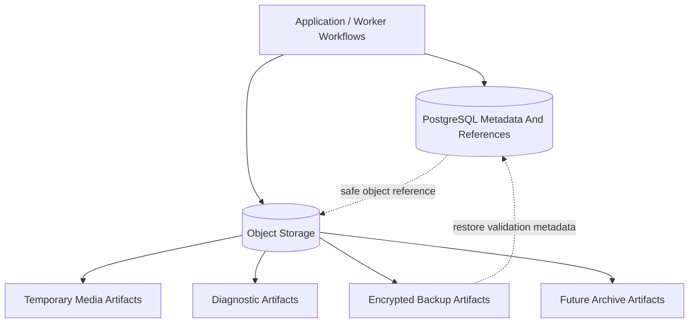

# Object Storage Architecture

## Purpose

This document defines OmniWA Phase 5.3 object storage architecture.

Object Storage is used for binary and large artifact storage when such artifacts are explicitly approved by product, retention, and security rules. It is not the source of business metadata.

This document does not choose S3, MinIO, a cloud provider, a bucket implementation, or object APIs.

## Object Storage Role

| Artifact Class | Allowed In MVP? | Retention | Source Of Truth? | Notes |
|---|---|---|---|---|
| Temporary media processing artifact | Yes when needed by media workflow | Deleted after processing unless diagnostic capture is enabled | No | Media metadata remains in PostgreSQL. |
| Diagnostic media artifact | Optional explicit enablement only | Maximum 7 days | No | Operator-visible capture and expiry are required. |
| Diagnostic message content artifact | Optional explicit enablement only | Maximum 7 days | No | Message body is not retained by default. |
| Webhook replay payload artifact | Deferred | Requires future approval | No | Normal WebhookDelivery stores metadata and redacted references only. |
| Import/export artifact | Future/admin only | Policy-defined | No | Must not expand API scope. |
| Encrypted backup artifact | Yes | 14 days | Backup artifact, not live source state | Restore requires PostgreSQL metadata validation. |
| Archive artifact | Future | Same or stricter than source retention | Archive copy only | Cannot resurrect expired data into normal API responses. |

## Layout Strategy

Object storage layout is organized by artifact class, environment, sensitivity, owner context, retention class, and object lifecycle.

This phase defines layout dimensions only and does not define concrete bucket names or object keys.

| Layout Dimension | Purpose | Constraint |
|---|---|---|
| Environment | Separate development, staging, and production artifacts | No cross-environment artifact reuse. |
| Artifact class | Media, diagnostic, backup, archive, import/export | Lifecycle policy depends on class. |
| Sensitivity | Internal, Confidential, Secret-derived artifact | Secret-derived artifacts require strongest handling. |
| Owner context | Media, Messaging, Backup, Audit, Recovery | Ownership follows source context. |
| Retention class | Temporary, diagnostic, backup, archive | Cleanup must be enforceable by class. |
| Object lifecycle state | Active, pending cleanup, expired, retained backup | State is reflected in PostgreSQL metadata when queryable. |

## Media Storage

Media binary is not retained by default after processing.

Object storage may hold media only when:

- the Media workflow needs a temporary binary artifact,
- diagnostic capture is explicitly enabled,
- retention is bounded,
- PostgreSQL stores only safe metadata and object reference,
- deletion can be verified or marked as action-required,
- access is authorized and audited.

## Temporary Files

Temporary artifacts:

- must have bounded TTL,
- must not be listed through normal product APIs,
- must not contain business metadata beyond what is required to locate the artifact,
- must have cleanup state visible through MediaAsset or operational health when cleanup fails.

## Import/Export

Import/export artifacts are future/admin-only candidates.

Constraints:

- export must apply authorization, retention, and redaction before artifact creation,
- import must not bypass Application validation,
- artifacts must have explicit expiry,
- object storage cannot become an API query backend.

## Backup Artifact Storage

Encrypted backup artifacts are stored outside the primary PostgreSQL runtime boundary.

Backup artifact requirements:

- encrypted at rest,
- integrity-verifiable,
- tied to a backup manifest,
- retained for 14 days,
- restorable into a replacement environment,
- validated against instance inventory, session availability, queue state, webhook retry state, and audit continuity.

## Object Storage Diagram

## Retention And Lifecycle

| Artifact | Lifecycle | Cleanup Rule |
|---|---|---|
| Temporary media artifact | Created during processing, active while needed, expired after processing | Delete immediately after processing completes unless diagnostic capture is enabled. |
| Diagnostic artifact | Created only by explicit capture, active for troubleshooting, expired by policy | Delete within 7 days maximum. |
| Backup artifact | Created by backup workflow, retained for restore window, expired after retention | Delete after 14 days. |
| Future archive artifact | Created after archive decision, retained under approved policy | Cannot exceed source policy without approval. |

## Object Storage Constraints

- Object Storage does not contain business metadata.
- PostgreSQL stores queryable metadata, retention markers, and safe object references.
- Object references are not public API identifiers.
- Object paths must not include raw phone numbers, JIDs, session secrets, webhook secrets, or provider payload identifiers.
- Object Storage access must be mediated by Application workflows.
- Object Storage artifacts must be included in backup/recovery planning only when they are recoverable and policy-approved.
