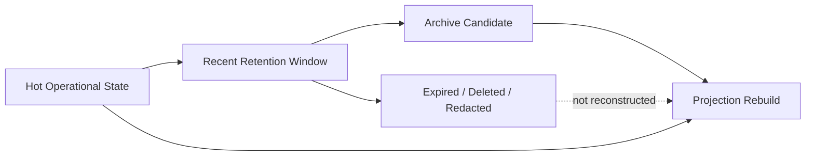

# Partition Strategy

## Purpose

This document defines OmniWA Phase 5.3 partition strategy at a conceptual level.

It does not create partition DDL, physical tables, SQL, indexes, or implementation code.

## Partition Principles

- Partitioning is driven by retention, write volume, archive boundaries, and recovery behavior.
- Partitioning must not change Aggregate ownership.
- Partitioning must not leak physical storage layout into Domain, Application, API, webhook, audit, or telemetry contracts.
- Current-state aggregates should remain simple unless volume or retention demands partitioning.
- History, audit, telemetry, and retry-heavy state are stronger candidates than configuration or provider profiles.

## Partition Candidates

| Storage Area | Partition Candidate? | Partition Driver | Notes |
|---|---|---|---|
| Instance State | No for MVP | Low volume, current-state access | Future sharding may consider instance ownership. |
| Session State | Conditional | Cleanup after instance deletion, active-session boundary | Partitioning must not weaken one-active-session rule. |
| Message State | Yes for history/metadata | 30-day metadata retention, high write volume | Current active state and retained history may have different physical treatment. |
| Media Metadata | Conditional | 30-day metadata retention and cleanup | Binary artifacts are handled in Object Storage lifecycle. |
| Webhook Subscription | No for MVP | Low volume configuration | Partitioning not justified initially. |
| Webhook Delivery | Yes | Retry volume, 30-day delivery metadata retention, dead-letter scans | Strong candidate for time-based partitioning. |
| Guardrail Decision | Conditional | Rate/abuse windows and decision retention | Depends on guardrail volume. |
| Provider Profile | No | Low volume reference state | Keep simple. |
| Worker Job | Yes | Completed 7-day retention; failed/action-required 30-day retention | Strong candidate for lifecycle/time partitions. |
| Access Decision | Conditional | Expiry windows and audit linkage | Sensitive access must remain restricted. |
| Audit | Yes | 180-day retention and append-heavy behavior | Strong candidate for time-based partitions. |
| Health Projection | Conditional | Current plus compacted history | Current status may stay unpartitioned; history may partition. |
| Configuration | No for MVP | Low write frequency | Active snapshot access should stay simple. |
| Telemetry Projection | Yes | Potentially high-volume sanitized signals | Strong candidate for time-based partitioning and aggregation. |
| Read Projections | Conditional | Query volume and rebuild scope | Partition by projection lifetime where useful. |

## Time-Based Strategy

Time-based partitioning is the primary MVP candidate for high-volume retention-bound data.

| Time-Based Area | Time Boundary Driver | Archive Relationship |
|---|---|---|
| Message metadata/history | Retention window and delivery history reads | Archive or cleanup after 30 days unless policy permits summary retention. |
| Webhook delivery history | Delivery log retention and retry/dead-letter visibility | Archive or cleanup after 30 days. |
| Worker job history | Completed 7 days; failed/action-required 30 days | Cleanup completed quickly; keep failed/action-required longer. |
| Audit records | 180-day audit retention | Archive under audit policy only. |
| Telemetry and metrics | Snapshot aggregation and operational window | Compact or aggregate before expiry. |
| Diagnostic artifact metadata | 7-day maximum diagnostic retention | Cleanup with corresponding Object Storage artifacts. |

## Tenant-Based Strategy

Tenant-based partitioning is not part of MVP because OmniWA is Single Tenant + Multi Instance.

Future tenant-based partitioning requires:

- approved Multi Tenant product decision,
- tenant identity model,
- authorization model update,
- backup and restore scoping update,
- retention and legal hold review,
- architecture ADR.

Until then, physical design must not expose a tenant partition key to API or Domain.

## Archive Boundary

Partition boundaries should align with archive and cleanup boundaries.

| Boundary | Decision |
|---|---|
| Active operational data | Kept in hot PostgreSQL operational store. |
| Retention-bound history | Candidate for time-based partitioning. |
| Expired data | Deleted, redacted, or reduced to safe marker according to policy. |
| Archive-eligible summaries | Moved to archive area only when source owner policy permits. |
| Backup artifacts | Stored separately with 14-day retention. |

## Rebuild Strategy

Partitioning must support projection rebuild without restoring expired data.

Rebuild rules:

- rebuild only from retained source partitions,
- mark unavailable when source data expired under retention,
- do not call Provider, Webhook consumers, or API during rebuild,
- do not publish Domain Events during rebuild,
- do not mutate source Aggregate state,
- use projection version to distinguish old and rebuilt read models.

## Partition Diagram

## Partition Constraints

- Partitioning cannot determine business state.
- Partitioning cannot replace retention policy.
- Partitioning cannot bypass repository ports.
- Partitioning cannot expose physical cursor values through API.
- Partitioning cannot store raw message body, raw media binary, raw webhook payload, or Secret data to make historical queries easier.
