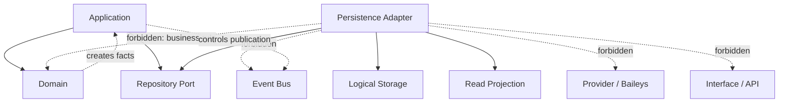

# Persistence Boundaries

## Purpose

This document defines the boundaries that Persistence must respect.

It does not define database technology, schema, SQL, Prisma, migrations, ORM models, tables, indexes, or source code.

## Boundary Principles

- Persistence stores state.
- Persistence rehydrates aggregate state through repository ports.
- Persistence persists aggregate outcomes after Application/Domain decisions.
- Persistence does not decide business.
- Persistence does not validate business invariants.
- Persistence does not orchestrate workflows.
- Persistence does not publish Domain Events.
- Persistence does not call external providers or transport systems.

## Allowed Persistence Responsibilities

| Responsibility | Allowed Behavior |
|---|---|
| Rehydrate aggregate | Return aggregate-owned state through the correct repository port. |
| Save aggregate outcome | Persist the state resulting from aggregate root decision. |
| Preserve identity | Store opaque product identities and safe references. |
| Preserve idempotency | Persist idempotency scope/outcome for duplicate-prone commands inside owner boundary. |
| Preserve async visibility | Persist owner lifecycle and WorkerJob lifecycle so accepted work is recoverable. |
| Support read model | Maintain safe derived read models required by approved queries. |
| Enforce retention mechanics | Expire, archive, or clean data according to retention decisions made by Domain/Application. |
| Protect sensitive data | Store only approved representation of Secret/Confidential data. |
| Classify storage failures | Return safe dependency failure categories to Application. |

## Forbidden Persistence Responsibilities

| Forbidden Behavior | Reason |
|---|---|
| Decide if a message can be sent | Business rule belongs to Messaging, Guardrails, Session, and Application preconditions. |
| Decide if webhook delivery can retry | Retry policy belongs to WebhookDelivery and Application workflow. |
| Decide if session is active or revoked | Session aggregate owns lifecycle. |
| Decide if configuration is safe | ConfigurationSnapshot aggregate and policy own validation. |
| Publish Domain Events | Domain creates facts; Application controls publication timing. |
| Publish Integration Events | Webhook/Application owns external delivery scheduling. |
| Call Provider/Baileys | Provider adapters are separate Infrastructure ports; Persistence stores translated state only. |
| Call API/Interface | Interface calls Application; Persistence is not an entry point. |
| Store provider-native payloads as source of truth | Provider Integration anti-corruption boundary must translate first. |
| Store Secret/raw Confidential payloads in normal state | Violates data classification, security, audit, and API freeze. |

## Repository Boundary

Repository ports are the contract between Application/Domain and Persistence.

Rules:

- Repository Port belongs to Domain contract.
- Repository Implementation belongs to Infrastructure/Persistence.
- Repository Port names use product language.
- Repository Implementation may know storage mechanics later, but must not leak them outward.
- Repository reads return aggregate-owned state or approved safe snapshots.
- Repository queries must not become broad reporting, analytics, or marketing query surfaces.

## Application Boundary

Application owns:

- Transaction boundary concept.
- Unit of Work sequencing.
- Cross-aggregate preconditions.
- Idempotency scope check.
- Event publication timing.
- Retry/recovery orchestration.
- Query side-effect freedom.

Persistence supports these by storing state but does not choose workflow behavior.

## Domain Boundary

Domain owns:

- Aggregate invariants.
- Business policies.
- Domain specifications.
- Domain errors.
- Domain events as product facts.
- Value object validation.

Persistence does not validate these rules. Persistence may reject unsafe storage representation, missing identity, or storage conflict, but the Application maps that as persistence/dependency failure, not business meaning.

## Read Model Boundary

Read models are allowed for API query needs.

Read models must:

- Be safe and redacted.
- Be traceable to approved queries.
- Preserve retention and authorization boundaries.
- Include staleness markers where eventual.
- Avoid raw provider payload, raw phone/JID, message body, media binary, webhook secret, and session secret.

Read models must not:

- Mutate Domain state.
- Trigger recovery.
- Repair projections during a query.
- Become analytics/campaign storage.
- Replace aggregate write model.

## Persistence Boundary Diagram

## Boundary Validation Rules

| Rule | Status |
|---|---|
| Persistence stores state only | PASS |
| Persistence does not decide business | PASS |
| Persistence does not publish Domain Events | PASS |
| Persistence does not validate business invariants | PASS |
| Persistence does not orchestrate workflows | PASS |
| Persistence does not know Provider/Baileys payloads | PASS |
| Persistence does not know REST/DTO/API response shapes | PASS |
