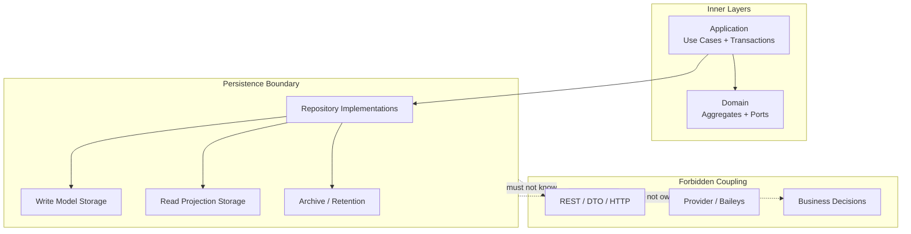

# Persistence Constraints

## Purpose

This document defines Phase 5.1 persistence constraints, consistency strategy, and future evolution boundaries.

It does not define database technology, Prisma, ORM, SQL, migrations, tables, columns, indexes, or source code.

## Architectural Constraints

| Constraint | Rule |
|---|---|
| Persistence does not know REST | No API route, HTTP method, status code, DTO, response envelope, or controller concept in persistence model. |
| Persistence does not know Provider | No Baileys object, provider runtime socket, callback payload, or raw provider error stored as product state. |
| Persistence does not know DTO | Request/response schema and transport naming remain outside persistence. |
| Persistence only knows ports | Persistence adapters implement repository ports and application/infrastructure ports later. |
| Repository Implementation belongs to Infrastructure | Concrete persistence implementation is outside Domain and Application. |
| Repository Port belongs to Domain contract | Port meaning is frozen by Domain docs and cannot be redefined by storage. |
| Aggregate Root is persistence entry point | Write persistence starts from aggregate root outcome. |
| Value Objects are embedded by need | Do not persist Value Objects as independent units unless they have approved identity/lifecycle. |
| Read models are derived | Read models do not own business state and cannot mutate write model. |
| Storage failure is dependency failure | Storage cannot convert technical failure into business decision. |

## Data Safety Constraints

- Do not store raw message bodies by default.
- Do not store raw media binary by default after processing.
- Do not store raw webhook payloads in normal records.
- Do not store session secret in general repository state.
- Do not store API/admin key secret in queryable/loggable fields.
- Do not store webhook signing secret in webhook delivery payload or delivery history.
- Do not store raw phone numbers or raw JIDs as aggregate identity.
- Do not store raw provider payloads as product state.
- Do not expose database identifiers through API, Domain, Application, Webhook, Audit, or Metrics.

## Persistence Consistency

### Strong Consistency

Strong consistency is required for:

- One aggregate's lifecycle state.
- One current Message state.
- One Session active/expired/revoked state.
- One WebhookDelivery terminal/retry/dead-letter state.
- One WorkerJob reservation/running/completed/retry/dead state.
- One GuardrailDecision outcome before Message acceptance.
- One AccessDecision outcome before privileged mutation.
- One ConfigurationSnapshot validation/activation decision.
- One AuditRecord redaction/retention category.

Strong consistency boundary is aggregate-scoped unless Application explicitly coordinates multiple aggregate outcomes in one Unit of Work.

### Eventual Consistency

Eventual consistency is allowed for:

- Health projections.
- Telemetry projections.
- Metrics snapshots.
- List/history views.
- Webhook delivery projections from source events.
- Audit/observability follow-up after source fact.
- Provider status observations after translation.

Eventual consistency must not:

- Hide accepted work.
- Hide terminal failure/dead-letter/action-required state when known.
- Let queries repair state.
- Change business truth.
- Expose stale data without marker when the query contract requires freshness.

## Snapshot Strategy

Snapshots are allowed for:

- Current aggregate status.
- Recovery checkpoint.
- API status view.
- Metrics projection input.
- Archive summary.

Snapshot constraints:

- Snapshot must be derived from owner aggregate state.
- Snapshot must not become independent write model.
- Snapshot must obey retention and classification.
- Snapshot must not contain raw provider payloads, raw message bodies, raw media binaries, raw webhook payloads, session secrets, phone numbers, or JIDs.

## Read Projection Strategy

Read projections are allowed for:

- `GetInstanceStatus`
- `ListInstances`
- `GetMessageStatus`
- `GetMessageDeliveryHistory`
- `GetMediaStatus`
- `GetWebhookStatus`
- `GetWebhookDeliveryHistory`
- `GetHealthStatus`
- `GetActionRequiredItems`
- `GetWorkerJobStatus`
- `GetProviderCapabilityStatus`
- `GetConfigurationStatus`
- `QueryAuditRecords`
- Metrics snapshot queries

Read projection constraints:

- Projection updates must be triggered by Application-approved workflows or event publication handling.
- Query execution must not mutate projection state.
- Projection must carry staleness/freshness marker when eventual.
- Projection must preserve authorization and retention.
- Projection must not become analytics or campaign storage.

## Transaction Scope

Transaction scope remains conceptual in Phase 5.1.

Persistence must support these Application transaction boundary categories:

| Boundary | Persistence Support |
|---|---|
| Single aggregate | Persist one aggregate outcome and related event fact capture conceptually. |
| Cross-aggregate precondition | Allow Application to load safe source snapshots before target aggregate mutation. |
| Async acceptance | Persist owner accepted state and WorkerJob visibility before accepted response. |
| Worker execution | Persist WorkerJob reservation/result and owner aggregate outcome without disappearing work. |
| Projection/evidence | Persist derived audit/health/telemetry independently from source state. |
| External side effect | Preserve local state before/after provider/webhook attempt according to workflow; no distributed rollback assumed. |

This document does not define ORM transactions, isolation levels, database transactions, or distributed transaction coordinators.

## Persistence Evolution

| Future Change | Impact | Boundary That Must Hold |
|---|---|---|
| Multi Tenant | Product identities and storage ownership must gain tenant boundary only after product decision/ADR. | Domain/API MVP must not gain hidden TenantId now. |
| Horizontal Scaling | WorkerJob, idempotency, and reconnect ownership persistence must become multi-runtime safe. | Application transaction/idempotency semantics remain. |
| Sharding | Opaque product IDs and cursor tokens must hide shard topology. | API IDs/cursors cannot expose storage layout. |
| Read Replica | Read models may use eventual replicas with staleness markers. | Strong owner reads must still be available where required. |
| Archive DB | Archive can move terminal/expired safe state to cheaper storage. | Source owner and retention rules remain. |
| Cloud Storage | Media diagnostic artifacts or future large objects may be stored externally if approved. | No default media binary retention; retention/encryption required. |
| Object Storage For Webhook Payload Replay | Requires future product/security decision. | Raw webhook payload excluded by default. |
| Analytics Storage | Requires future product decision. | Analytics must not become source of truth or raw payload sink. |

## Boundaries That Stay Stable Under Evolution

- Aggregate ownership.
- Repository port semantics.
- Application command/query boundary.
- Domain invariants.
- API opaque IDs.
- Cursor opacity.
- Idempotency ownership.
- Async visibility requirement.
- Webhook retry/dead-letter visibility.
- Sensitive-data exclusions.
- Provider abstraction and Baileys isolation.

## Persistence Boundary Diagram

## Validation

| Item | Status |
|---|---|
| Persistence does not know REST | PASS |
| Persistence does not know Provider | PASS |
| Persistence does not know DTO | PASS |
| Persistence only knows Domain/Application ports | PASS |
| Repository implementation belongs to Infrastructure | PASS |
| Repository port belongs to Domain | PASS |
| Value Objects are not persisted separately unless needed | PASS |
| Aggregate Root is the main persistence unit | PASS |
| Strong/eventual consistency boundaries are defined | PASS |
| Persistence evolution boundaries are defined | PASS |
