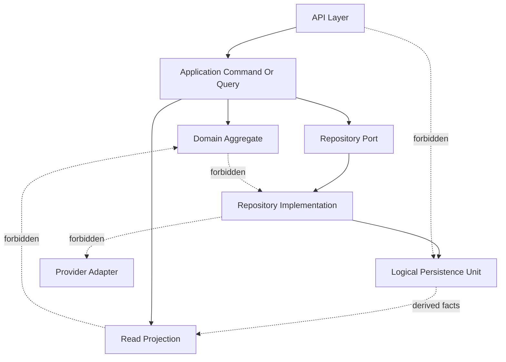

# Persistence Mapping Rules

## Purpose

This document defines the binding rules that govern repository mapping, aggregate mapping, projection mapping, and future evolution for OmniWA Phase 5.2.

These rules protect the frozen Product, Architecture, Domain, Application, and API decisions.

## Core Mapping Rules

| Rule ID | Rule | Reason | Violation Example |
|---|---|---|---|
| PMR-001 | Repository persists and rehydrates Aggregate Root only | Keeps persistence aligned with Domain ownership | MessageRepositoryPort directly persists MediaAsset processing state |
| PMR-002 | Repository does not persist Domain Events | Avoids introducing event sourcing or event bus implementation in Phase 5.2 | A repository stores Domain Events as a required event stream |
| PMR-003 | Projection does not change Aggregate state | Read models cannot become write models | Health projection marks Instance as disconnected |
| PMR-004 | Read Model contains no business rule | Business rules remain in Domain and Application orchestration | MessageStatusProjection decides whether a message can be sent |
| PMR-005 | Persistence must not mutate Value Objects | Value Objects are immutable domain concepts | Storage normalizes a JID differently from Domain validation |
| PMR-006 | Persistence model must not leak into Domain | Domain must not depend on storage shape | Aggregate exposes storage record ID or storage-specific field |
| PMR-007 | Persistence must not know REST, DTO, or API response shape | API remains an Interface adapter | Repository returns API response envelope metadata |
| PMR-008 | Persistence must not know Provider or Baileys internals | Provider remains behind approved abstractions | Session persistence stores provider socket object |
| PMR-009 | Cross-aggregate writes must go through Application coordination | Prevents hidden coupling and consistency leaks | WebhookDeliveryRepository mutates Message failure state |
| PMR-010 | Read projections cannot bypass authorization, retention, or redaction | Protects sensitive data and compliance posture | Audit projection returns raw Confidential payload |
| PMR-011 | Public identity remains product identity | Prevents physical storage coupling | API exposes storage record IDs |
| PMR-012 | Caches and projections must expose freshness when eventual | Prevents operational ambiguity | Metrics snapshot hides that it is stale |

## Aggregate Mapping Rules

### Persist Together

Persist together only the state that belongs to one Aggregate Root and is required for that aggregate to preserve lifecycle, identity, invariant boundary, or idempotency.

Examples:

- Message lifecycle and outbound idempotency marker.
- WebhookDelivery retry and dead-letter state.
- WorkerJob reservation and retry lifecycle.
- ConfigurationSnapshot validation and activation state.

### Persist Separately

Persist separately when identity, lifecycle, sensitivity, or retention differs.

Examples:

- Session is separate from Instance because Session has secret-sensitive recovery and retention rules.
- WebhookDelivery is separate from WebhookSubscription because delivery attempts write frequently and expire differently.
- TelemetrySignal is separate from business aggregates because observability cannot become business truth.

### Reference Only

Cross-aggregate links use identity references, source signal references, owner context references, or correlation identifiers.

Reference-only mapping avoids:

- oversized aggregates,
- hidden transaction boundaries,
- circular persistence dependencies,
- persistence-level graph loading,
- business rules moving into storage.

### Composition

Composition is valid only inside an Aggregate boundary for owned internal concepts and Value Objects. Composition is not a permission to embed another Aggregate Root.

### Association

Association is a read or workflow relationship across aggregate boundaries. Application use cases and read projections may associate data for a response, but the association does not change ownership.

## Persistence Access Diagram

## Future Evolution

### Read Replica

Reusable projections:

- InstanceStatusProjection
- InstanceListProjection
- MessageStatusProjection
- WebhookDeliveryHistoryProjection
- MetricsSnapshotProjection

Repositories that stay stable:

- All Domain repository ports stay semantically unchanged.
- Strong owner reads may still require routing to the authoritative write boundary.

Boundaries that do not change:

- Domain does not learn read-replica topology.
- API does not choose physical storage.
- Projections remain read-only.

### CQRS

Reusable projections:

- All approved read projections become natural read-side candidates.
- Existing Application command/query separation remains valid.

Repositories that stay stable:

- Write repositories remain Aggregate Root persistence ports.
- Query read models may become more specialized without changing Domain ports.

Boundaries that do not change:

- Commands enforce business through Domain and repository ports.
- Queries do not mutate state.
- Read model changes require Application/API compatibility review when exposed.

### Event Sourcing

Reusable projections:

- Event-driven projection catalog and projection versioning concepts can be reused.

Repositories that stay stable:

- Repository port names and Aggregate Root ownership should remain stable.
- Implementation behind the port may change only after a future ADR.

Boundaries that do not change:

- Phase 5.2 does not require event sourcing.
- Repository ports must not expose event streams unless a future Domain and Architecture decision approves it.

### Analytics DB

Reusable projections:

- MetricsSnapshotProjection
- OperationalDashboardProjection
- AuditRecordProjection after redaction and retention filtering

Repositories that stay stable:

- Operational repositories remain source-of-truth ports and are not analytics repositories.

Boundaries that do not change:

- Analytics cannot write back to aggregates.
- Analytics cannot store raw message body, raw media, session secrets, or provider payload by default.

### Search Engine

Reusable projections:

- Safe metadata projections may feed search after a future Product/API decision.

Repositories that stay stable:

- MessageRepositoryPort remains restricted from full-text body search in MVP.

Boundaries that do not change:

- Search cannot expand Product Scope into contacts, chats, groups, campaign segmentation, or message body search without new approval.

### Data Warehouse

Reusable projections:

- Sanitized telemetry, metrics snapshots, audit metadata, and operational summaries.

Repositories that stay stable:

- Domain repositories remain operational persistence ports, not warehouse loaders.

Boundaries that do not change:

- Warehouse export is downstream and read-only.
- Retention and redaction apply before export.

### Reporting

Reusable projections:

- Operational metrics, queue metrics, webhook metrics, message metrics, media metrics, and audit metadata.

Repositories that stay stable:

- Reporting reads projections or future reporting stores, not Aggregate Root repositories.

Boundaries that do not change:

- Reporting cannot create business decisions.
- Reporting cannot mutate Domain or Application state.

## Mapping Governance

- New persistence mappings require traceability to Aggregate, Repository Port, Application Query, API Resource, and Product Capability.
- New read projections require an owner, source facts, consistency class, lifetime, rebuild rule, and sensitive data review.
- New query access patterns require authorization, retention, freshness, and caching classification.
- Any change that alters ownership, consistency, or public semantics requires review against Architecture Freeze, Domain Freeze, Application Freeze, and API Freeze.

## Phase 5.2 Checklist

| Item | Status |
|---|---|
| Repository mappings defined | PASS |
| Aggregate mappings defined | PASS |
| Query access patterns defined | PASS |
| Read projections defined | PASS |
| Projection strategy defined | PASS |
| Query consistency defined | PASS |
| Mapping rules defined | PASS |
| Traceability completed | PASS |

**Phase 5.2 is ready for review.**
