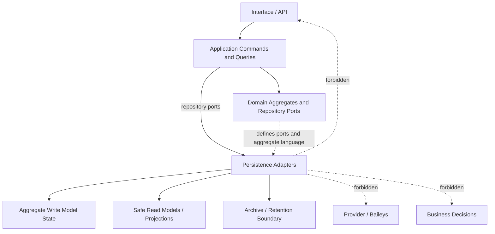

# OmniWA Persistence Overview

## Purpose

This document defines the Phase 5.1 persistence model overview for OmniWA.

It does not define database tables, Prisma schema, SQL, migrations, ORM models, indexes, source code, deployment topology, or concrete storage technology.

## Persistence Layer Responsibility

The Persistence Layer is an Infrastructure concern that implements approved repository ports and durable state responsibilities required by the frozen Domain, Application, and API contracts.

Persistence is responsible for:

- Rehydrating aggregate state through repository ports.
- Persisting aggregate root outcomes after Domain decisions.
- Preserving accepted async work visibility and recovery state.
- Preserving idempotency replay/conflict state within the owning persistence boundary.
- Supporting read models and projections required by approved API queries.
- Enforcing retention, archive, cleanup, and sensitive-data storage boundaries.
- Supporting backup and recovery requirements later without exposing storage mechanics to Domain or API.
- Returning safe persistence failures that Application can classify into approved error categories.

## What Persistence Does Not Do

Persistence must not:

- Own business rules.
- Decide aggregate lifecycle transitions.
- Validate business invariants.
- Orchestrate workflows.
- Publish Domain Events.
- Call Provider, Baileys, Webhook Transport, Queue, Interface, or API.
- Define API resources, DTOs, or response envelopes.
- Expose database identifiers as product identities.
- Store raw provider payloads as product state.
- Store raw message bodies or media binaries by default.
- Return Secret values or raw Confidential payloads through general repository reads.

## Layer Relationship

| Layer | Relationship To Persistence |
|---|---|
| Interface/API | Does not call Persistence for product behavior. It calls Application commands/queries. |
| Application | Owns transaction boundaries conceptually, calls repository ports, coordinates cross-aggregate preconditions, and controls publication timing. |
| Domain | Defines aggregates, repository ports, invariants, policies, errors, events, and value concepts. It does not know storage mechanics. |
| Persistence | Implements repository ports and read projections as Infrastructure. It stores state and returns safe data only. |
| Infrastructure | Contains persistence adapters, migration/runtime mechanics later, backup/recovery adapters later, and technical storage integration. |

## Core Persistence Principles

- Persistence serves Domain; it does not shape Domain.
- Aggregate roots are the primary persistence units for write models.
- Repository ports are the semantic contract; storage models are implementation details behind ports.
- Write model state is owned by one aggregate/context at a time.
- Read models are derived and must not become source of truth.
- Eventual consistency is allowed for projections only when staleness is explicit and accepted work is still visible.
- Strong consistency is required inside aggregate persistence boundaries.
- Persistence must preserve opaque product identity.
- Retention and sensitive-data classification are storage design constraints, not optional implementation details.

## Persistence Layer Diagram

## Persistence Design Scope For Phase 5.1

In scope:

- Logical persistence boundaries.
- Logical storage responsibilities.
- Aggregate persistence strategy.
- Read model vs write model strategy.
- Storage ownership and access boundaries.
- Consistency, projection, snapshot, retention, and archive strategy at conceptual level.
- Traceability from persistence unit to aggregate, repository port, Application use case, API resource, and product capability.

Out of scope:

- Concrete database selection.
- Physical schemas.
- Table, column, index, partition, or migration design.
- ORM/Prisma design.
- SQL.
- Queue engine persistence mechanics.
- Object storage implementation.
- Backup tooling.
- Encryption implementation details.

## Phase 5.1 Checklist

| Item | Status |
|---|---|
| Persistence boundaries defined | PASS |
| Storage model defined | PASS |
| Aggregate persistence defined | PASS |
| Read/write model defined | PASS |
| Storage ownership defined | PASS |
| Persistence constraints defined | PASS |
| Traceability completed | PASS |

**Phase 5.1 is ready for review.**
