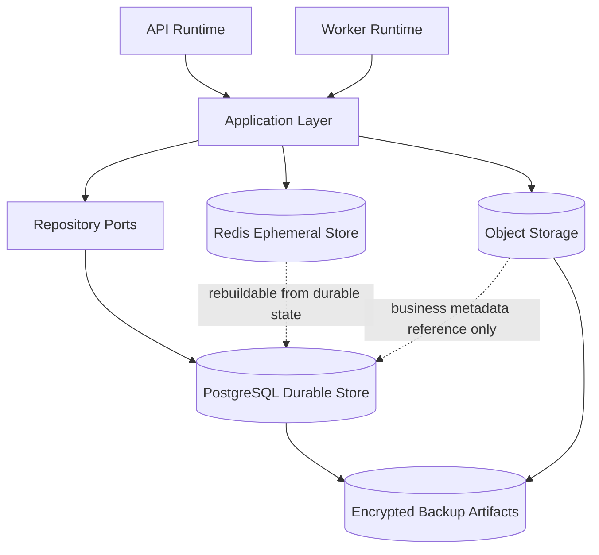
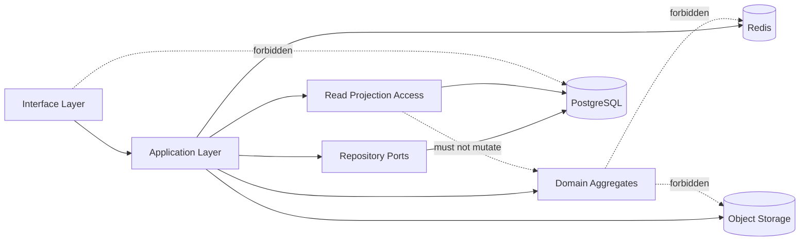

# Physical Persistence Architecture

## Purpose

This document defines OmniWA Phase 5.3 physical persistence architecture.

Phase 5.3 is the first persistence phase that selects physical storage roles. It does not create physical tables, SQL, Prisma models, indexes, migrations, or implementation code.

## Physical Persistence Decision

OmniWA MVP uses a three-store physical topology:

| Physical Store | Role | Source Of Truth? | Primary Responsibility |
|---|---|---|---|
| PostgreSQL | Durable transactional persistence | Yes for approved aggregate state, repository state, read projections, audit, and recovery state | Aggregate state, repository persistence, query projections, durable worker state, idempotency records, retention markers |
| Redis | Ephemeral operational store | No | Cache, distributed coordination, temporary rate/guardrail windows, queue-support metadata, transient runtime hints |
| Object Storage | Binary and artifact storage | No for business metadata; yes for retained artifacts explicitly stored there | Temporary media artifacts, diagnostic binary artifacts, import/export artifacts, encrypted backup artifacts |

## Storage Topology

### Physical Storage Diagram

## Storage Responsibility

| Logical Storage | Physical Store Of Record | Optional Redis Role | Optional Object Storage Role | Notes |
|---|---|---|---|---|
| Instance State Storage | PostgreSQL | Reconnect lock, short status cache | None | Instance lifecycle remains durable in PostgreSQL. |
| Session State Storage | PostgreSQL | Pairing/reconnect coordination hints | None by default | Secret material must be encrypted and never loggable or broadly queryable. |
| Messaging State Storage | PostgreSQL | Idempotency hot cache, send coordination lock | Diagnostic content artifact only when explicitly enabled | Message body is not retained by default. |
| Media Metadata Storage | PostgreSQL | Processing lock and short status cache | Temporary or diagnostic media artifact when enabled | Object storage stores binary artifact, not business metadata. |
| Webhook Subscription Storage | PostgreSQL | Subscription status cache | None | Webhook secrets are not cacheable in plaintext. |
| Webhook Delivery Storage | PostgreSQL | Delivery reservation lock, retry scheduling hint | Optional payload replay artifact only if later approved | Delivery lifecycle and dead-letter state remain durable. |
| Guardrail Decision Storage | PostgreSQL | Short-lived rate and abuse windows | None | Durable decision history remains owner-scoped. |
| Provider Profile Storage | PostgreSQL | Capability cache | None | No provider runtime socket or native payload. |
| Worker Job Storage | PostgreSQL | Queue-support structures, reservation lock | None | PostgreSQL WorkerJob state is the recovery source. |
| Access Decision Storage | PostgreSQL | Short-lived authorization decision cache | None | Cache must fail closed and respect expiry. |
| Audit Storage | PostgreSQL | None by default | Encrypted archive artifact if future approved | Audit evidence remains Secret-safe and redacted. |
| Health Projection Storage | PostgreSQL | Health status cache | None | Health remains projection state, not business truth. |
| Configuration Storage | PostgreSQL | Safe active configuration cache | None | Secret values are not exposed in cache. |
| Telemetry Projection Storage | PostgreSQL | Metrics cache | Aggregated export artifact if future approved | Raw Confidential telemetry is not stored. |
| Read Projection Storage | PostgreSQL | Query result cache | None | Projection can be rebuilt from retained source state. |
| Archive Storage | PostgreSQL archive area or future archive database | None | Cold archive artifact where policy permits | Archive remains source-owner governed. |
| Backup Storage | Backup catalog in PostgreSQL, artifacts outside PostgreSQL | None | Encrypted backup artifacts | Backup retention is 14 days. |

## Storage Isolation

| Isolation Area | Decision | Reason |
|---|---|---|
| Source state vs projections | Separate PostgreSQL logical namespaces | Prevents read models from becoming write models. |
| Operational state vs audit | Separate PostgreSQL logical namespaces and access roles | Audit requires stricter access and retention handling. |
| Secret-sensitive state | Separate access boundary and encryption requirement | Session, API key, webhook secret, and configuration secret references require stronger handling. |
| Redis keyspaces | Separate keyspace prefixes by environment, purpose, and owner context | Prevents accidental cache/lock/queue collisions. |
| Object storage classes | Separate artifact classes by retention and sensitivity | Media, diagnostic, export, archive, and backup artifacts have different lifecycle policies. |
| MVP tenancy | Single Tenant + Multi Instance | Multi-tenant isolation is future and requires Product decision plus ADR. |

## Storage Evolution

| Evolution | Phase 5.3 Position | What Must Stay Stable |
|---|---|---|
| Read replica | Candidate for projection and read-heavy query traffic | Strong owner reads remain tied to authoritative state. |
| Archive database | Candidate after retention volume grows | Archive cannot become source of truth or resurrect expired data. |
| Cold storage | Candidate for encrypted backup and permitted archive artifacts | Classification and retention rules must stay enforced. |
| Analytics database | Deferred future product decision | Analytics cannot write back to Domain or expand MVP scope. |
| Search store | Deferred future product/API decision | Full message body search remains out of scope. |
| Multi-tenant sharding | Future only | MVP storage must not assume tenant-based access model. |

## Storage Scalability

| Concern | Strategy | Trade-off |
|---|---|---|
| Read-heavy status queries | Use PostgreSQL read projections and future read replicas | Projections are eventually consistent unless owner read is required. |
| Write-heavy message/webhook/job flows | Keep durable owner state compact and partition candidates explicit | More projection work is needed for broad histories. |
| Connection pressure | Use separate connection roles/pools by runtime and workload | Requires operational governance later. |
| Horizontal worker scale | Persist WorkerJob source state in PostgreSQL and use Redis only for coordination | Redis failure must not lose accepted work. |
| Archive growth | Move retention-bound history to archive boundary when policy permits | Archived data has slower access and stricter query limits. |
| Cold backup storage | Store encrypted backup artifacts outside primary PostgreSQL | Restore validation becomes mandatory. |

## Storage Constraints

- Persistence contains no business logic.
- Projection storage is not the source of truth.
- Redis is not permanent storage.
- Object Storage does not contain business metadata.
- Application accesses durable storage through Repository Ports and approved query/projection access only.
- API does not access PostgreSQL, Redis, or Object Storage directly.
- Provider adapters do not access source-of-truth persistence directly.
- Physical storage identifiers must not leak to API, Domain, Application messages, webhook payloads, audit events, or telemetry.
- Secret and raw Confidential data must not be stored in cache, logs, projections, or archive artifacts unless explicitly approved by retention and security policy.

## Storage Interaction Diagram

## Physical Storage Traceability

| Physical Storage Area | Repository Port | Aggregate | Application Service / Query | API Resource | Product Capability |
|---|---|---|---|---|---|
| PostgreSQL Instance Source State | InstanceRepositoryPort | Instance | Instance application services, GetInstanceStatus, ListInstances | Instance | Instance lifecycle |
| PostgreSQL Session Source State | SessionRepositoryPort | Session | QR pairing, reconnect, GetInstanceStatus safe session marker | Session, QR | Pairing and reliability |
| PostgreSQL Messaging Source State | MessageRepositoryPort | Message | Messaging services, GetMessageStatus, GetMessageDeliveryHistory | Message | Messaging |
| PostgreSQL Media Metadata | MediaAssetRepositoryPort | MediaAsset | Media services, GetMediaStatus | Media | Media handling |
| PostgreSQL Webhook Subscription State | WebhookSubscriptionRepositoryPort | WebhookSubscription | Webhook configuration services, GetWebhookStatus | WebhookSubscription | Webhook configuration |
| PostgreSQL Webhook Delivery State | WebhookDeliveryRepositoryPort | WebhookDelivery | Webhook delivery services, GetWebhookDeliveryHistory | WebhookDelivery | Webhook delivery reliability |
| PostgreSQL Guardrail Decision State | GuardrailDecisionRepositoryPort | GuardrailDecision | Guardrail evaluation during send message | Message | Product guardrails |
| PostgreSQL Provider Profile State | ProviderProfileRepositoryPort | ProviderProfile | Provider compatibility services, GetProviderCapabilityStatus | Provider | Provider abstraction |
| PostgreSQL Worker Job State | WorkerJobRepositoryPort | WorkerJob | Worker services, GetWorkerJobStatus, GetQueueMetricsSnapshot | WorkerJob | Queue and worker visibility |
| PostgreSQL Access Decision State | AccessDecisionRepositoryPort | AccessDecision | Authorization services, QueryAuditRecords where safe | Admin resources | Security and access |
| PostgreSQL Audit State | AuditRecordRepositoryPort | AuditRecord | Audit services, QueryAuditRecords | AuditRecord | Audit |
| PostgreSQL Health Projection State | HealthStatusRepositoryPort | HealthStatus | Health services, GetHealthStatus, GetActionRequiredItems | Health | Observability |
| PostgreSQL Configuration State | ConfigurationSnapshotRepositoryPort | ConfigurationSnapshot | Configuration services, GetConfigurationStatus | Configuration | Configuration |
| PostgreSQL Telemetry Projection State | TelemetrySignalRepositoryPort | TelemetrySignal | Observability services, metrics snapshot queries | Metrics | Observability |
| Redis Cache/Lock/Queue Support | Owner repository remains PostgreSQL-backed | No source aggregate | Application coordination and runtime optimization | Not directly exposed | Performance and operational coordination |
| Object Storage Artifacts | Metadata repository remains PostgreSQL-backed | No source aggregate | Media, backup, import/export, recovery services | Media, Admin future | Binary artifacts and backup |
