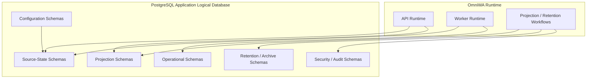

# PostgreSQL Architecture

## Purpose

This document defines OmniWA Phase 5.3 PostgreSQL architecture.

PostgreSQL is selected as the MVP durable persistence system for aggregate state, repository-backed state, read projections, audit-safe evidence, idempotency state, and recovery-visible operational state.

This document does not create tables, SQL, index DDL, Prisma models, or implementation code.

## PostgreSQL Role

| Responsibility | Decision |
|---|---|
| Durable source-of-truth state | PostgreSQL stores Aggregate Root persistence units through repository implementations. |
| Read projections | PostgreSQL stores safe projections for approved Application queries. |
| Recovery state | PostgreSQL stores accepted async work, retry/dead-letter state, idempotency markers, and retention markers. |
| Audit continuity | PostgreSQL stores Secret-safe audit evidence and redaction state. |
| Backup baseline | PostgreSQL is part of encrypted daily backup scope. |

## Logical Database Layout

MVP uses one application logical database per environment.

| Logical Database Area | Purpose | Reason |
|---|---|---|
| Application operational database | Aggregate source state, read projections, operational state, audit-safe metadata | Keeps MVP transaction and restore boundaries simple. |
| Future archive database | Retention-bound history after active operational window | Avoids hot-store growth without changing repository ownership. |
| Future analytics database | Sanitized downstream analytics if approved | Prevents analytics workloads from shaping operational Domain storage. |
| Future reporting database | Operational/reporting projections if approved | Keeps reporting read-only and downstream. |

The MVP does not require a separate logical database per bounded context because cross-context workflows still need Application-coordinated consistency. Boundaries are enforced through logical schemas, access roles, repository contracts, and ownership rules.

## Schema Strategy

PostgreSQL schemas are logical namespaces, not Domain boundaries by themselves.

| Schema Family | Contents | Owner | Access Pattern |
|---|---|---|---|
| Source-state schemas | Aggregate source persistence units | Owning bounded context | Repository implementations only |
| Projection schemas | Read projections and metrics snapshots | Query/Application projection owner or source owner | Application queries only |
| Operational schemas | WorkerJob, idempotency, recovery-visible async state | Operations and owning contexts | Application and Worker runtimes |
| Security/audit schemas | AccessDecision and AuditRecord persistence | Security and Audit | Restricted Application services and admin queries |
| Configuration schemas | ConfigurationSnapshot state and safe metadata | Configuration | Configuration services and safe status queries |
| Retention/archive schemas | Retention markers and archived summaries | Source owner | Retention and recovery workflows |

Schema separation must not be used to permit cross-owner writes. Ownership remains defined by repository ports and aggregate boundaries.

## Naming Convention

| Naming Area | Convention | Reason |
|---|---|---|
| Physical names | Lower snake case | Operational consistency and PostgreSQL convention. |
| Source-state names | Aggregate-owner vocabulary | Keeps physical names traceable to Domain language. |
| Projection names | Query or projection vocabulary | Keeps read models traceable to Application queries. |
| Retention names | Data category plus lifecycle vocabulary | Makes cleanup and archive policy visible. |
| Identifiers | Opaque product identifiers as stored values; physical identifiers remain internal | Prevents database identity from leaking to API or Domain. |
| Secret fields | Names must make sensitivity visible | Reduces accidental logging and query exposure. |

Naming does not define physical tables in this phase. Future implementation must produce a separate reviewable physical model.

## Extension Strategy

PostgreSQL extension use is conservative.

| Extension Category | Phase 5.3 Position | Constraint |
|---|---|---|
| Cryptographic support | Candidate only if needed for encrypted or hashed persistence helpers | Secret handling must still be Application/Security governed. |
| UUID or random identifier support | Candidate only if Application identity generation requires database assistance | Product identity must not become database-generated by default. |
| Text search | Deferred | MVP excludes full message body search and campaign segmentation. |
| Scheduling | Deferred | Scheduler architecture is outside PostgreSQL extension choice. |
| Geospatial or specialized types | Deferred | No approved MVP capability requires them. |

Any extension must be justified by a future implementation decision and must not change Domain, API, or repository port semantics.

## Connection Strategy

| Connection Role | Access | Reason |
|---|---|---|
| API runtime write role | Repository-backed command writes and strong owner reads | Supports Application command handling. |
| API runtime read role | Approved projections and owner reads | Limits accidental writes from query handling. |
| Worker runtime role | WorkerJob lifecycle, owner repository state through Application, projection refresh | Supports async work without API-layer access. |
| Projection maintenance role | Projection refresh and rebuild only | Prevents projection workflows from mutating source state. |
| Retention maintenance role | Cleanup, archive marker, retention enforcement | Keeps deletion/redaction flows auditable and scoped. |
| Backup/restore role | Backup and restore validation access | Least-privilege operational recovery. |

Connection pooling is required for production readiness, but this phase does not choose a pooler or driver.

## Replication Candidate

PostgreSQL replication is a candidate for:

- read-heavy status and list queries,
- read projection access,
- backup/restore safety,
- operational reporting separation,
- future archive extraction.

Replication must not be used for command preconditions that require current owner state unless the read is guaranteed to be current enough by a future implementation decision.

## Read Replica Candidate

| Query Area | Read Replica Candidate? | Notes |
|---|---|---|
| Instance list and status projections | Yes | Strong owner read still uses authoritative boundary when needed. |
| Message status projection | Conditional | Active troubleshooting may require primary/authoritative read. |
| Webhook delivery history | Yes | Retention-bound history is a strong candidate. |
| Audit queries | Conditional | Must preserve access control and retention. |
| Metrics snapshots | Yes | Snapshot and eventual reads are suitable. |
| Configuration active status | Usually no | Strong active snapshot should stay close to authoritative state. |
| WorkerJob active status | Conditional | Running/retrying jobs may need current authoritative state. |

## Future Multi Tenant Strategy

MVP is Single Tenant + Multi Instance. PostgreSQL design must not pretend otherwise.

Future Multi Tenant support would require:

- a Product decision,
- Architecture and Domain review,
- tenant identity model,
- authorization model changes,
- retention and backup scoping review,
- possible tenant-based partitioning or database separation.

Until then:

- storage names should not embed tenant assumptions,
- API and Domain should not expose future tenant fields,
- single-tenant operational restore remains the recovery target.

## PostgreSQL Architecture Diagram

## PostgreSQL Constraints

- PostgreSQL schemas do not define Domain ownership; repository ports do.
- PostgreSQL physical identifiers must not be returned as public identifiers.
- Provider-native payloads must not be stored as product state.
- Message bodies and media binaries are excluded by default.
- Redis cannot be required to restore PostgreSQL source state.
- Object Storage object references cannot replace PostgreSQL business metadata.
- Query projections cannot write source-state schemas.
