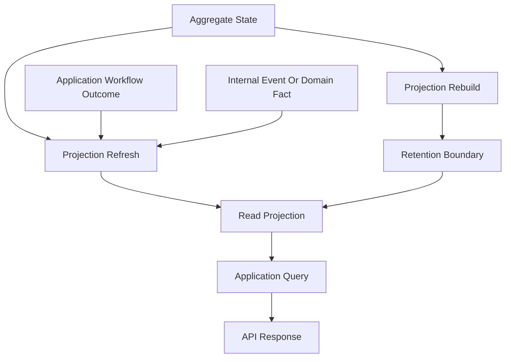

# Projection Strategy

## Purpose

This document defines how OmniWA Phase 5.2 read projections are sourced, refreshed, versioned, rebuilt, and constrained.

This is a logical design document only. It does not choose a projection engine, queue implementation, database technology, table structure, query language, or index strategy.

## Projection Strategy Overview

| Projection | Projection Source | Projection Owner | Projection Refresh | Projection Consistency | Projection Lifetime | Projection Rebuild | Projection Version |
|---|---|---|---|---|---|---|---|
| InstanceStatusProjection | Instance State, safe Session summary, HealthStatus | Query/Application projection | After committed owner-state changes and health updates | Strong for Instance fields; eventual for related fields | Active instance lifetime plus summary retention | Rebuild from source states within retention | Versioned with Instance status read model |
| InstanceListProjection | Instance State, HealthStatus | Query/Application projection | After instance lifecycle updates and health classification updates | Eventual | Active operational window | Rebuild from Instance State and current HealthStatus | Versioned independently from InstanceStatusProjection |
| MessageStatusProjection | Message State, WorkerJob summary, WebhookDelivery summary | Query/Application projection | After Message transitions and related async status updates | Strong for Message fields; eventual related summaries | Message retention | Rebuild from Message State and retained related summaries | Versioned with message status read model |
| MessageDeliveryHistoryProjection | Message lifecycle facts, WorkerJob State, provider-translated status facts | Query/Application projection | After retained lifecycle or delivery status facts | Eventual | Message history retention | Rebuild only from retained safe history | Versioned with history read model |
| MediaStatusProjection | Media Metadata State, WorkerJob summary | Query/Application projection | After media lifecycle and processing updates | Strong for MediaAsset fields; eventual job summary | Media metadata retention | Rebuild from Media Metadata State and retained WorkerJob state | Versioned with media status read model |
| WebhookStatusProjection | Webhook Subscription State, Webhook Delivery State, HealthStatus | Query/Application projection | After subscription, delivery, retry, dead-letter, or health updates | Strong for requested owner; eventual health | Subscription and delivery retention | Rebuild from retained Webhook state and HealthStatus | Versioned with webhook status read model |
| WebhookDeliveryHistoryProjection | Webhook Delivery State | Query/Application projection | After delivery attempts, retry scheduling, or terminal transitions | Eventual retention-bound | Webhook delivery log retention | Rebuild from retained Webhook Delivery State | Versioned with delivery history read model |
| WorkerJobStatusProjection | Worker Job State | Query/Application projection | After job lifecycle transitions | Strong for WorkerJob fields | Operational retention | Rebuild from Worker Job State | Versioned with worker job read model |
| HealthStatusProjection | Health Projection State | Health | After health classification changes | Eventual relative to source systems | Current plus compacted history where retained | Rebuild from retained source classifications; otherwise mark stale/unknown | Versioned with health read model |
| ActionRequiredProjection | HealthStatus plus owner status projections | Query/Application projection | After health/action marker changes | Eventual | Short operational window | Rebuild from current owner and health projections | Versioned with operational read model |
| ProviderCapabilityProjection | Provider Profile State, HealthStatus | Provider Integration / Query projection | After provider profile refresh or health updates | Strong for ProviderProfile; external freshness marker required | Provider profile lifecycle | Rebuild from Provider Profile State | Versioned with provider capability read model |
| ConfigurationStatusProjection | Configuration State | Configuration | After validation, activation, rejection, or superseding | Strong for active snapshot | Configuration retention | Rebuild from Configuration State | Versioned with configuration read model |
| AuditRecordProjection | Audit State | Audit | On audit record creation, redaction, retention, or expiry | Strong for AuditRecord | Audit retention | Rebuild from Audit State only | Versioned with audit read model |
| MetricsSnapshotProjection | TelemetrySignal, HealthStatus, WorkerJob, Message, WebhookDelivery, MediaAsset summaries | Observability / Query projection | Event-driven and scheduled snapshot refresh | Eventual snapshot | Short operational window plus aggregated retention | Rebuild from retained sanitized telemetry and safe summaries | Versioned with metrics read model |
| OperationalDashboardProjection | Health, WorkerJob, Metrics, Message, Webhook summaries | Query/Application projection | After operational projection refresh | Eventual with freshness marker | Short operational window | Rebuild from current operational projections | Versioned with operational dashboard read model |

## Projection Source Rules

- Aggregate state is the source for product facts.
- Domain Events may inform projection refresh, but repository implementations do not persist Domain Events as an event store in this phase.
- Application workflow outcomes may mark projection refresh eligibility after committed state changes.
- Worker lifecycle state is the source for async operational visibility, not the owner aggregate business outcome.
- Health and telemetry projections are source facts only for observability and operational reads.

## Projection Refresh Modes

| Refresh Mode | Meaning | Use Cases | Trade-off |
|---|---|---|---|
| Owner-state refresh | Projection is refreshed after an owning aggregate state change is committed | InstanceStatus, MessageStatus, MediaStatus, WorkerJobStatus | Better read freshness, but more write-path coordination |
| Event-driven refresh | Projection is refreshed from approved internal events or workflow outcomes | Histories, webhook status, action-required, metrics | Decouples reads from writes, but projections are eventually consistent |
| Scheduled refresh | Projection is refreshed on a cadence for operational summaries | Health, metrics, provider freshness | Simple operational visibility, but snapshot may be stale |
| Manual/admin rebuild | Projection is rebuilt after detected projection drift or operational recovery | Most projections | Requires retained source facts and careful retention handling |

## Projection Consistency Rules

- A projection that mixes multiple sources is eventual unless every source belongs to the same Aggregate boundary and is refreshed in the same owner-state transition.
- A projection that includes external dependency freshness must expose the last-observed or stale marker.
- A projection used for operator action must not hide retrying, failed, dead-letter, revoked, expired, or disconnected states.
- A stale projection may be returned only when the query contract allows stale markers.
- Projection consistency cannot be used to weaken Domain invariant enforcement.

## Projection Rebuild Rules

- Rebuild reads source-of-truth persistence units through approved owner boundaries.
- Rebuild must respect retention and redaction; expired payloads or secrets cannot be reconstructed.
- Rebuild may produce partial projections with stale or unavailable markers when sources are missing due to retention.
- Rebuild does not publish Domain Events.
- Rebuild does not call Provider, Webhook transport, API layer, or external receivers.
- Rebuild failures must be observable and auditable without exposing sensitive data.

## Projection Versioning

Projection versions are internal persistence compatibility markers.

| Change Type | Compatibility Meaning | Required Action |
|---|---|---|
| Add safe optional read field | Non-breaking for projection consumers | Increment projection version when rebuild logic changes |
| Remove or rename read field | Breaking for projection consumers | Requires approved API/Application contract change before rollout |
| Change derived meaning | Breaking if business interpretation changes | Requires review against Domain and API freeze |
| Change freshness semantics | Potentially breaking for operations | Requires documentation and transition/rebuild plan |
| Change retention behavior | Potentially security-sensitive | Requires review against Phase 0 retention and sensitive data decisions |

## Projection Diagram

## Projection Failure Handling

- If a projection is stale but source state is healthy, queries may return stale data only with a freshness marker.
- If a projection is unavailable and a strong owner read is required, the Application query may read the owner repository directly when allowed by the query contract.
- If a projection is unavailable and the query is eventual-only, the query returns a safe unavailable state rather than triggering mutation or external calls.
- Projection corruption is an operational incident and must not be repaired silently during user reads.
