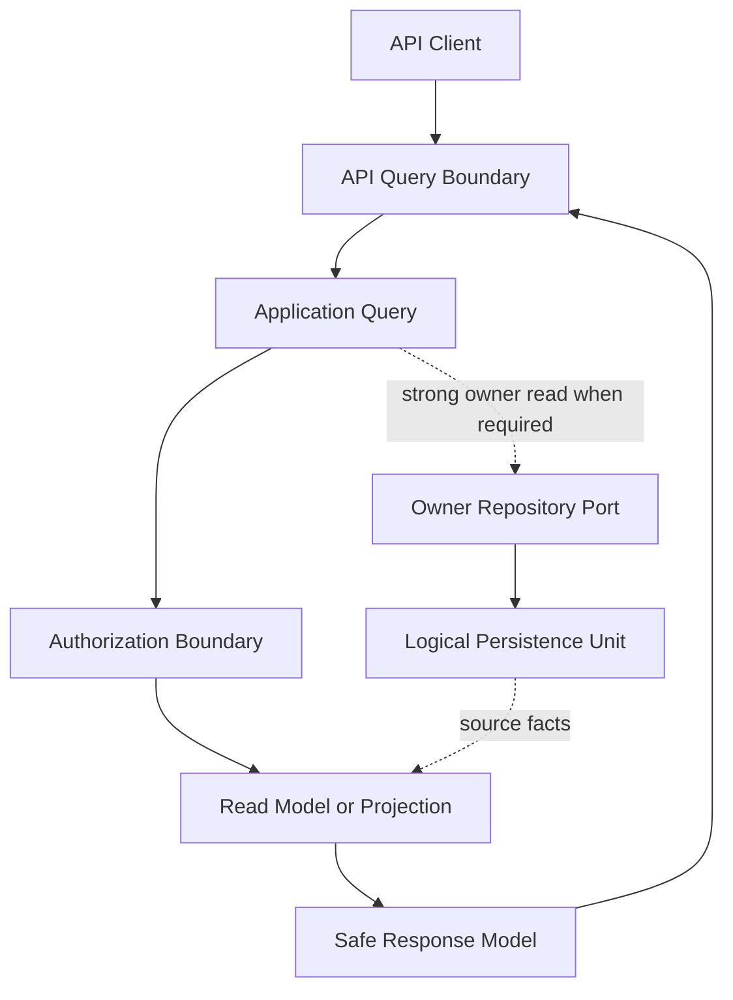

# Query Access Patterns

## Purpose

This document defines Phase 5.2 query access patterns for approved OmniWA Application queries.

The goal is to classify how each query reads persistence, what projection it should use, how fresh the answer must be, and whether caching is safe. This document does not define indexes, physical tables, query language, SQL, ORM behavior, or implementation details.

## Query Access Principles

- Queries do not mutate state.
- Queries do not repair projections during read.
- Queries do not call Provider, Worker, Webhook transport, or external dependencies.
- Queries return safe read models, not Aggregate Roots unless a strong owner read is explicitly required.
- Query results must preserve authorization, retention, redaction, and sensitive data rules.
- Active operational reads must avoid stale answers when stale state could mislead an operator or caller.

## Access Pattern Catalog

| Query | Primary Read Model | Read Frequency | Write Frequency Behind Query | Consistency | Expected Latency | Projection Candidate | Caching Candidate |
|---|---|---|---|---|---|---|---|
| GetInstanceStatus | Instance status view | High | Medium lifecycle and health writes | Strong for Instance; Session and Health summaries may be eventual | Interactive | InstanceStatusProjection | Conditional short cache when not used before a mutation |
| ListInstances | Instance list view | Medium | Low to medium lifecycle and health writes | Eventual with stale marker | Interactive | InstanceListProjection | Short cache with authorization and freshness scope |
| GetMessageStatus | Message status view | High during active messaging | High during message lifecycle | Strong for Message; WorkerJob and Webhook summaries eventual | Interactive troubleshooting | MessageStatusProjection | Conditional; avoid stale cache for active messages |
| GetMessageDeliveryHistory | Message delivery history view | Medium | Event-driven lifecycle writes | Retention-bound eventual | Support and troubleshooting | MessageDeliveryHistoryProjection | Conditional for historical ranges |
| GetMediaStatus | Media status view | Medium | Medium media processing writes | Strong for MediaAsset; WorkerJob summary eventual | Interactive | MediaStatusProjection | Conditional; avoid stale cache while processing |
| GetWebhookStatus | Webhook status view | Medium | Event-driven delivery and subscription writes | Strong for requested owner; health summary eventual | Interactive/admin | WebhookStatusProjection | Conditional short cache |
| GetWebhookDeliveryHistory | Webhook delivery history view | Medium, high during incidents | Event-driven and retry writes | Retention-bound eventual | Support/admin | WebhookDeliveryHistoryProjection | Cache historical ranges; avoid stale active retry status |
| GetHealthStatus | Health status view | High for monitoring | Event-driven or scheduled classification writes | Eventual with stale marker | Monitoring low-latency | HealthStatusProjection | Short cache only with freshness marker |
| QueryAuditRecords | Audit record view | Low/admin | Append and retention writes | Retention-bound, access-scoped snapshot | Admin/support | AuditRecordProjection | Cautious; must respect authorization and retention |
| GetConfigurationStatus | Configuration status view | Medium/admin/startup | Low configuration writes | Strong for active snapshot | Interactive/admin | ConfigurationStatusProjection | Short cache with version marker |
| GetOperationalMetricsSnapshot | Operational metrics snapshot | Medium to high for monitoring | Event-driven telemetry writes | Eventual snapshot | Monitoring | MetricsSnapshotProjection | Short cache with snapshot timestamp |
| GetQueueMetricsSnapshot | Queue metrics snapshot | Medium to high for operations | Event-driven worker writes | Eventual snapshot; must not hide dead work | Monitoring | QueueMetricsProjection | Short cache with freshness marker |
| GetWebhookMetricsSnapshot | Webhook metrics snapshot | Medium | Event-driven delivery writes | Eventual snapshot | Monitoring | WebhookMetricsProjection | Short cache with freshness marker |
| GetMessageMetricsSnapshot | Message metrics snapshot | Medium | Event-driven message writes | Eventual snapshot | Monitoring | MessageMetricsProjection | Short cache with freshness marker |
| GetMediaMetricsSnapshot | Media metrics snapshot | Low to medium | Event-driven media writes | Eventual snapshot | Monitoring | MediaMetricsProjection | Short cache with freshness marker |
| GetActionRequiredItems | Action-required view | High for operators | Event-driven health and lifecycle writes | Eventual with stale marker | Interactive operations | ActionRequiredProjection | Short cache; must expose freshness |
| GetWorkerJobStatus | Worker job status view | Medium, high during incidents | High worker lifecycle writes | Strong for WorkerJob where possible | Interactive operations | WorkerJobStatusProjection | Conditional; avoid stale cache for running jobs |
| GetProviderCapabilityStatus | Provider capability view | Medium/admin | Low or scheduled provider profile writes | Strong for ProviderProfile; external freshness can be stale | Admin/monitoring | ProviderCapabilityProjection | Short cache with last-refreshed marker |

## Query Access Classes

| Class | Applies To | Access Pattern |
|---|---|---|
| Strong owner read | GetInstanceStatus, GetMessageStatus, GetMediaStatus, GetWebhookStatus, GetWorkerJobStatus, GetConfigurationStatus, GetProviderCapabilityStatus | Reads the owner Aggregate state or owner-aligned projection when current state is required. |
| Eventual operational projection | ListInstances, GetHealthStatus, GetActionRequiredItems, metrics snapshots | Reads projection state with freshness markers. |
| Retention-bound history | GetMessageDeliveryHistory, GetWebhookDeliveryHistory, QueryAuditRecords | Reads historical projection or audit state constrained by retention and authorization. |
| Snapshot metrics | Operational, queue, webhook, message, and media metrics snapshots | Reads a point-in-time safe snapshot that is not business truth. |

## Query Flow Diagram

## Access Rules

- Query access must pass through Application query handling.
- API resources must not read persistence directly.
- Query models must never expose raw provider payload, raw message body, raw media binary, session secret, API key secret, admin key secret, or webhook signing secret.
- Queries may expose stale data only when the response carries a safe freshness marker.
- Queries may not enqueue async work, publish Integration Events, or trigger Webhook delivery.
- Query caching must be scoped by authorization, query parameters, retention state, and freshness rules.

## Deferred Query Boundaries

| Deferred Query | Reason |
|---|---|
| GetSession | Session detail is sensitive; MVP exposes safe availability through GetInstanceStatus. |
| GetMessages full search | Product scope does not include full message search or body search. |
| Contact, chat, and group browsing | These capabilities are outside the approved MVP read model. |
| Analytics and reporting queries | Future storage may add analytics projections, but Phase 5.2 keeps operational metrics only. |
