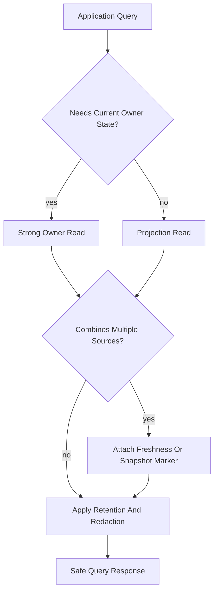

# Query Consistency

## Purpose

This document defines the Phase 5.2 query consistency model for OmniWA read models, projections, and Application queries.

The goal is to make freshness and correctness explicit without designing physical storage, indexes, SQL, ORM models, or database implementation.

## Consistency Classes

### Strong Consistency

Strong consistency means the query reads the current owner state for the relevant Aggregate boundary.

Use strong consistency when:

- a caller needs the current lifecycle of one owner Aggregate,
- an operator may make an immediate decision based on the result,
- stale state could cause an invalid command attempt,
- the query is about one Aggregate Root rather than a combined operational summary.

Trade-off: strong owner reads are clearer for correctness but can be less efficient than a read projection and should not become reporting surfaces.

### Eventually Consistent

Eventually consistent reads return derived state that may lag behind source facts.

Use eventual consistency when:

- the response combines multiple aggregate sources,
- the query is operational summary, health, metrics, or history,
- freshness can be represented with stale or snapshot markers,
- the read does not authorize or execute a state-changing command by itself.

Trade-off: eventual reads scale and decouple workflows, but they require visible freshness semantics.

### Cached

Cached reads reuse a previously computed safe result for a short period or bounded condition.

Use cached reads only when:

- authorization scope is part of the cache boundary,
- query filters and retention state are part of the cache boundary,
- stale answers do not hide active failures or pending work,
- the response carries a freshness marker when needed.

Trade-off: caching improves repeated reads but can produce operational confusion if active lifecycle states are cached too aggressively.

### Snapshot

Snapshot reads return a point-in-time view.

Use snapshot reads when:

- metrics or dashboard views summarize many source facts,
- the response must include snapshot time and projection version,
- exact current state is not required for business correctness.

Trade-off: snapshots are stable and efficient, but not realtime.

### Realtime

Realtime in Phase 5.2 means near-current operational visibility through a strong owner read or a fresh projection. It does not imply push streaming, websocket delivery, provider polling, or a new transport contract.

Use realtime-style reads only when:

- the approved query is already in scope,
- the source owner can provide current safe state,
- the read does not call external dependencies,
- the query can still tolerate documented operational limits.

Trade-off: realtime expectations improve operations, but they must not create hidden provider calls or bypass Application boundaries.

## Query Consistency Matrix

| Query | Consistency Class | Freshness Requirement | Stale Data Allowed? | Notes |
|---|---|---|---|---|
| GetInstanceStatus | Strong owner read plus eventual related summaries | Current Instance lifecycle; Health may be stale | Yes for Health only, with marker | Safe session availability only; no Session secret |
| ListInstances | Eventually consistent | Projection freshness marker required | Yes | Optimized for listing, not command precondition |
| GetMessageStatus | Strong owner read plus eventual related summaries | Current Message lifecycle | Yes for WorkerJob/Webhook summaries, with marker | Avoid stale cache for active troubleshooting |
| GetMessageDeliveryHistory | Eventually consistent retention-bound history | Retention and projection version required | Yes | History may omit expired facts |
| GetMediaStatus | Strong owner read plus eventual job summary | Current MediaAsset state | Yes for job summary, with marker | No media binary |
| GetWebhookStatus | Strong owner read plus eventual health/delivery summary | Current requested owner state | Yes for related summaries | Subscription and delivery may be separate owners |
| GetWebhookDeliveryHistory | Eventually consistent retention-bound history | Retention marker required | Yes | Dead-letter state must not be hidden |
| GetHealthStatus | Eventually consistent | Stale marker required | Yes | Health cannot mutate source state |
| QueryAuditRecords | Snapshot, retention-bound, access-scoped | Retention and redaction state required | Yes for source fact freshness | Audit record itself is strong once persisted |
| GetConfigurationStatus | Strong owner read | Current active snapshot required | Limited | Must not expose secret values |
| GetOperationalMetricsSnapshot | Snapshot eventual | Snapshot timestamp required | Yes | Not business truth |
| GetQueueMetricsSnapshot | Snapshot eventual | Snapshot timestamp and dead-letter visibility required | Yes | Must not hide dead work |
| GetWebhookMetricsSnapshot | Snapshot eventual | Snapshot timestamp required | Yes | Operational metric only |
| GetMessageMetricsSnapshot | Snapshot eventual | Snapshot timestamp required | Yes | Operational metric only |
| GetMediaMetricsSnapshot | Snapshot eventual | Snapshot timestamp required | Yes | Operational metric only |
| GetActionRequiredItems | Eventually consistent operational projection | Stale marker required | Yes | Must expose action-required freshness |
| GetWorkerJobStatus | Strong owner read | Current WorkerJob lifecycle when used for operations | Limited | Avoid stale status for running/retrying jobs |
| GetProviderCapabilityStatus | Strong owner read plus external freshness marker | Current stored ProviderProfile | Yes for external observation freshness | Does not call provider during read |

## Query Consistency Flow

## Consistency Rules

- Strong reads are scoped to one owner Aggregate boundary.
- Cross-aggregate query responses are eventual unless explicitly defined otherwise.
- Retention-bound queries must be correct about what is unavailable due to retention.
- Cached responses must not hide terminal failures, retrying work, dead-letter state, revoked session state, or disconnected instance state.
- Metrics are snapshots, not authoritative business facts.
- Health reads are current classifications, not source aggregate mutation.
- Provider capability reads show stored product-level compatibility and external freshness, not live provider probing.
- Query consistency must be documented in Application and API contracts when externally visible.

## Consistency And Failure Behavior

| Failure | Query Behavior |
|---|---|
| Projection unavailable for strong-owner query | Use owner read when allowed; otherwise return safe unavailable state |
| Projection stale for eventual query | Return result with stale marker when query contract allows |
| Retained source facts expired | Return retention-limited result; do not reconstruct expired data |
| Authorization cannot be evaluated | Fail closed; do not return cached or projected data |
| Redaction status uncertain | Fail closed or omit unsafe fields |
| External provider unreachable | Do not call provider during query; return stored provider or health state with freshness marker |

## Future Consistency Evolution

- Read replicas can serve eventual and snapshot queries, while strong owner reads remain tied to the authoritative write boundary.
- CQRS can specialize read models without changing Aggregate ownership.
- Event sourcing would require a future ADR and cannot be implied by the Phase 5.2 projection model.
- Analytics, warehouse, and reporting stores can consume sanitized projections but cannot become command preconditions.
- Search projections require a future Product/API decision because MVP excludes full message search and campaign segmentation.
