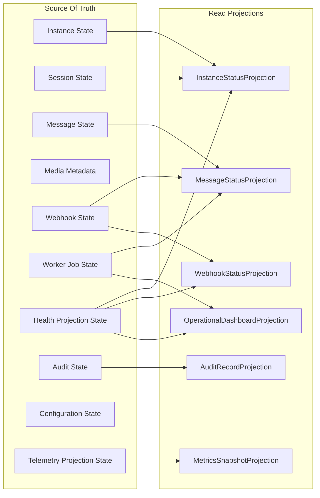

# Read Projections

## Purpose

This document defines Phase 5.2 read projections for OmniWA.

Read projections are derived, query-oriented persistence views used by Application queries and API resources. They are not Aggregate Roots, do not enforce business invariants, and do not mutate source state.

## Projection Principles

- A projection has an explicit owner.
- A projection has explicit source facts.
- A projection exposes freshness, snapshot, or retention state when relevant.
- A projection stores only safe, queryable information.
- A projection can be rebuilt only from approved source-of-truth state that still exists within retention.
- A projection may combine multiple sources but cannot create new business meaning that is not owned by a Domain context.

## Projection Catalog

| Projection | Purpose | Sources | Owner | Queries | Consistency | Lifetime | Rebuild |
|---|---|---|---|---|---|---|---|
| InstanceStatusProjection | Shows one instance lifecycle, readiness, safe session availability, and action-required markers | Instance State, safe Session summary, HealthStatus | Query/Application projection with Instance as source owner | GetInstanceStatus | Strong for Instance fields; eventual for Health | Active instance lifetime plus retention summary | Rebuild from Instance State, Session State safe references, and Health Projection |
| InstanceListProjection | Provides safe list summaries for instances | Instance State, HealthStatus | Query/Application projection | ListInstances | Eventual with stale marker | Active instance lifetime; destroyed summary retention | Rebuild from Instance State and Health Projection |
| MessageStatusProjection | Shows one message lifecycle, delivery status, failure category, and async summary | Message State, WorkerJob summary, WebhookDelivery summary | Query/Application projection with Messaging as source owner | GetMessageStatus | Strong for Message fields; related summaries eventual | Message retention period | Rebuild from Message State and retained WorkerJob/WebhookDelivery summaries |
| MessageDeliveryHistoryProjection | Shows retained message transitions and delivery attempts | Message State, WorkerJob State, provider-translated lifecycle facts | Query/Application projection | GetMessageDeliveryHistory | Retention-bound eventual | Message history retention | Rebuild from retained Message State and safe operational history |
| MediaStatusProjection | Shows media metadata, processing state, retention state, and safe diagnostic category | Media Metadata State, WorkerJob State | Query/Application projection with Media as source owner | GetMediaStatus | Strong for MediaAsset fields; job summary eventual | Media metadata retention | Rebuild from Media Metadata State and WorkerJob summary |
| WebhookStatusProjection | Shows subscription status, delivery posture, retry/dead-letter summary, and health markers | Webhook Subscription State, Webhook Delivery State, HealthStatus | Query/Application projection with Webhook Delivery as source owner | GetWebhookStatus | Strong for requested owner; health eventual | Subscription lifetime plus delivery retention | Rebuild from Webhook Subscription and retained Webhook Delivery state |
| WebhookDeliveryHistoryProjection | Shows webhook attempt history, retry state, terminal state, and failure category | Webhook Delivery State | Query/Application projection | GetWebhookDeliveryHistory | Retention-bound eventual | Webhook delivery log retention | Rebuild from Webhook Delivery State within retention |
| WorkerJobStatusProjection | Shows one async job lifecycle, owner reference, retry/dead-letter status, and action marker | Worker Job State | Query/Application projection with Operations as source owner | GetWorkerJobStatus | Strong for WorkerJob fields | Operational retention | Rebuild from Worker Job State |
| HealthStatusProjection | Shows current safe health classification by subject | Health Projection State | Health | GetHealthStatus | Eventual relative to source systems; strong for stored classification | Current health lifetime plus optional compacted history | Rebuild from retained source facts where available; otherwise mark unknown/stale |
| ActionRequiredProjection | Lists safe items that require operator action | HealthStatus, InstanceStatus, WorkerJobStatus, WebhookStatus, ConfigurationStatus | Query/Application projection | GetActionRequiredItems | Eventual with stale marker | Operational active window | Rebuild from current health and owner status projections |
| ProviderCapabilityProjection | Shows supported, degraded, or unsupported capability vocabulary | Provider Profile State, HealthStatus | Provider Integration / Query projection | GetProviderCapabilityStatus | Strong for ProviderProfile; external freshness marker required | Provider profile lifecycle | Rebuild from Provider Profile State and health classification |
| ConfigurationStatusProjection | Shows active configuration snapshot, validation status, and safe setting categories | Configuration State | Configuration | GetConfigurationStatus | Strong for active snapshot | Active and superseded configuration retention | Rebuild from Configuration State |
| AuditRecordProjection | Shows safe audit evidence and retention state | Audit State | Audit | QueryAuditRecords | Strong for AuditRecord; retention and authorization constrained | Audit retention | Rebuild from Audit State only; no source payload reconstruction |
| MetricsSnapshotProjection | Shows operational, queue, webhook, message, and media metrics snapshots | TelemetrySignal, HealthStatus, WorkerJob, Message, WebhookDelivery, MediaAsset summaries | Observability / Query projection | Metrics snapshot queries | Eventual snapshot | Short operational window plus aggregated retention | Rebuild from retained sanitized telemetry and source summaries |
| OperationalDashboardProjection | Provides a combined operational status read model for human operators | HealthStatus, WorkerJobStatus, MetricsSnapshot, WebhookDelivery summaries, Message summaries | Query/Application projection | GetOperationalMetricsSnapshot, GetActionRequiredItems | Eventual with freshness marker | Short operational window | Rebuild from current operational projections |

## Read Model Diagram

## Projection Safety Rules

- Projection fields must be safe for the target API boundary.
- Projection records must not contain Secret values.
- Projection records must not contain raw Confidential payloads unless an approved future decision explicitly changes retention and redaction policy.
- Projection rebuild must respect retention; expired source facts cannot be reconstructed.
- Projection failures must be observable, but a projection failure must not mutate source Aggregate state.
- Projection freshness must be visible when data is eventual.

## Projection Ownership Notes

Instance, Message, Media, Webhook, WorkerJob, Configuration, ProviderProfile, AuditRecord, and HealthStatus remain the source owners for their facts. Query/Application projections can combine facts for read ergonomics but do not own the underlying product state.

Observability projections own sanitized telemetry state only. They do not own Message delivery, Webhook delivery, Worker lifecycle, Instance health source facts, or provider compatibility.
