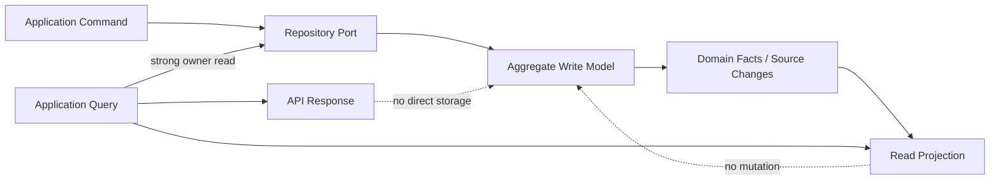

# Read Model vs Write Model

## Purpose

This document defines the Phase 5.1 read/write persistence model for OmniWA.

It does not define SQL, views, tables, indexes, ORM models, query parameters, cache implementation, Prisma, or source code.

## Write Model

The Write Model is aggregate-owned durable state accessed through repository ports.

Write Model characteristics:

- Owned by one aggregate/context.
- Mutated only through Application use cases invoking Domain aggregate roots.
- Strongly consistent inside one aggregate boundary.
- Stores product state, lifecycle, idempotency outcome, and recovery markers.
- Emits Domain Event facts through Domain/Application publication timing, not Persistence.
- Does not serve broad reporting or analytics directly.

## Read Model

The Read Model is safe query-oriented state used by Application queries and API responses.

Read Model characteristics:

- Derived from write model state, domain facts, or safe projections.
- May combine multiple source aggregates for status or dashboard-like views.
- Does not own business state.
- May be eventually consistent when query contract allows.
- Must carry staleness/freshness markers when needed.
- Must obey retention, authorization, and sensitive-data rules.
- Must not repair itself during a query.

## Projection

A Projection is a derived persistence representation optimized for query needs.

Projection rules:

- Projection is updated by Application-approved workflows or projection handlers later.
- Projection failure does not roll back source aggregate state.
- Projection state must be observable when it affects API correctness.
- Projection state must not mutate source aggregates.
- Projection must be rebuilt only through approved recovery/projection workflows, not by read queries.

## Materialized View Candidates

| Candidate Read Model | Source Write Model | Query Served | Consistency |
|---|---|---|---|
| InstanceStatusView | Instance, Session summary, HealthStatus | GetInstanceStatus | Strong for Instance, eventual for Health |
| InstanceListView | Instance, HealthStatus | ListInstances | Eventual with stale marker |
| MessageStatusView | Message, WorkerJob summary, WebhookDelivery summary | GetMessageStatus | Strong for Message, eventual related summaries |
| MessageDeliveryHistoryView | Message lifecycle facts, WorkerJob lifecycle | GetMessageDeliveryHistory | Retention-bound eventual |
| MediaStatusView | MediaAsset, WorkerJob summary | GetMediaStatus | Strong for MediaAsset, eventual job summary |
| WebhookStatusView | WebhookSubscription, WebhookDelivery, HealthStatus | GetWebhookStatus | Strong for requested owner, health eventual |
| WebhookDeliveryHistoryView | WebhookDelivery attempt facts | GetWebhookDeliveryHistory | Retention-bound eventual |
| WorkerJobStatusView | WorkerJob | GetWorkerJobStatus | Strong owner read where possible |
| HealthStatusView | HealthStatus | GetHealthStatus, GetActionRequiredItems | Eventual projection |
| ProviderCapabilityView | ProviderProfile, HealthStatus | GetProviderCapabilityStatus | Strong ProviderProfile, external freshness marker |
| ConfigurationStatusView | ConfigurationSnapshot | GetConfigurationStatus | Strong active snapshot read |
| AuditRecordView | AuditRecord | QueryAuditRecords | Retention-bound and access-scoped |
| MetricsSnapshotView | TelemetrySignal, HealthStatus, WorkerJob, Message, WebhookDelivery | Metrics snapshot queries | Eventual with freshness marker |

## Strongly Consistent Reads

Strong reads are required when the query is about one owner aggregate's current state and the Application needs current truth for operation or troubleshooting.

Examples:

- Instance current lifecycle in GetInstanceStatus.
- Message current lifecycle in GetMessageStatus.
- MediaAsset processing state in GetMediaStatus.
- WebhookSubscription/WebhookDelivery owner state in GetWebhookStatus.
- WorkerJob lifecycle in GetWorkerJobStatus.
- Configuration active snapshot in GetConfigurationStatus.
- ProviderProfile current capability in GetProviderCapabilityStatus.

## Eventually Consistent Reads

Eventual reads are allowed when the query returns projection, history, metrics, or combined status.

Examples:

- ListInstances with health summary.
- Message delivery history.
- Webhook delivery history.
- Health/action-required summaries.
- Metrics snapshots.
- Audit record search within retention.
- Related WorkerJob/Webhook summaries on MessageStatusView.

Eventual reads must:

- Include stale/fresh markers where relevant.
- Never hide terminal failure, dead-letter, or action-required state when known.
- Never claim state not yet produced by the source aggregate.
- Preserve authorization and retention.

## Read/Write Model Diagram

## Query Safety Rules

- Query reads do not mutate state.
- Query reads do not enqueue jobs.
- Query reads do not call providers.
- Query reads do not deliver webhooks.
- Query reads do not write audit evidence.
- Query reads do not repair missing projections.
- Query reads do not expose Secret/raw Confidential data.

## Cursor And Projection Relationship

API cursor pagination requires read models/history views to support stable continuation without exposing storage internals.

Rules:

- Cursor content is opaque.
- Cursor must be scoped to caller, query, filters, sort, and retention state.
- Cursor must not expose database identifiers, provider identifiers, queue identifiers, shard information, Secret, or raw Confidential values.
- Cursor invalidation must be safe and classified as API validation/conflict/retention outcome.

## Read Model Evolution

Read models may be added later when:

- A frozen API query needs a safe optimized view.
- Projection source is traceable to aggregate state or approved events.
- The read model does not change command semantics.
- Retention and authorization behavior is documented.
- Staleness behavior is documented.

Read models must not be added to introduce unapproved analytics, campaign, broadcast, chat/contact/group, or multi-tenant behavior.
