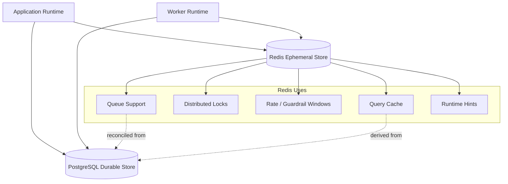

# Redis Architecture

## Purpose

This document defines OmniWA Phase 5.3 Redis architecture.

Redis is an ephemeral operational store. It may support cache, coordination, rate windows, queue mechanics, and runtime hints, but it is not the durable source of truth for OmniWA product state.

This document does not create concrete keys, choose a Redis client, select a queue library, or implement locking.

## Redis Role

| Role | Allowed? | Source Of Truth? | Notes |
|---|---|---|---|
| Query cache | Yes | No | Must include authorization, freshness, and retention scope. |
| Distributed lock | Yes | No | Must have TTL and recovery behavior. |
| Queue support | Conditional | No | WorkerJob state in PostgreSQL remains durable recovery source. |
| Rate/guardrail window | Yes | No | Durable GuardrailDecision remains in PostgreSQL. |
| Provider runtime hint | Conditional | No | Must not store provider socket/session object. |
| Secret storage | No | No | Secret values must not be stored in Redis. |
| Long-term history | No | No | History belongs in PostgreSQL or approved archive. |

## Key Namespace Strategy

Redis keys use structured namespaces by environment, project, version, owner context, purpose, and safe owner reference.

This phase defines namespace shape only and does not define concrete keys.

| Namespace Segment | Purpose | Constraint |
|---|---|---|
| Environment | Prevents cross-environment collision | Must be explicit and stable. |
| Project | Separates OmniWA from other systems | Must not contain secrets. |
| Version | Allows future keyspace evolution | Old versions require bounded expiry. |
| Owner context | Aligns cache/lock with source owner | Must match repository ownership. |
| Purpose | Cache, lock, queue-support, rate-window, health-hint | Purpose must imply TTL class. |
| Safe owner reference | Correlates to product identity or hashed sensitive reference | Raw phone, JID, webhook secret, or session secret must not appear. |

## TTL Strategy

| Data Class | TTL Requirement | Reason |
|---|---|---|
| Query cache | Short and bounded | Prevents stale operational reads. |
| Distributed lock | Very short and renewable only by holder | Prevents permanent deadlock. |
| Queue support state | Bounded by workflow visibility and recovery policy | Redis cannot outlive durable WorkerJob state. |
| Rate/guardrail window | Bounded by policy window | Prevents indefinite risk classification. |
| Provider runtime hint | Short | Provider state changes frequently and must not become truth. |
| Health hint | Short | Health is projection-oriented and must expose freshness. |

Every Redis value must have an explicit TTL unless a future ADR approves otherwise.

## Cache Strategy

| Cache Candidate | Source | Safety Requirement |
|---|---|---|
| Instance status projection | PostgreSQL read projection | Include stale marker and authorization scope. |
| Instance list projection | PostgreSQL read projection | Include filter, pagination, and authorization scope. |
| Metrics snapshot | PostgreSQL projection or telemetry summary | Include snapshot timestamp. |
| Provider capability status | PostgreSQL ProviderProfile | Include last refreshed marker. |
| Configuration safe status | PostgreSQL ConfigurationSnapshot | Never include Secret values. |
| Health/action-required status | PostgreSQL HealthStatus | Include freshness marker. |

Cache must be bypassed or invalidated for active operational reads where stale state can mislead an operator or caller.

## Distributed Lock Strategy

| Lock Candidate | Purpose | Guardrail |
|---|---|---|
| Instance reconnect | Prevent concurrent reconnect workflows for one instance | Lock is a coordination hint; PostgreSQL state remains authoritative. |
| Provider connection ownership | Prevent multiple runtime owners for one active provider connection | Must use bounded TTL and safe owner token. |
| Outbound message processing | Prevent duplicate processing of one outbound message | Message and WorkerJob state remain durable idempotency boundary. |
| Webhook delivery attempt | Prevent duplicate active delivery attempts | WebhookDelivery state determines final lifecycle. |
| Projection rebuild | Prevent concurrent rebuild of the same projection scope | Rebuild does not mutate source aggregates. |
| Retention cleanup | Prevent concurrent cleanup for the same scope | Cleanup must respect PostgreSQL retention markers. |

Distributed locks require:

- bounded TTL,
- owner token or fencing concept,
- correlation ID,
- safe failure behavior,
- durable state verification before and after lock usage.

## Queue Support

Redis may support queue mechanics only if a later implementation phase selects it.

Phase 5.3 constraints:

- accepted async work must be durable in PostgreSQL WorkerJob state before the caller receives accepted status,
- Redis queue state can be reconstructed or reconciled from PostgreSQL WorkerJob state,
- completed Redis queue entries are not the durable record,
- failed or dead work must remain visible through WorkerJob and owner aggregate state,
- queue retry must not bypass Application idempotency.

## Ephemeral Data

Redis may store:

- short-lived cache entries,
- lock tokens,
- queue-support hints,
- rate/guardrail counters,
- in-flight workflow hints,
- non-sensitive freshness markers,
- operational throttling signals.

Redis must not store:

- session secrets,
- API keys or admin keys,
- webhook signing secrets,
- raw message bodies,
- raw media binary,
- raw webhook payloads,
- raw provider payloads,
- audit evidence,
- backup artifacts.

## Redis Topology Diagram

## Redis Failure Policy

| Failure | Required Behavior |
|---|---|
| Cache unavailable | Fall back to PostgreSQL or return safe unavailable state for cache-only operational view. |
| Lock unavailable | Fail closed for workflows that require single owner; do not proceed optimistically. |
| Queue support unavailable | Do not accept new async work unless durable state and queue path are both safe. |
| Rate window unavailable | Apply conservative guardrail behavior and record safe failure classification. |
| Redis data loss | Rebuild cache and queue-support state from PostgreSQL where possible. |

## Redis Constraints

- Redis is not permanent storage.
- Redis is not backup source of truth.
- Redis key names and values must not contain Secret or raw Confidential values.
- Redis locks do not replace PostgreSQL consistency checks.
- Redis queues do not replace WorkerJob lifecycle persistence.
- Redis cache does not override retention or redaction.
