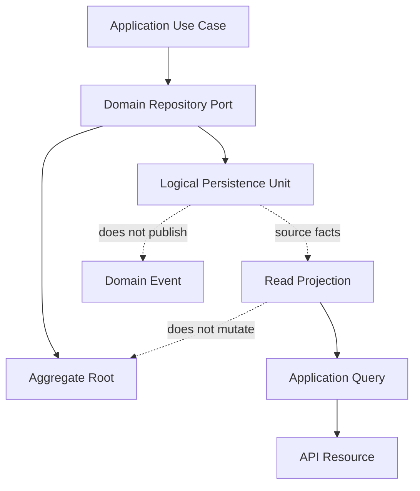

# Repository Mapping

## Purpose

This document defines the Phase 5.2 repository-to-persistence mapping for OmniWA.

The goal is to make every Domain repository port traceable to a logical persistence unit, storage owner, query surface, and product capability without defining a physical schema, ORM model, query language, or storage implementation.

## Mapping Principles

- Repository ports remain Domain contracts.
- Repository implementations belong to Infrastructure and must not redefine aggregate ownership.
- A repository persists and rehydrates one Aggregate Root boundary.
- Cross-aggregate relationships are represented by stable domain identity references, not object graphs.
- Read projections may derive from multiple sources, but projections never become the source of business truth.
- Mapping decisions must preserve the Phase 0 retention, sensitive data, compliance guardrail, and MVP scope decisions.

## Repository Mapping Catalog

| Repository Port | Aggregate Root | Persistence Unit | Storage Owner | Consistency | Snapshot Candidate | Archive Candidate | Mapping Boundary |
|---|---|---|---|---|---|---|---|
| InstanceRepositoryPort | Instance | Instance State | Instance | Strong for one Instance lifecycle; Session readiness is Application-coordinated | Current lifecycle, readiness, safe connection summary | Destroyed instance summary after retention | Maps only Instance lifecycle state and safe references; no Session mutation or provider-native state |
| SessionRepositoryPort | Session | Session State | Session | Strong for one Session; one-active-session requires Instance precondition coordination | Safe session availability and recovery marker | Expired, revoked, or cleaned session metadata; Secret material excluded | Maps Session lifecycle, recovery, and retention classification; no raw credential material |
| MessageRepositoryPort | Message | Message State | Messaging | Strong for one Message; provider, webhook, audit, and health summaries are eventual | Current message lifecycle and delivery visibility | Retention-bound delivery history; body excluded by default | Maps message identity, type category, direction, lifecycle, failure category, and idempotency marker; no campaign or body search |
| MediaAssetRepositoryPort | MediaAsset | Media Metadata State | Media | Strong for one MediaAsset; Message attachment readiness is Application-coordinated | Processing, retention, and safe metadata status | Metadata or diagnostic summary within policy; binary excluded | Maps metadata and lifecycle only; no media binary or provider payload |
| WebhookSubscriptionRepositoryPort | WebhookSubscription | Webhook Subscription State | Webhook Delivery | Strong for one subscription | Active subscription status and signal selection | Retired subscription metadata | Maps subscription lifecycle and safe destination metadata; no transport execution or secret exposure |
| WebhookDeliveryRepositoryPort | WebhookDelivery | Webhook Delivery State | Webhook Delivery | Strong for one delivery lifecycle; source product fact is eventual | Attempt summary, retry state, terminal state | Delivery history and dead-letter summary | Maps delivery identity, source signal reference, retry/dead-letter state, and idempotency marker; no raw payload storage by default |
| GuardrailDecisionRepositoryPort | GuardrailDecision | Guardrail Decision State | Guardrails | Strong for one decision; Message acceptance uses it as a precondition | Decision outcome and safe reason category | Decision summary within guardrail and audit retention | Maps evaluated intent reference, decision outcome, and bounded rate-limit context; no legal-compliance engine behavior |
| ProviderProfileRepositoryPort | ProviderProfile | Provider Profile State | Provider Integration | Strong for one provider profile; consumers may observe updates eventually | Capability and compatibility classification | Superseded capability snapshots | Maps product-level provider capability vocabulary; no provider socket, runtime session object, or business policy |
| WorkerJobRepositoryPort | WorkerJob | Worker Job State | Operations | Strong for one job lifecycle; owner interpretation is Application-coordinated | Job lifecycle, retry, reservation, and dead-letter status | Completed or dead job summary after operational retention | Maps async work visibility and idempotency; no queue-engine internals or business outcome decisions |
| AccessDecisionRepositoryPort | AccessDecision | Access Decision State | Security and Access | Strong for one access decision; target mutation requires granted decision precondition | Decision outcome and expiry marker | Expired decision audit-safe summary | Maps actor, capability, target reference, decision, and expiry; no authentication secret or identity-provider payload |
| AuditRecordRepositoryPort | AuditRecord | Audit State | Audit | Strong for one audit record; source facts remain source of truth | Audit record is itself the evidence snapshot | Audit archive according to retention | Maps safe audit metadata, source reference, redaction marker, and retention state; no Secret or raw Confidential payload |
| HealthStatusRepositoryPort | HealthStatus | Health Projection State | Health | Strong for one health classification; source facts are eventual inputs | Current health classification and action-required marker | Health history may compact or archive | Maps safe cause category and health subject; no probes, source mutation, or raw dependency payload |
| ConfigurationSnapshotRepositoryPort | ConfigurationSnapshot | Configuration State | Configuration | Strong for one configuration snapshot; consumers observe through Application coordination | Active validated configuration status | Superseded or rejected snapshot metadata | Maps safe setting categories, activation state, and guardrail classification; no Secret value exposure |
| TelemetrySignalRepositoryPort | TelemetrySignal | Telemetry Projection State | Observability | Strong for one telemetry sanitization decision; export is eventual | Sanitized telemetry projection/drop decision | Aggregated or sanitized telemetry only | Maps safe telemetry category and redaction decision; no raw payload, log sink implementation, or business mutation |

## Aggregate Mapping

### Persist Together

An Aggregate Root persists together with the state required to enforce its own invariants, lifecycle, and identity.

Examples:

- Instance persists lifecycle state, readiness metadata, and safe references owned by the Instance aggregate.
- Message persists lifecycle, direction, supported message type category, delivery state, failure category, and idempotency marker for one outbound intent.
- WebhookDelivery persists retry state, attempt summary, dead-letter state, and idempotency marker for one source signal and subscription pair.
- ConfigurationSnapshot persists validation, activation, superseded, and guardrail-safety classification for one snapshot.

Value Objects are stored as part of the owning Aggregate representation when needed for rehydration. They do not become standalone persistence owners unless a later approved domain change gives them independent identity and lifecycle.

### Persist Separately

Separate Aggregate Roots persist separately even when workflows coordinate them.

| Relationship | Persistence Decision | Reason |
|---|---|---|
| Instance and Session | Persist separately | Instance lifecycle and Session secret-sensitive lifecycle have different retention, recovery, and sensitivity rules. |
| Message and MediaAsset | Persist separately | Message lifecycle must not depend on binary or media processing storage. |
| WebhookSubscription and WebhookDelivery | Persist separately | Configuration lifecycle and delivery retry lifecycle have different write frequencies and retention. |
| Message and WorkerJob | Persist separately | Async execution state must not decide Message business state. |
| AuditRecord and source aggregates | Persist separately | Audit is evidence and must not mutate source business state. |
| HealthStatus and source aggregates | Persist separately | Health is projection-oriented and must not repair or mutate source state. |
| TelemetrySignal and source aggregates | Persist separately | Observability state is sanitized and cannot become business truth. |

### Reference Only

Cross-aggregate relationships use identity references or source signal references.

Examples:

- Message references InstanceId and optional MediaId; it does not embed Instance or MediaAsset.
- WebhookDelivery references WebhookSubscription and the source signal; it does not embed the source aggregate.
- WorkerJob references owner context and owner identity; it does not own the aggregate it works for.
- AuditRecord, HealthStatus, and TelemetrySignal reference source subjects safely; they do not own source facts.

### Composition

Composition is allowed only inside the Aggregate boundary.

Internal state can be composed with the Aggregate Root when it has no independent lifecycle and is needed to preserve invariants. Composition does not allow one Aggregate Root to embed another Aggregate Root.

### Association

Association is used for cross-context visibility and workflow coordination. Associations are resolved by Application use cases through repository ports and read projections, never by persistence-level joins that leak into Domain behavior.

## Aggregate Mapping Trade-Offs

| Decision | Benefit | Trade-off |
|---|---|---|
| Keep one repository per Aggregate Root | Preserves ownership and makes invariants explicit | Workflows that span aggregates require Application coordination |
| Store idempotency markers inside the owning boundary | Keeps retry behavior close to the state it protects | Cross-workflow reporting needs read projections |
| Keep Message separate from MediaAsset | Avoids coupling message lifecycle to media retention and binary concerns | Send-media workflows need Application orchestration |
| Keep WebhookDelivery separate from WebhookSubscription | Delivery retries do not mutate subscription configuration | Queries need projections to show subscription and delivery together |
| Keep Health and Metrics as projections | Prevents observability from becoming business truth | Monitoring reads may be stale and must expose freshness markers |

## Repository Mapping Diagram

## Repository Mapping Traceability

| Persistence Unit | Aggregate | Repository Port | Application Query | API Resource | Product Capability |
|---|---|---|---|---|---|
| Instance State | Instance | InstanceRepositoryPort | GetInstanceStatus, ListInstances | Instance | Instance lifecycle |
| Session State | Session | SessionRepositoryPort | GetInstanceStatus through safe session availability | Session, QR | Pairing and connection reliability |
| Message State | Message | MessageRepositoryPort | GetMessageStatus, GetMessageDeliveryHistory, GetMessageMetricsSnapshot | Message | Messaging |
| Media Metadata State | MediaAsset | MediaAssetRepositoryPort | GetMediaStatus, GetMediaMetricsSnapshot | Media | Media handling |
| Webhook Subscription State | WebhookSubscription | WebhookSubscriptionRepositoryPort | GetWebhookStatus | WebhookSubscription | Webhook configuration |
| Webhook Delivery State | WebhookDelivery | WebhookDeliveryRepositoryPort | GetWebhookStatus, GetWebhookDeliveryHistory, GetWebhookMetricsSnapshot | WebhookDelivery | Webhook delivery reliability |
| Guardrail Decision State | GuardrailDecision | GuardrailDecisionRepositoryPort | GetMessageStatus where safe, GetMessageMetricsSnapshot | Message | Product guardrails |
| Provider Profile State | ProviderProfile | ProviderProfileRepositoryPort | GetProviderCapabilityStatus | Provider | Provider abstraction |
| Worker Job State | WorkerJob | WorkerJobRepositoryPort | GetWorkerJobStatus, GetQueueMetricsSnapshot | WorkerJob | Queue and worker visibility |
| Access Decision State | AccessDecision | AccessDecisionRepositoryPort | QueryAuditRecords where safe | Admin resources | Security and access |
| Audit State | AuditRecord | AuditRecordRepositoryPort | QueryAuditRecords | AuditRecord | Audit |
| Health Projection State | HealthStatus | HealthStatusRepositoryPort | GetHealthStatus, GetActionRequiredItems, GetOperationalMetricsSnapshot | Health | Observability |
| Configuration State | ConfigurationSnapshot | ConfigurationSnapshotRepositoryPort | GetConfigurationStatus | Configuration | Configuration |
| Telemetry Projection State | TelemetrySignal | TelemetrySignalRepositoryPort | Metrics snapshot queries | Metrics | Observability |

## Mapping Boundary Rules

- A repository may rehydrate only the Aggregate Root named by its port.
- A repository may not load another Aggregate Root to complete persistence.
- A repository may not use read projection state to decide aggregate validity.
- A repository may expose safe query helpers only when the Domain repository port already allows them.
- A repository may not return raw provider payloads, session secrets, API secrets, webhook secrets, raw media binary, or raw message bodies by default.
- A repository may not turn persistence identity into public API identity.
